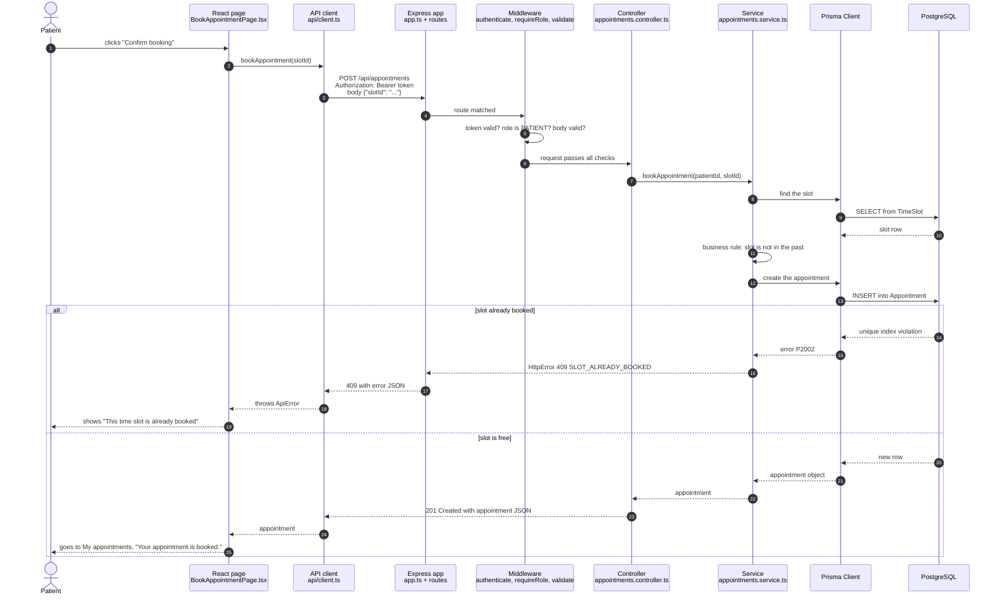
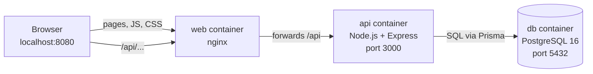
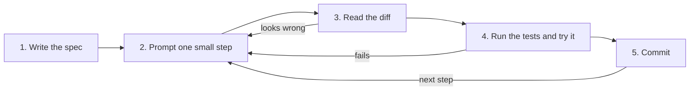

# Reading ClinicQ: a code-literacy course

This course teaches you to read, discuss and direct the building of production software, using ClinicQ as the textbook. ClinicQ is a small clinic appointment booking app, but it is built the way real teams build real apps. It has a database with migrations, an API with authentication and business rules, a React front end, automated tests, Docker and CI. Everything you read here is the actual running code, not a simplified example.

By the end you should be able to:

1. Open an unfamiliar production codebase and find your way around it.
2. Follow what your developers say in standups, refinement and PR reviews, and ask sharper questions.
3. Build small features yourself by directing an AI: you write the spec, prompt, review the diff and test; the AI types.

## How to use this course

**Pace.** Each week is designed for 4–6 hours. A split that works:

- about 1 hour on the concept primer and diagrams;
- 2 hours on the reading path, with the code open next to the lesson;
- 1–2 hours on the Build with AI exercise;
- 30 minutes on vocabulary and the quiz.

Do the weeks in order: each one assumes the earlier ones.

**Keep the app running while you read.** Reading code sticks much better when you can click the feature, watch the request in the browser's Network tab and see the log line appear in the terminal. Week 0 gets you set up.

**Every lesson has the same eight parts:**

1. **Goal**: what you can do by the end of the week.
2. **Concept primer**: the minimum theory, in plain English, with a diagram where there's a flow or structure.
3. **Reading path**: the files to read, in order, with links. Each file gets its purpose, and what breaks if a project doesn't have it.
4. **Block-by-block walkthrough**: real code from ClinicQ, quoted, then explained in four parts:
   - **What it does**
   - **Syntax decoded**: only the symbols that are new to you
   - **Connects to**: which files call it, or are called by it
   - **Dev-speak**: how developers would say it in a standup or review
5. **PA lens**: how this layer maps to acceptance criteria, questions to ask in refinement, and the UAT bugs that typically come from this layer.
6. **Build with AI**: one small change you direct an AI to make. It comes with a spec, a prompt, a diff-review checklist and a test plan. The changes get harder each week.
7. **Vocabulary**: 10–15 terms, each tied to where it appears in ClinicQ.
8. **Quiz**: five questions, with answers hidden in a collapsible block.

**Skim or master.** Lessons label material so you know where to spend effort:

- **Master** means you should be able to explain it to a colleague without notes. It comes up every week and in every PR.
- **Skim** means know that it exists and roughly what it's for. Developers look these things up too.

**Following links.** File links are relative. They work on GitHub, and in VS Code's Markdown preview (open it with `Cmd+Shift+V` on Mac, `Ctrl+Shift+V` on Windows). In VS Code you can also `Cmd+click` (Mac) or `Ctrl+click` (Windows) a link to open the file.

**Keep a questions log.** When something doesn't make sense, write down the file, the line and your question. Many of them will be answered a week or two later. The rest are good questions to take to your developers.

**Experimenting is safe.** You can change anything locally. `git status` shows what you changed, and `git restore .` puts everything back (Week 0 shows how).

## Architecture overview

ClinicQ has three running parts:

- **The web app** (`apps/web`) runs in the browser. It's written in React, and it draws the screens and reacts to clicks.
- **The API** (`apps/api`) runs on a server. It's written in Node.js with Express, and it checks who you are, enforces the business rules and talks to the database.
- **The database** is PostgreSQL. It stores users, doctors, time slots and appointments.

The browser never talks to the database directly. Everything goes through the API, which is the only place the business rules are enforced.

Here is one request from start to finish: a patient clicks **Confirm booking**.



Some things to notice:

- Each box does one job. The **middleware** decides whether the request may go any further. The **controller** translates between HTTP and plain function calls. The **service** holds the business rules. **Prisma** turns function calls into SQL. This split is called a _layered architecture_, and Weeks 3–5 cover it.
- The double-booking rule is enforced by the **database** (steps 13–14), not by an "is it free?" check in code. That's the only way to be sure when two patients click at the same moment. Week 5 explains why.
- Errors travel back up the same path. Whatever goes wrong, the patient sees a readable message, because every layer knows how to pass an error along.
- In development, Vite's dev server sits between the browser and the API and forwards `/api` calls. In Docker, nginx does the same job. Neither changes the request, so they're left out of the diagram.

This is how the parts are wired together when you run `docker compose up`:



## Folder map

Every file in the repository, in one line each. You don't need to read them all now; come back here whenever you meet a file name you don't recognise.

### Repository root

| File                                     | What it is                                                                                  |
| ---------------------------------------- | ------------------------------------------------------------------------------------------- |
| `README.md`                              | How to install, run and test ClinicQ on Windows and Mac                                     |
| `CLAUDE.md`                              | The project brief and rules the AI follows when it works on this repo                       |
| `PROGRESS.md`                            | Log of every build session: what was built, decisions, exact versions, known issues         |
| `package.json`                           | Declares the npm workspaces (`apps/*`), shared dev tools and the root scripts (`npm test`…) |
| `package-lock.json`                      | The exact version of every installed package, so every machine installs the same thing      |
| `tsconfig.base.json`                     | TypeScript settings shared by both apps                                                     |
| `eslint.config.js`                       | Lint rules: automatic checks for common mistakes                                            |
| `.prettierrc.json`                       | Formatting rules (quotes, line width); Prettier applies them automatically                  |
| `.prettierignore`                        | Files Prettier must not reformat                                                            |
| `.editorconfig`                          | Basic editor settings (indentation, line endings) that most editors respect                 |
| `.gitignore`                             | Files Git must never track: installed packages, build output, secrets in `.env`             |
| `.gitattributes`                         | Forces Linux line endings so files work in Docker even when edited on Windows               |
| `.nvmrc`                                 | The Node.js major version this project uses (22)                                            |
| `.dockerignore`                          | Files left out when Docker builds an image                                                  |
| `docker-compose.yml`                     | Defines the three containers (db, api, web) and how they connect                            |
| `docker/db/init/01-create-databases.sql` | Creates the test databases the first time the Postgres container starts                     |
| `.github/workflows/ci.yml`               | GitHub Actions: runs lint, tests, build, the E2E test and a Docker build on every PR        |
| `.vscode/extensions.json`                | The VS Code extensions this project recommends; VS Code offers to install them              |
| `docs/course/README.md`                  | This page: the course home                                                                  |
| `docs/course/week-NN.md`                 | One lesson per week                                                                         |

### API: configuration and database (`apps/api`)

| File                   | What it is                                                                                      |
| ---------------------- | ----------------------------------------------------------------------------------------------- |
| `package.json`         | The API's dependencies and scripts (`dev`, `test`, `db:migrate`, `db:seed`…)                    |
| `tsconfig.json`        | TypeScript settings for type-checking the API, tests and scripts                                |
| `tsconfig.build.json`  | TypeScript settings for compiling only `src/` into `dist/` for production                       |
| `.env.example`         | Template for `.env`: every setting the API needs, with safe placeholder values                  |
| `.env.test`            | Settings for the automated tests (points at the `clinicq_test` database)                        |
| `prisma.config.ts`     | Tells Prisma where the schema, migrations and seed script are, and the database URL             |
| `prisma/schema.prisma` | The data model: tables, columns, relations and constraints                                      |
| `prisma/migrations/`   | SQL files that build the database step by step; `migration_lock.toml` records the database type |
| `prisma/seed.ts`       | Fills the database with sample doctors, slots, users and appointments                           |
| `vitest.config.ts`     | Test runner settings: uses `.env.test`, runs test files one at a time                           |
| `Dockerfile`           | Recipe for the API's Docker image                                                               |
| `README.md`            | The API's endpoints, status codes and folder responsibilities                                   |

### API: source code (`apps/api/src`)

| File                                     | What it is                                                                             |
| ---------------------------------------- | -------------------------------------------------------------------------------------- |
| `server.ts`                              | Starts the HTTP server and shuts it down cleanly                                       |
| `app.ts`                                 | Builds the Express app: security headers, CORS, JSON parsing, logging, routes          |
| `config/env.ts`                          | Reads settings from the environment and refuses to start if any are missing            |
| `lib/prisma.ts`                          | Creates the one shared database client                                                 |
| `lib/logger.ts`                          | Creates the logger, with passwords and tokens hidden                                   |
| `errors/HttpError.ts`                    | The error type that code throws on purpose, carrying a status and a code               |
| `types/express.d.ts`                     | Tells TypeScript that a request can carry the logged-in `user`                         |
| `routes/index.ts`                        | Mounts each group of routes under `/api/...`                                           |
| `routes/auth.routes.ts`                  | URLs for register, login and "who am I"                                                |
| `routes/doctors.routes.ts`               | URLs for listing doctors and a doctor's available slots                                |
| `routes/appointments.routes.ts`          | URLs for booking, listing and cancelling (patients only)                               |
| `routes/admin.routes.ts`                 | URL for the admin list of every appointment (admins only)                              |
| `middleware/authenticate.ts`             | Checks the login token and attaches the user to the request                            |
| `middleware/requireRole.ts`              | Blocks users whose role isn't allowed on a route                                       |
| `middleware/validate.ts`                 | Checks request bodies and URL parameters against a Zod schema                          |
| `middleware/notFound.ts`                 | Replies 404 for URLs that match no route                                               |
| `middleware/errorHandler.ts`             | Turns any error into a consistent JSON error response                                  |
| `schemas/auth.schema.ts`                 | What a valid register or login request looks like                                      |
| `schemas/appointment.schema.ts`          | What a valid booking request looks like                                                |
| `schemas/common.schema.ts`               | Shared rule: an `id` in the URL must be a UUID                                         |
| `controllers/auth.controller.ts`         | Handles auth requests: calls the service, sends the response                           |
| `controllers/doctors.controller.ts`      | Handles doctor requests                                                                |
| `controllers/appointments.controller.ts` | Handles booking, listing and cancelling                                                |
| `controllers/admin.controller.ts`        | Handles the admin appointment list                                                     |
| `services/auth.service.ts`               | Registration and login logic: password hashing, duplicate emails                       |
| `services/token.service.ts`              | Creates and verifies login tokens (JWTs)                                               |
| `services/doctors.service.ts`            | Loads doctors and their available slots                                                |
| `services/appointments.service.ts`       | Booking, cancelling and listing, applying every business rule                          |
| `services/appointment.rules.ts`          | The time-based rules as small functions: "is it in the past?", "is it > 2 hours away?" |
| `generated/prisma/` (not in Git)         | Database client code that Prisma generates from the schema on `npm install`            |

### API: tests (`apps/api/tests`)

| File                        | What it is                                                               |
| --------------------------- | ------------------------------------------------------------------------ |
| `globalSetup.ts`            | Before any test runs: brings the test database schema up to date         |
| `helpers.ts`                | Shortcuts for tests: empty the database, create users, doctors and slots |
| `app.test.ts`               | Health check, unknown URLs and broken JSON                               |
| `auth.test.ts`              | Register, login and "who am I", including the failure cases              |
| `doctors.test.ts`           | Doctor list and available slots                                          |
| `appointments.test.ts`      | Booking, listing and cancelling: one test per business rule              |
| `admin.test.ts`             | Admin sees everything; patients are refused                              |
| `appointment.rules.test.ts` | The time rules, including the exact 2-hour boundary                      |

### Web app (`apps/web`)

| File                                  | What it is                                                                  |
| ------------------------------------- | --------------------------------------------------------------------------- |
| `package.json`                        | The web app's dependencies and scripts (`dev`, `build`, `test`, `test:e2e`) |
| `tsconfig.json`                       | TypeScript settings for browser code and JSX                                |
| `vite.config.ts`                      | Dev server settings, including forwarding `/api` to the API                 |
| `index.html`                          | The one HTML page; React draws everything inside `<div id="root">`          |
| `public/favicon.svg`                  | The browser-tab icon                                                        |
| `nginx.conf`                          | How nginx serves the built site and forwards `/api` in Docker               |
| `Dockerfile`                          | Recipe for the web app's Docker image: build with Node, serve with nginx    |
| `playwright.config.ts`                | E2E test settings: starts its own API and web servers against `clinicq_e2e` |
| `e2e/global-setup.ts`                 | Before the E2E test: migrates and reseeds the E2E database                  |
| `e2e/booking.spec.ts`                 | The browser test: log in → book → view → cancel                             |
| `README.md`                           | The web app's pages and folder responsibilities                             |
| `src/main.tsx`                        | The entry point: starts React inside the router and the auth provider       |
| `src/App.tsx`                         | The route table: which URL shows which page, and who may see it             |
| `src/types.ts`                        | The shapes of the data the API sends back                                   |
| `src/styles.css`                      | All the styling                                                             |
| `src/hooks.ts`                        | `useApiData`: loads data and tracks loading and error states                |
| `src/api/client.ts`                   | The one place that calls `fetch`: adds the token, handles errors            |
| `src/api/auth.ts`                     | Calls for register, login and "who am I"                                    |
| `src/api/doctors.ts`                  | Calls for doctors and their slots                                           |
| `src/api/appointments.ts`             | Calls for booking, listing, cancelling and the admin list                   |
| `src/api/client.test.ts`              | Unit tests for the API client                                               |
| `src/auth/AuthContext.tsx`            | Remembers who is logged in and provides login, register and logout          |
| `src/auth/ProtectedRoute.tsx`         | Redirects users who aren't logged in, or have the wrong role                |
| `src/components/Layout.tsx`           | The header and navigation around every page                                 |
| `src/components/Loading.tsx`          | The "Loading…" spinner                                                      |
| `src/components/ErrorMessage.tsx`     | The red error box, with an optional "Try again" button                      |
| `src/components/EmptyState.tsx`       | The "nothing here yet" box                                                  |
| `src/components/StatusBadge.tsx`      | The Booked / Cancelled label                                                |
| `src/pages/LoginPage.tsx`             | Login form                                                                  |
| `src/pages/RegisterPage.tsx`          | Registration form                                                           |
| `src/pages/DoctorsPage.tsx`           | List of doctors                                                             |
| `src/pages/BookAppointmentPage.tsx`   | A doctor's available times, and the confirm-booking bar                     |
| `src/pages/MyAppointmentsPage.tsx`    | The patient's appointments, with Cancel                                     |
| `src/pages/AdminAppointmentsPage.tsx` | Every appointment, with a status filter                                     |
| `src/pages/NotFoundPage.tsx`          | "Page not found"                                                            |
| `src/utils/format.ts`                 | Formats dates and times in the user's time zone; groups slots by day        |
| `src/utils/appointments.ts`           | "Can this be cancelled?" and "is it upcoming?" checks for the screen        |
| `src/utils/appointments.test.ts`      | Unit tests for those checks                                                 |

## Curriculum

- **[Week 0: Setup and tour](week-00.md).** Install VS Code, Git, Node and Docker on your Mac; clone ClinicQ, run it and click through every feature; run the tests.
- **Week 1: The big picture** _(coming soon)_. Client and server, HTTP, URLs, JSON and APIs; the life of a request; README, `package.json`, `.env` and the folder map.
- **Week 2: TypeScript as it appears in ClinicQ** _(coming soon)_. Types and interfaces, functions and arrow functions, objects and arrays, imports and exports, `async`/`await` and promises.
- **Week 3: Backend I** _(coming soon)_. Express setup, routes, controllers, middleware and HTTP status codes.
- **Week 4: Backend II** _(coming soon)_. Services and business rules, Zod validation, error handling and logging.
- **Week 5: Database** _(coming soon)_. The Prisma schema, relations, migrations, the seed, queries and transactions; how acceptance criteria become database constraints.
- **Week 6: Auth and security** _(coming soon)_. Password hashing, JWTs, roles and authorization, CORS and secrets; healthcare and PHI considerations.
- **Week 7: Frontend I** _(coming soon)_. React components, JSX, props, state and hooks.
- **Week 8: Frontend II** _(coming soon)_. Routing, forms, calling the API, loading/error/empty states and the auth context.
- **Week 9: Quality** _(coming soon)_. Unit, API and E2E tests; linting; Git branches, commits and PRs; code review; CI.
- **Week 10: Shipping and capstone** _(coming soon)_. Docker, environments and deployment concepts; the capstone: you write the PBI for "Patients can reschedule an appointment", have AI build it, review it and run a retrospective.

## How to build with AI

From Week 0 on, each lesson ends with a change you make by directing an AI coding assistant, such as Claude Code. Your job is the part a good product analyst is already good at: saying exactly what should happen, then checking that it does. The AI types the code. You stay responsible for what gets committed.

The loop is the same every time:



### 1. Spec first

Write down what you want before you open the AI. If you can't write the spec, the AI can't build it correctly either: it will fill the gaps with guesses, and the guesses will look plausible. Use the format you already use for PBIs:

```markdown
## Story

As a patient, I want to …, so that …

## Acceptance criteria

- Given …, when …, then …
- Given …, when …, then … (include the unhappy paths: invalid input, not logged in, wrong role)

## Out of scope

- What this change must NOT do.

## Where I expect changes

- apps/api/src/services/… (my guess, before looking at the diff)

## How I'll test it

- Automated: which test(s) should exist or change.
- Manual: the clicks in the app, and what I expect to see.
```

"Where I expect changes" is your prediction. Comparing it with the real diff is one of the fastest ways to learn the codebase, and to catch an AI that wandered off.

### 2. Small steps

Ask for one behaviour at a time, and commit between steps. A good step can be reviewed in five minutes. "Add the reschedule endpoint with its tests" is one step. "Add rescheduling to the API and the web app and update the docs" is three.

A prompt that works has four parts:

- **Context**: which part of ClinicQ this touches, and a pointer to the spec.
- **Task**: the one step.
- **Constraints**: follow the existing patterns, don't touch other files, add or update tests, don't add new packages without asking.
- **Done when**: the tests you expect to pass and the behaviour you expect to see.

Ask the AI to **explain its plan before it writes code**. A wrong plan is cheaper to fix than a wrong diff.

### 3. Read the diff

The diff is the list of lines added (shown with `+`) and removed (shown with `-`). Read it before you accept anything. Run these in the terminal:

- `git status`: which files changed.
- `git diff --stat`: how much changed in each file.
- `git diff`: the changes themselves. (In VS Code, the Source Control panel shows the same thing side by side.)

Check it against this list:

- Do the changed files match your "where I expect changes"? Any surprise file needs an explanation.
- Is every acceptance criterion covered by code **and** by a test?
- Did it follow the existing pattern? For example, business rules belong in a service and URLs in a route file.
- Were any tests deleted, skipped (`.skip`, `.only`), or weakened (e.g. an expected `409` changed to `expect.anything()`)? That's a red flag, every time.
- Any new packages in `package.json`? Were they needed, and did you agree to them?
- Any secrets, passwords or tokens written into the code?
- Any leftover debugging (`console.log`), commented-out code or TODOs?
- Can you explain every changed line, at least roughly? If not, ask the AI to explain that block, then check the explanation against the code.

### 4. Test

Never take "the tests pass" on trust. Run them yourself:

```bash
npm test          # API and web unit tests
npm run lint      # common mistakes
npm run typecheck # type errors
npm run test:e2e  # the browser test, for anything that touches a user flow
```

Then do your own quick UAT in the running app, including at least one unhappy path. A useful habit for business rules: ask the AI to **write the test first** and run it to show that it fails. Then have it write the code that makes it pass. A test that has never failed might not be testing anything.

### 5. Commit

Commit when one step is done and green. Use the same style as the history of this repo (`git log --oneline` shows it):

```text
feat(api): allow patients to reschedule an appointment
fix(web): show the cancel error message instead of a blank page
test(api): cover rescheduling into a slot that was just taken
```

Work on a branch (`git switch -c feature/reschedule`), not on `main`. Week 9 covers branches and PRs in depth.

### When to distrust AI output

AI is fast and usually right about the shape of a solution, and often wrong about details it can't see. Be most sceptical when:

- **It names a package, a function or a version from memory.** Libraries change quickly. This repo's own history has examples:
  - npm's "latest" tag for Prisma pointed to a release candidate (8.0.0-rc.17), which the brief rules out, so Session 1 used 7.10.0.
  - The newest TypeScript (7.0.2) didn't work with the lint tool yet (typescript-eslint supported only versions below 6.1).
  - React Router, Express and Prisma all changed their APIs in recent major versions, so an example that's a year old can be wrong.

  Check the registry, the official docs or the code that's already in the repo.

- **It says something works but you didn't see it run.** "Tests pass" means nothing until you've seen the output. In Session 2 of this repo, the AI committed a test file that broke the formatting rules. Running the formatter before pushing caught it; had it been pushed, CI's format check would have gone red.
- **It writes descriptions of its own work.** The auto-generated description for PR #1 claimed an `apps/web` placeholder existed (it didn't) and gave a wrong reason for a design choice. Summaries are claims; the diff is the evidence.
- **It touches security.** That means login, passwords, tokens, roles, anything about patient data, and anything that switches off a check "to make it work". Ask what could go wrong, and read the code slowly.
- **It handles edges of a business rule.** Look at exactly 2 hours, midnight, time zones, two people at the same moment, an already-cancelled appointment. AIs, like people, tend to get the middle of a rule right and the edges wrong. Ask for a test at each edge.
- **It changes more than you asked.** Unrequested refactors, renamed files and reformatting hide the real change. Ask it to undo everything outside the scope.
- **It deletes, skips or loosens tests, or disables a lint rule, to get to green.** The tests exist to protect the rules; making them quieter doesn't make the code correct.
- **It explains code it hasn't opened.** Ask it to quote the file and line it's talking about.
- **It refuses, or warns that an action is dangerous.** Read the warning. In Session 1, Prisma refused to let the AI wipe a database without the user's explicit consent. That was the right call.

Distrust doesn't mean don't use it. It means: trust, then verify, in proportion to the risk.
