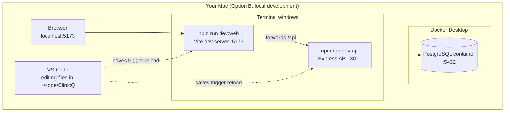

# Week 0: Setup and tour

[← Course home](README.md)

## 1. Goal

By the end of this week you will have:

- a Mac set up the way a developer's would be: Terminal, Git, Node.js, Docker Desktop and VS Code;
- ClinicQ cloned, running two ways (all in Docker, and as a local dev setup), and clicked through as a patient and as an admin;
- run every automated test and seen them pass;
- used the handful of terminal and Git commands you'll need every week;
- made your first change to ClinicQ by directing an AI, and thrown it away or kept it on a branch, safely.

Most of this week is doing, not reading.

## 2. Concept primer

### Terminal and shell

The **terminal** is a window where you type commands instead of clicking. The program inside it that reads your commands is the **shell**; on a Mac it's called `zsh`. Developers use the terminal because many tools (Git, npm, Docker) are built for it, and because a typed command can be copied, shared and repeated exactly. "Run `npm test`" is an instruction anyone can follow; "click the green thing" isn't.

A command is a program name followed by arguments. In `git clone https://github.com/...`, `git` is the program, `clone` is what you want it to do, and the URL is what to do it to. Arguments that start with `-` or `--` are **flags** (options), as in `git log --oneline`.

The shell always has a **current folder** (the _working directory_). Commands act on it unless you say otherwise. That's why most instructions start with `cd ClinicQ`.

### The tools you're installing, and why each exists

- **Git** records every change to the code as a _commit_. A commit is a snapshot with a message, an author and a time. Git lets several people work in parallel on _branches_ and merge their work later. **GitHub** is a website that hosts Git repositories and adds pull requests, code review and CI on top.
- **Node.js** runs JavaScript outside a browser. ClinicQ's API runs on it, and so do all the development tools: the TypeScript compiler, the test runner and the dev server. **npm** comes with Node. It downloads the libraries the project depends on (its _packages_) and runs the project's scripts.
- **Docker** packages a program together with everything it needs (operating system files, runtime, settings) into an **image**. A running copy of an image is a **container**. Docker is why "it works on my machine" becomes "it works on every machine": ClinicQ's database runs in a container, so you don't have to install PostgreSQL yourself.
- **VS Code** is a code editor: a text editor that understands code. It highlights syntax, shows type errors as you read, jumps to where a function is defined, and shows Git changes side by side.

### How ClinicQ runs on your Mac

You'll run ClinicQ in two ways. **Option A** puts all three parts in Docker containers. It's the quickest way to click around, and the closest to how it would run on a server. **Option B** runs only the database in Docker, while the API and the web app run directly on your Mac with Node. That's the developer setup: when you save a file, the running app reloads within a second.



**localhost** means "this computer". The number after the colon is the **port**: think of the computer as a building and ports as numbered doors, one per running program. ClinicQ uses:

- **5173**: the web app's dev server (Option B)
- **3000**: the API (both options)
- **8080**: the web app, served by nginx in Docker (Option A)
- **5432**: PostgreSQL (both options)

## 3. Setup on your Mac

Do these in order. Anything in a grey box is a command: type or paste it into Terminal and press Enter. Lines starting with `#` are comments; you don't need to type them.

### 3.1 Open Terminal and learn five commands

Open **Terminal**: press `Cmd+Space`, type `Terminal`, press Enter. Pin it to the Dock (right-click the icon → Options → Keep in Dock).

Try each of these:

```bash
pwd              # "print working directory": where am I?
ls               # list what's in this folder
mkdir -p ~/code  # make a folder called "code" in your home folder (~ means your home folder)
cd ~/code        # "change directory" into it
cd ..            # go up one folder; `cd ~/code` to come back
```

Four habits save a lot of time:

- `Tab` completes a file or folder name.
- The `↑` key brings back your previous commands.
- `Ctrl+C` stops the program that's running in this terminal. You'll use it to stop servers.
- `clear` (or `Cmd+K`) empties the screen.

If a command prints `command not found`, the program isn't installed, or the terminal was opened before it was installed. Open a new terminal window and try again.

### 3.2 Check which chip your Mac has

Apple menu → **About This Mac**. It says either **Chip: Apple M…** (Apple silicon) or **Processor: Intel**. Some downloads ask which one you have.

### 3.3 Install Homebrew, which also gives you Git

[Homebrew](https://brew.sh) is the standard way developers install command-line tools on a Mac. Paste the install command from the Homebrew home page. At the time of writing it is:

```bash
/bin/bash -c "$(curl -fsSL https://raw.githubusercontent.com/Homebrew/install/HEAD/install.sh)"
```

It will ask for your Mac password. Nothing appears while you type it; that's normal. It also installs Apple's Command Line Tools, which include **Git**.

On Apple silicon Macs, the installer ends with a **"Next steps"** section containing two or three commands that add `brew` to your PATH. PATH is the list of folders the shell searches for programs. **Copy and run those commands exactly as printed**, then open a new terminal window. Check:

```bash
brew --version
git --version
```

### 3.4 Tell Git who you are

Every commit records an author. Use the email address of your GitHub account:

```bash
git config --global user.name "Your Name"
git config --global user.email "you@example.com"
git config --global init.defaultBranch main
```

### 3.5 Install the GitHub CLI and log in

The GitHub CLI (`gh`) lets you log in to GitHub once, and then Git can clone and push without asking for a password each time.

```bash
brew install gh
gh auth login
```

Answer the questions: **GitHub.com** → **HTTPS** → **Yes** (authenticate Git with your GitHub credentials) → **Login with a web browser**. Copy the one-time code it shows, press Enter, and paste the code into the browser page that opens.

### 3.6 Install Node.js 22

ClinicQ uses Node.js 22; the file `.nvmrc` in the repo says so, and CI uses the same version. Go to [nodejs.org/en/download](https://nodejs.org/en/download), choose version **v22** (LTS) and **macOS**, and download the **installer (.pkg)**. Run it with the default options. Then, in a **new** terminal window:

```bash
node -v   # must print v22.22.0 or a later v22
npm -v
```

**Skim:** many developers use a version manager such as [nvm](https://github.com/nvm-sh/nvm) instead. It lets you switch Node versions per project, and running `nvm install` inside the repo reads `.nvmrc` automatically. You don't need it for this course, but you'll hear about it.

### 3.7 Install Docker Desktop

Download **Docker Desktop for Mac** from [docker.com/products/docker-desktop](https://www.docker.com/products/docker-desktop/). Pick **Apple chip** or **Intel chip** to match step 3.2. Open the downloaded `.dmg`, drag Docker to Applications, and start it from Applications. Accept the terms; you can skip signing in.

Docker must be **running** before any `docker` command works. You'll see a whale icon in the menu bar at the top of the screen. Check:

```bash
docker --version
docker compose version
```

### 3.8 Install VS Code

Download from [code.visualstudio.com](https://code.visualstudio.com), unzip it, and drag **Visual Studio Code** into Applications. Open it. Then:

1. Press `Cmd+Shift+P` to open the Command Palette. Type `shell command` and choose **Shell Command: Install 'code' command in PATH**. Now `code .` in Terminal opens the current folder in VS Code.
2. **Optional:** install an AI coding assistant for the Build with AI exercises. This course's examples use [Claude Code](https://code.claude.com/docs), which runs in the terminal and in VS Code; follow its install guide. Any assistant that can read and edit files in your repo will do.

### 3.9 Clone ClinicQ

"Cloning" downloads the repository, with its entire history, into a new folder.

```bash
cd ~/code
gh repo clone Vijayperi/ClinicQ
cd ClinicQ
code .
```

When VS Code opens, it will offer to install the **recommended extensions** for this workspace. Accept. They come from [`.vscode/extensions.json`](../../.vscode/extensions.json):

- **ESLint** and **Prettier**, which show lint problems and format on request;
- **Prisma**, which highlights `schema.prisma`;
- **Markdown Preview Mermaid Support**, which draws this course's diagrams in VS Code's preview;
- **Playwright Test**, which runs the browser test from the editor.

VS Code has a built-in terminal: **View → Terminal**, or `` Ctrl+` ``. It opens in the project folder. From now on you can use it instead of the Terminal app.

## 4. Run ClinicQ

### 4.1 Option A: everything in Docker

Make sure Docker Desktop is running, then from the `ClinicQ` folder:

```bash
docker compose up --build
```

The first run downloads base images and builds ClinicQ's two images, which takes a few minutes. Watch the logs scroll by: you'll see `db`, `api` and `web` prefixes, one per container. When you see a line from `api` saying it's listening, open a **second** terminal tab (`Cmd+T`) in the same folder and load the sample data:

```bash
npm run docker:seed
```

Open **http://localhost:8080** in Chrome.

To stop, press `Ctrl+C` in the first terminal, then run `docker compose down`. Your data survives in a Docker _volume_. `docker compose down -v` deletes it too.

**Master:** `docker compose up --build` rebuilds the images from the current code. Without `--build`, Docker reuses the images it built last time. After you pull new code, that means you'd be testing an old version (see the PA lens below).

### 4.2 Option B: the local development setup

Stop Option A first (`docker compose down`): both options use port 3000. Then:

```bash
# 1. Start only the database, in the background (-d = "detached")
docker compose up -d db

# 2. Download every package the project depends on (takes a minute or two)
npm install

# 3. Create the API's settings file from the template
cp apps/api/.env.example apps/api/.env
```

Open `apps/api/.env` in VS Code and replace the `JWT_SECRET` value with a long random string. This command prints one you can paste:

```bash
node -e "console.log(require('crypto').randomBytes(48).toString('hex'))"
```

Then:

```bash
# 4. Create the tables, then load the sample data
npm run db:migrate
npm run db:seed

# 5. Start the API (leave this terminal running)
npm run dev:api
```

Open a second terminal tab (`Cmd+T`) and start the web app:

```bash
npm run dev:web
```

Open **http://localhost:5173**.

You now have two servers running in two terminals. Their logs show every request: keep them visible while you click around.

## 5. Tour: click through every feature

Use Chrome and open its developer tools with `Cmd+Option+I`. Select the **Network** tab and the **Fetch/XHR** filter. Every time the app talks to the API, a row appears. Click a row to see its request and response. Week 1 explains what you're looking at; for now just notice that each click that loads or changes data makes a request.

Sample accounts:

- Admin: `admin@clinicq.test`, password `Admin123!`
- Patient: `alice@clinicq.test`, password `Password123!`
- Patient: `bob@clinicq.test`, password `Password123!`

Work through this list. Each item shows one feature or business rule from the brief.

1. **Doctors are public.** Without logging in, open **Doctors**. You see four doctors and their specialties.
2. **Booking needs a login.** Click **See available times**. You're sent to the login page. After logging in as Alice, you land back where you were going.
3. **Wrong password.** Log out, then log in as Alice with a wrong password. Notice the message doesn't say whether the email or the password was wrong. Week 6 explains why.
4. **Book an appointment.** As Alice, pick Dr. Chloe Nguyen, choose a time, confirm. You land on **My appointments** with a green confirmation.
5. **No double-booking.** The time you just booked no longer appears in Dr. Nguyen's list. Log in as Bob: it's not offered to him either.
6. **No booking in the past.** The earliest times offered are tomorrow's. Past slots are never listed.
7. **Cancel your own, more than 2 hours ahead.** As Alice, cancel the appointment. It moves to **Past and cancelled** with a grey badge.
8. **Only your own appointments.** As Bob, **My appointments** shows only Bob's. His cancelled seed appointment is there too.
9. **Admins see everything.** Log in as the admin. **All appointments** lists every patient's appointments with their status. Try the Status filter.
10. **Roles are enforced.** As Alice, type `localhost:5173/admin` (or `:8080/admin`) in the address bar. You're sent back to Doctors.
11. **Register.** Create a new patient. **My appointments** shows the empty state with a **Book an appointment** button.
12. **The API is just URLs.** Open **http://localhost:3000/api/doctors** in a new tab. That's the raw JSON the Doctors page is built from. **http://localhost:3000/health** is what Docker checks to see if the API is alive.

## 6. Run the tests

With the database running (Option B, step 1), from the `ClinicQ` folder:

```bash
npm test
```

This runs 52 tests in about ten seconds: 42 check the API and its business rules, and 10 check the web app's helpers. Every line should be green, ending with `passed`.

Then the browser test. It starts its own copies of the API and web app, logs in as Alice, books, views and cancels, just as you did by hand. The first time, download the browser it drives:

```bash
npx playwright install chromium
npm run test:e2e
```

Finally, the two quality checks that CI also runs:

```bash
npm run lint
npm run typecheck
```

Both print nothing alarming when all is well. Silence is success.

## 7. Git: the commands you'll use every week

```bash
git status                  # what have I changed?
git log --oneline -15       # the last 15 commits, one line each
git switch -c week-00-practice   # create a new branch and move onto it
```

Now change something small. Open `apps/web/src/pages/DoctorsPage.tsx` and change the text `Choose a doctor to see their available times.` to anything you like. Save. The browser at `localhost:5173` updates by itself.

```bash
git status                  # shows the file as "modified"
git diff                    # shows exactly what changed: - old line, + new line
git restore .               # throw away all uncommitted changes (careful: no undo)
git switch main             # go back to the main branch
git branch -D week-00-practice   # delete the practice branch
```

**Master:** `git status` and `git diff` before and after every change, whoever made it: you or an AI. They're the most important habit in this course.

## 8. Reading path

Read these files in order. Most are short. For each file: what it's for, and what breaks in real projects that don't have one.

1. [`README.md`](../../README.md) (**master**). How to install, run and test the project. _Why projects have one:_ without it, every new team member (or AI) has to reverse-engineer how to start the app, and each person ends up with a slightly different, broken setup.
2. [`.nvmrc`](../../.nvmrc) (**skim**). The Node.js version, `22`. _Why:_ different Node versions can behave differently. Pinning one means your laptop, your colleague's and CI all run the same thing.
3. [`docker-compose.yml`](../../docker-compose.yml) (**master the shape, skim the details**). The three containers and how they connect. _Why:_ it replaces a page of "install PostgreSQL, create a user, create a database…" instructions with one command, and makes every developer's database identical.
4. [`docker/db/init/01-create-databases.sql`](../../docker/db/init/01-create-databases.sql) (**skim**). Creates the two test databases. _Why:_ tests need their own database, so running them never wipes your development data.
5. [`.gitignore`](../../.gitignore) (**master the idea**). Files Git must never track. _Why:_ without it, people commit gigabytes of downloaded packages, build output, and, worst of all, `.env` files full of passwords and keys.
6. [`apps/api/.env.example`](../../apps/api/.env.example) (**master the idea**). A template of every setting the API needs. _Why:_ real settings (secrets) must stay out of Git, but newcomers still need to know which settings exist. The `.example` file is the committed, secret-free list.
7. [`PROGRESS.md`](../../PROGRESS.md) (**skim**). The log of every build session: what was built, which versions, what's known to be broken. _Why:_ decisions get forgotten. A written log answers "why is it like this?" months later. Real teams use architecture decision records, release notes and ticket history for the same job.
8. [`CLAUDE.md`](../../CLAUDE.md) (**skim**). The brief the AI follows when it works on this repo. _Why:_ an AI starts every session with no memory. This file is how the project's rules and goals reach it every time. It's a spec for the builder.

## 9. Block-by-block walkthrough: `docker-compose.yml`

This is the file behind Option A, and behind `docker compose up -d db` in Option B. It's written in **YAML**, a format for settings. Indentation shows what belongs to what (like a nested bullet list), `key: value` sets a value, a leading `-` starts a list item, and `#` starts a comment.

### The database service

```yaml
services:
  db:
    image: postgres:16-alpine
    environment:
      POSTGRES_USER: clinicq
      POSTGRES_PASSWORD: clinicq
      POSTGRES_DB: clinicq
    ports:
      - '${DB_PORT:-5432}:5432'
    volumes:
      - db-data:/var/lib/postgresql/data
      - ./docker/db/init:/docker-entrypoint-initdb.d:ro
    healthcheck:
      test: ['CMD-SHELL', 'pg_isready -U clinicq -d clinicq']
      interval: 5s
      timeout: 5s
      retries: 10
```

- **What it does:** it defines a container called `db` that runs PostgreSQL 16. It sets up a user `clinicq` (password `clinicq`) and a database `clinicq`, and makes it reachable on your Mac at port 5432. The data is kept in a named volume, so it survives restarts. It also runs the SQL files in `docker/db/init` the first time it starts, and it checks every 5 seconds whether the database is ready to accept connections.
- **Syntax decoded:**
  - `services:` is the list of containers.
  - `image: postgres:16-alpine` means: use the official `postgres` image, tag `16-alpine` (version 16, built on the small Alpine Linux).
  - `environment:` holds settings passed into the container.
  - `'${DB_PORT:-5432}:5432'` is `host:container`. The left side is the port on your Mac, the right side the port inside the container. `${DB_PORT:-5432}` means "use the `DB_PORT` variable if it's set, otherwise 5432".
  - `volumes:` connects storage. `db-data:/var/lib/…` stores the data in a Docker-managed volume. `./docker/db/init:/docker-entrypoint-initdb.d:ro` shares a folder from the repo into the container; `ro` means read-only.
  - `healthcheck:` is a command Docker runs repeatedly to decide whether the container is healthy.
- **Connects to:** the API's `DATABASE_URL`, in [`apps/api/.env.example`](../../apps/api/.env.example) for Option B and in the `api` service below for Option A. The tests connect to the databases created by [`01-create-databases.sql`](../../docker/db/init/01-create-databases.sql).
- **Dev-speak:** "Postgres runs in a container with a named volume, so data persists across restarts. Compose waits on its healthcheck before starting the API."

### The API service

```yaml
  api:
    build:
      context: .
      dockerfile: apps/api/Dockerfile
    environment:
      PORT: 3000
      DATABASE_URL: postgresql://clinicq:clinicq@db:5432/clinicq
      JWT_SECRET: ${JWT_SECRET:-local-docker-secret-change-me-0123456789abcdef}
      ...
    ports:
      - '3000:3000'
    depends_on:
      db:
        condition: service_healthy
```

- **What it does:** it builds the API's image from its Dockerfile, gives it its settings, exposes it on port 3000, and doesn't start it until the database is healthy.
- **Syntax decoded:**
  - `build:` means "build an image from a recipe" instead of downloading one. `context: .` sends the whole repo folder to the build, and `dockerfile:` says which recipe to use.
  - In `DATABASE_URL`, the host is **`db`**, the service name, not `localhost`. Inside Docker's network, containers find each other by service name.
  - `depends_on … condition: service_healthy` means "wait for the db healthcheck to pass".
  - `...` in this quote marks lines left out. It's not in the real file.
- **Connects to:** [`apps/api/Dockerfile`](../../apps/api/Dockerfile) (the recipe) and [`apps/api/src/config/env.ts`](../../apps/api/src/config/env.ts), which reads these variables and refuses to start if any are missing (Week 4).
- **Dev-speak:** "The API container gets its config through env vars; it resolves the database by its service name."

### The web service and the volume

```yaml
  web:
    build:
      context: .
      dockerfile: apps/web/Dockerfile
    ports:
      - '8080:80'
    depends_on:
      api:
        condition: service_healthy

volumes:
  db-data:
```

- **What it does:** it builds the web app into static files served by nginx, publishes nginx's port 80 as 8080 on your Mac, and waits for the API. The last block declares the named volume the database uses.
- **Syntax decoded:** `'8080:80'` follows the same `host:container` pattern as before. `volumes:` at the top level (not indented under a service) declares a volume that services can use.
- **Connects to:** [`apps/web/Dockerfile`](../../apps/web/Dockerfile) and [`apps/web/nginx.conf`](../../apps/web/nginx.conf). nginx forwards `/api/...` requests to `http://api:3000`, again by service name.
- **Dev-speak:** "Compose brings up db, api and web in dependency order; web is on 8080."

## 10. PA lens

**Environments are part of the acceptance criteria.** "Works on my machine" isn't done. For ClinicQ, "done" includes: a new person can follow the README and get the app running, and CI is green. When you write PBIs, the definition of done can say so explicitly, e.g. "README updated if setup changes".

**Test data is a product decision.** The seed script decides what UAT starts from: four doctors, three accounts, one of each appointment state. Good seed data covers every state you want to test. If an acceptance criterion mentions a state (a cancelled appointment, an admin), there should be seed data for it, or a documented way to create it.

**Refinement questions for this layer:**

- Which environment will UAT happen in, and which build or commit will be deployed there?
- What test accounts exist for each role? How do I reset test data between runs?
- Does this change need new seed data or a new setting (environment variable)? Is `.env.example` updated?
- Does this change affect setup? If so, is the README updated?

**Typical UAT bugs that come from this layer, not from the code:**

- **Testing an old build.** Starting Docker without `--build` after pulling new code, or a browser tab still showing old JavaScript. Before reporting a bug, rebuild and hard-refresh (`Cmd+Shift+R`).
- **Stale seed data.** "No available times for any doctor" usually means the seed is more than 7 days old (known issue in PROGRESS.md), not that booking is broken. Re-run the seed.
- **Time zones.** Seed slots are 09:00–12:00 **UTC**. In India they show as 14:30–17:30. A bug report that says "times are wrong" needs to state the time zone.
- **Wrong role, or a leftover login.** The app remembers your login in the browser. Testing "as a patient" while still logged in as admin gives confusing results. Check the name in the top right.
- **Port already in use.** Running Option A and B together, or another Postgres on 5432, makes a server fail to start. Read the first error in the terminal.

A good environment bug report says: which option (Docker or local), which commit (`git log --oneline -1`), which account, which time zone, and the exact steps.

## 11. Build with AI: add a doctor to the sample data

Your first change is deliberately small: one file, no business logic. The point is to practise the loop from the [course home](README.md#how-to-build-with-ai), not to write anything clever.

### The spec (write this yourself first)

```markdown
## Story

As a product analyst running UAT, I want a neurologist in the sample data,
so that I can demo booking with a fifth specialty.

## Acceptance criteria

- Given I run `npm run db:seed`, then the output says 5 doctors.
- Given I open the Doctors page, then I see "Dr. Farah Idris — Neurology"
  with the same kind of available times as the other doctors.
- Given the other four doctors, then their names, specialties and slots are unchanged.

## Out of scope

- No changes to the API, the web app, the database schema or the tests.

## Where I expect changes

- apps/api/prisma/seed.ts only.

## How I'll test it

- Automated: npm test and npm run test:e2e still pass.
- Manual: re-seed, open Doctors, book one of Dr. Idris's times as Alice.
```

### Example prompt

```text
In the ClinicQ repo, the sample data is created by apps/api/prisma/seed.ts.
Add one more doctor to it: Dr. Farah Idris, specialty Neurology. She should get
the same time slots as the existing doctors.

Constraints:
- Change only apps/api/prisma/seed.ts. Follow the existing pattern in that file.
- Don't change the schema, the API, the web app or any tests.
- Don't add packages.

Before editing, tell me in two or three sentences where you'll make the change
and why that's enough. After editing, show me the diff.
```

### Checklist for reviewing the diff

Run `git status` and `git diff`, then check:

- [ ] Exactly one file changed: `apps/api/prisma/seed.ts`.
- [ ] The change is one new line in the `DOCTORS` list, shaped exactly like the others: `{ name: '…', specialty: '…' }`.
- [ ] No other lines changed. Watch for reformatting, renamed variables and "improvements" you didn't ask for.
- [ ] The slot-creation code is untouched. It already loops over every doctor, so no change is needed there. If the AI changed it anyway, ask why.
- [ ] The "Seeded N doctors" message wasn't edited by hand. It's calculated from the list's length, so it will say 5 on its own.

### How to test it

```bash
git switch -c week-00-neurologist   # do the work on a branch
# ...ask the AI to make the change, review the diff...
npm run db:seed          # expect: Seeded 5 doctors, 210 slots, 3 users and 3 appointments.
npm test                 # all green
npm run test:e2e         # still green: it books with Dr. Chloe Nguyen, who is unchanged
```

In the app, check the Doctors page, then book one of Dr. Idris's times as Alice and cancel it.

Then decide: keep it (`git add -A` and `git commit -m "feat(api): add a neurologist to the seed data"`) or throw it away (`git restore .`). Either way, switch back with `git switch main`. Don't push it; pushing and pull requests come in Week 9.

**Why "210 slots"?** Each doctor gets 7 days × 6 half-hour slots = 42 slots, and 5 doctors × 42 = 210. Predicting a number before you run the command is a cheap, powerful test. If the output doesn't match your prediction, either the code or your understanding is wrong, and both are worth knowing.

## 12. Vocabulary

| Term                     | Meaning, and where it shows up in ClinicQ                                                                                               |
| ------------------------ | --------------------------------------------------------------------------------------------------------------------------------------- |
| Terminal / shell         | The window where you type commands, and the program (`zsh`) that runs them. Everything in the README is a shell command.                |
| Working directory        | The folder the shell is "in"; commands act on it. Most ClinicQ commands expect the `ClinicQ` folder.                                    |
| Repository (repo)        | A project folder whose full history Git tracks. `Vijayperi/ClinicQ` on GitHub.                                                          |
| Clone                    | Download a repo with its history: `gh repo clone Vijayperi/ClinicQ`.                                                                    |
| Commit                   | A saved snapshot of changes with a message, like `feat(api): add a neurologist to the seed data`.                                       |
| Branch                   | A separate line of work. You make changes on `week-00-neurologist`, and `main` stays clean.                                             |
| Diff                     | The exact lines added and removed. `git diff` shows it; reviewing it is your main job in Build with AI.                                 |
| Node.js                  | The program that runs JavaScript outside a browser. It runs ClinicQ's API and all the dev tools.                                        |
| npm / package            | npm is Node's package manager. A package is a downloaded library, like Express or React, listed in `package.json`.                      |
| Script                   | A named command in `package.json` that you run with `npm run <name>`, e.g. `npm run dev:api`.                                           |
| Docker image / container | An image is a packaged program plus its environment (`postgres:16-alpine`). A container is a running copy of an image (`clinicq-db-1`). |
| Docker Compose           | Runs several containers together from `docker-compose.yml`: db, api and web.                                                            |
| localhost / port         | `localhost` is this computer. A port is one program's "door" on it: 5173 web (dev), 8080 web (Docker), 3000 API, 5432 database.         |
| Environment variable     | A setting given to a program from outside its code, like `DATABASE_URL` and `JWT_SECRET` in `apps/api/.env`.                            |
| Seed data                | Sample data loaded by `npm run db:seed`: 4 doctors, 168 slots, 3 users, 3 appointments.                                                 |

## 13. Quiz

1. You pulled new code and ran `docker compose up`, but your colleague's new feature isn't there. What's the most likely reason, and the fix?
2. You're about to read and change code this week. Which option do you run, A or B, and why?
3. Why is `apps/api/.env` ignored by Git while `apps/api/.env.example` is committed?
4. You booked three appointments yesterday, then ran `npm run db:seed` today. Where are your three appointments?
5. Inside Docker, the API connects to the database at host `db`. On your Mac, in Option B, it connects to `localhost`. Why the difference?

<details>
<summary>Answers</summary>

1. Without `--build`, Docker reuses the images it built last time, which contain the old code. Run `docker compose up --build`. (Hard-refresh the browser too, with `Cmd+Shift+R`.)
2. Option B. The API and web app run directly on your Mac and reload when you save a file, so you see the effect of a change in about a second. Option A needs a rebuild after every change.
3. `.env` holds real settings, including secrets like `JWT_SECRET`. Committing it would publish them to everyone with access to the repo, forever (Git keeps history). `.env.example` lists the same setting names with safe placeholder values, so newcomers know what to configure.
4. Gone. The seed deletes all existing data before loading the sample data (see the comment in `apps/api/prisma/seed.ts`). That's why it refuses to run in production.
5. Inside Docker's network, each container is reachable by its service name from `docker-compose.yml`, so `db` means "the database container". In Option B the API runs on your Mac, where the database is published on port 5432 of `localhost`.

</details>

---

Next: **Week 1: The big picture** _(coming soon)_. Client and server, HTTP, JSON, and the life of the request you just watched in the Network tab.
