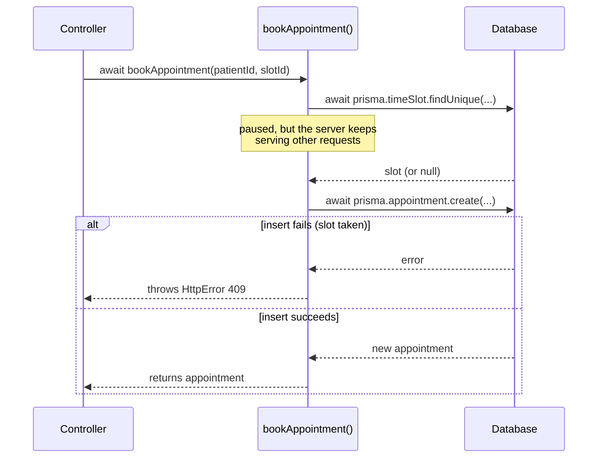

# Week 2: TypeScript as it appears in ClinicQ

[← Course home](README.md) · [Previous: Week 1](week-01.md)

## 1. Goal

By the end of this week you can:

- read any ClinicQ file and name what each symbol is doing: a type, a function, an object, an import, an `await`;
- read a TypeScript type (like `Appointment`) and picture the JSON it describes;
- follow an `async` function line by line, including what happens when something inside it fails;
- use the TypeScript checker as a reviewer: understand what a red squiggle is telling you;
- make a small, typed change with AI and review it.

This is not a programming course. The aim is **reading fluency**, not writing from scratch. Every example comes from ClinicQ's own code.

## 2. Concept primer

### JavaScript and TypeScript

**JavaScript** is the language browsers run, and Node.js runs it on servers. **TypeScript** is JavaScript plus **types**: labels that say what kind of value something holds. Before the code runs, the TypeScript compiler (`tsc`) checks that values are used consistently. Then the types are stripped away and plain JavaScript runs.

Why bother? Look at this line from the web app:

```ts
slot: Slot & { doctor: Doctor };
```

It says that every appointment has a slot, and that slot has a doctor. Now if someone writes `appointment.slot.docter.name` (a typo), TypeScript refuses before anyone opens the browser. Without types, that typo would be a blank screen found in UAT. Types are **executable documentation**: they describe the data, and the compiler makes sure the description stays true.

**Master:** types exist only while developing. They cannot check data that arrives from outside, such as a request body or a form. That's why the API _also_ validates input at runtime with Zod (Week 4). "The type says it's a string" means "our code promises it's a string", not "the user sent a string".

### Values and names

- `const` names a value that won't be reassigned. It's used almost everywhere: `const user = getAuthUser(req);`.
- `let` names a value that can change: `let response: Response;` in the API client.
- Strings: `'single'`, `"double"`, or `` `template ${withValues}` ``.
- Numbers, booleans (`true`/`false`), `null` ("deliberately empty") and `undefined` ("not set").
- Objects `{ name: 'Dr. Test', specialty: 'Cardiology' }` and arrays `[1, 2, 3]`, the same shapes as the JSON in Week 1.

### Types you'll see

<!-- example -->

```ts
let count: number; // a number
let name: string; // text
let done: boolean; // true or false
let cancelledAt: string | null; // a string OR null (a "union")
let role: 'PATIENT' | 'ADMIN'; // only one of these two exact strings
let ids: string[]; // an array of strings
let groups: [string, Slot[]][]; // an array of pairs: [day label, slots on that day]
```

**`interface`** and **`type`** give a name to an object shape, so it can be reused. `?` marks a field as optional. `extends` means "everything that one has, plus more".

### Functions

<!-- example -->

```ts
// A function declaration: name, parameters with types, return type.
function isInPast(startsAt: Date, now: Date): boolean {
  return startsAt.getTime() <= now.getTime();
}

// An arrow function: the same idea, shorter, often passed to other functions.
const double = (n: number) => n * 2;
```

A parameter can have a **default**, as in `now = new Date()`. If the caller doesn't pass it, the default is used. ClinicQ uses this so tests can pass a fixed "now" while real code uses the current time.

### Modules: import and export

Each file is a **module**. `export` makes something visible to other files; `import` uses it.

- `import { prisma } from '../lib/prisma.js'` is a **named import**: one specific export.
- `import express from 'express'` is a **default import**: the module's main export.
- `import * as authService from '../services/auth.service.js'` gathers every export under one name, so you write `authService.login(...)`.
- `import type { User } from '../types'` imports only a type. It disappears when the code is compiled.

Paths starting with `./` or `../` are files in this repo; bare names like `'express'` are packages from `node_modules`. The API imports end in `.js` even though the files are `.ts`. That's Node's rule: the path must name the file that will exist after compiling. The web app doesn't need this, because Vite resolves the files itself.

### Asynchronous code: promises and `await`

Talking to a database or a server takes time. Rather than freezing while it waits, JavaScript starts the work and gets back a **promise**: an object that will later hold either a result or an error.

- `async function` marks a function that works with promises. It always returns a promise.
- `await somePromise` pauses _this function_ until the promise settles, then gives you the result. If the promise failed, `await` throws the error.
- `try { ... } catch (err) { ... }` catches errors thrown inside `try`, including ones from `await`.



You'll also see the older style, `promise.then(result => ...).catch(err => ...)`, in [`hooks.ts`](../../apps/web/src/hooks.ts). It means the same thing, written as callbacks.

### Small symbols with big meanings

- `a?.b` (**optional chaining**): "`a.b`, unless `a` is null or undefined; then just undefined". Used in `header?.startsWith('Bearer ')`.
- `a ?? b` (**nullish coalescing**): "`a`, unless it's null or undefined; then `b`".
- `===` and `!==`: strict equals and not-equals. You'll almost never see `==`.
- `&&` and `||`: "and" and "or". `!` means "not".
- `...` (**spread**): "copy everything from here into this new object or array".
- `{ a, b } = obj` (**destructuring**): take the fields `a` and `b` out of `obj` as variables.
- `value as Type` (**type assertion**): "trust me, it's this type". It's a promise the compiler can't check, so every `as` deserves a second look in review.

## 3. Reading path

1. [`apps/web/src/types.ts`](../../apps/web/src/types.ts) (**master**). The shapes of the API's data. _Why real projects have it:_ one shared description of the data, so every page agrees on field names, and a typo is a compile error instead of a blank screen.
2. [`apps/api/src/services/appointment.rules.ts`](../../apps/api/src/services/appointment.rules.ts) (**master**). Small typed functions holding the time rules. _Why:_ pure functions (no database, no clock of their own) are the easiest code to read and to test.
3. [`apps/web/src/utils/appointments.ts`](../../apps/web/src/utils/appointments.ts) (**master**). The same kind of functions on the web side, with default parameters.
4. [`apps/web/src/api/auth.ts`](../../apps/web/src/api/auth.ts) (**master**). Imports, exports, an interface and generic calls.
5. [`apps/api/src/services/auth.service.ts`](../../apps/api/src/services/auth.service.ts) (**master**). `async`/`await` and throwing errors, in real business logic.
6. [`apps/api/src/errors/HttpError.ts`](../../apps/api/src/errors/HttpError.ts) (**skim**). A class: a template for making objects.
7. [`apps/web/src/api/client.ts`](../../apps/web/src/api/client.ts) (**skim**). `try`/`catch`, `?.`, `??` and generics working together.
8. [`apps/web/src/utils/format.ts`](../../apps/web/src/utils/format.ts) (**skim**). A generic function and a `Map`.
9. [`tsconfig.base.json`](../../tsconfig.base.json) (**skim**). The compiler settings. `"strict": true` turns on the strictest checks. _Why:_ without strict mode, TypeScript lets many mistakes through, like forgetting that a value might be `null`.

## 4. Block-by-block walkthrough

### Types for the API's data (`types.ts`)

```ts
export type Role = 'PATIENT' | 'ADMIN';
export type AppointmentStatus = 'BOOKED' | 'CANCELLED';
```

- **What it does:** it defines two types that only allow specific strings. A role is either `'PATIENT'` or `'ADMIN'`; nothing else compiles.
- **Syntax decoded:** `type X = ...` names a type. `|` means "or". A string in quotes used as a type is a **literal type**: that exact text and nothing else. `export` makes it importable.
- **Connects to:** the API's `Role` and `AppointmentStatus` enums in [`schema.prisma`](../../apps/api/prisma/schema.prisma) (Week 5). The two must agree, and nothing forces them to (see the PA lens).
- **Dev-speak:** "Status is a string-literal union, so a typo like `'CANCELED'` won't compile."

```ts
export interface Appointment {
  id: string;
  status: AppointmentStatus;
  createdAt: string;
  cancelledAt: string | null;
  slot: Slot & { doctor: Doctor };
}

export interface AdminAppointment extends Appointment {
  patient: { id: string; name: string; email: string };
}
```

- **What it does:** it describes the JSON the API sends for an appointment, and for the admin view, the same plus the patient.
- **Syntax decoded:**
  - `interface Name { field: type; }` describes an object's shape.
  - `string | null` means `cancelledAt` is a string, or `null` when it was never cancelled.
  - `Slot & { doctor: Doctor }` is an **intersection**: everything a `Slot` has, and a `doctor` field too.
  - `extends Appointment` copies every field of `Appointment` into `AdminAppointment`.
  - Dates are `string`, not `Date`, because JSON has no date type (Week 1).
- **Connects to:** every page that shows appointments (`MyAppointmentsPage.tsx`, `AdminAppointmentsPage.tsx`) and the API functions in [`api/appointments.ts`](../../apps/web/src/api/appointments.ts). On the API side, the matching shape is `appointmentInclude` in [`appointments.service.ts`](../../apps/api/src/services/appointments.service.ts).
- **Dev-speak:** "The admin DTO extends the appointment DTO with patient info." (**DTO**, _data transfer object_, is jargon for "the shape of data sent over the wire".)

### Pure functions with types (`appointment.rules.ts`)

```ts
export const CANCELLATION_CUTOFF_HOURS = 2;
const CANCELLATION_CUTOFF_MS = CANCELLATION_CUTOFF_HOURS * 60 * 60 * 1000;
```

- **What it does:** it defines the 2-hour rule once, in hours (for messages) and in milliseconds (for arithmetic).
- **Syntax decoded:** `const NAME = value` with UPPER_CASE is the convention for fixed settings. Only the first is `export`ed; the second is private to this file. `*` is multiply. Time in JavaScript is counted in milliseconds.
- **Connects to:** [`appointments.service.ts`](../../apps/api/src/services/appointments.service.ts), which uses the hours in its error message.
- **Dev-speak:** "No magic numbers: the cutoff is a named constant."

```ts
export function isOutsideCancellationWindow(startsAt: Date, now: Date): boolean {
  return startsAt.getTime() - now.getTime() > CANCELLATION_CUTOFF_MS;
}
```

- **What it does:** it answers "is the appointment more than 2 hours away?" with `true` or `false`.
- **Syntax decoded:** `(startsAt: Date, now: Date)` are two parameters, both of type `Date`. `: boolean` after the parentheses is the **return type**. `.getTime()` turns a date into milliseconds, so two dates can be subtracted. `>` is "greater than": strictly more, so exactly 2 hours gives `false`.
- **Connects to:** `cancelAppointment` in [`appointments.service.ts`](../../apps/api/src/services/appointments.service.ts), and the boundary tests in [`appointment.rules.test.ts`](../../apps/api/tests/appointment.rules.test.ts).
- **Dev-speak:** "It's a pure function; `now` is injected so it's deterministic in tests."

### Default parameters (`utils/appointments.ts`)

```ts
export function canCancel(appointment: Appointment, now = new Date()): boolean {
  const msUntilStart = new Date(appointment.slot.startsAt).getTime() - now.getTime();
  return appointment.status === 'BOOKED' && msUntilStart > CANCELLATION_CUTOFF_MS;
}
```

- **What it does:** it decides whether the Cancel button should show: the appointment is still booked **and** it's more than 2 hours away.
- **Syntax decoded:**
  - `now = new Date()` is a default parameter. Pages call `canCancel(appointment)`, and tests call `canCancel(appointment, fixedTime)`.
  - `new Date(appointment.slot.startsAt)` turns the ISO string from the API into a `Date`.
  - `&&` means both conditions must be true.
- **Connects to:** [`MyAppointmentsPage.tsx`](../../apps/web/src/pages/MyAppointmentsPage.tsx) (uses it) and [`appointments.test.ts`](../../apps/web/src/utils/appointments.test.ts) (tests it). It duplicates the API rule, a known issue in `PROGRESS.md`.
- **Dev-speak:** "The UI mirrors the server rule for UX; the server is still the source of truth."

### Imports, interfaces and generics (`api/auth.ts`)

```ts
import type { User } from '../types';
import { apiRequest } from './client';

interface AuthResponse {
  token: string;
  user: User;
}

export function login(email: string, password: string) {
  return apiRequest<AuthResponse>('/auth/login', { method: 'POST', body: { email, password } });
}
```

- **What it does:** `login` sends the email and password to `POST /api/auth/login` and returns a promise of `{ token, user }`.
- **Syntax decoded:**
  - `import type` brings in only the `User` type.
  - `interface AuthResponse` isn't exported: it's used only in this file.
  - `apiRequest<AuthResponse>(...)` is a **generic** call. The `<...>` tells `apiRequest` what shape the response will have, so the caller gets a typed result.
  - `{ email, password }` is shorthand for `{ email: email, password: password }`.
  - There's no `: ReturnType` after the parameters, because TypeScript works it out (**type inference**). Here it's `Promise<AuthResponse>`.
- **Connects to:** [`AuthContext.tsx`](../../apps/web/src/auth/AuthContext.tsx), which calls `authApi.login(...)`, and [`client.ts`](../../apps/web/src/api/client.ts), which does the HTTP work.
- **Dev-speak:** "The client is generic over the response type, so each call site gets a typed payload."

### `async`, `await` and `throw` (`auth.service.ts`)

```ts
export async function register(input: RegisterInput) {
  const existing = await prisma.user.findUnique({ where: { email: input.email } });
  if (existing) {
    throw new HttpError(409, 'EMAIL_TAKEN', 'An account with this email already exists');
  }

  const passwordHash = await bcrypt.hash(input.password, SALT_ROUNDS);
```

- **What it does:** it looks up the email. If an account already exists, it stops with a 409 error. Otherwise it hashes the password (Week 6) and carries on to create the user.
- **Syntax decoded:**
  - `async function` means this function returns a promise.
  - `await prisma.user.findUnique(...)` waits for the database. The result is a user or `null`.
  - `if (existing)` is true when `existing` is an object and false when it's `null`.
  - `throw new HttpError(...)` stops the function immediately and hands the error to whoever called it.
  - `input.email` reads a field from the `input` object.
- **Connects to:** [`auth.controller.ts`](../../apps/api/src/controllers/auth.controller.ts) (calls it), [`HttpError.ts`](../../apps/api/src/errors/HttpError.ts) (the error) and [`errorHandler.ts`](../../apps/api/src/middleware/errorHandler.ts), which turns the thrown error into the HTTP response.
- **Dev-speak:** "Guard clause: fail fast with a 409 if the email exists, then do the happy path."

```ts
export async function login(input: LoginInput) {
  const user = await prisma.user.findUnique({ where: { email: input.email } });
  const passwordMatches = user ? await bcrypt.compare(input.password, user.passwordHash) : false;
```

- **What it does:** it finds the user, then checks the password only if a user was found.
- **Syntax decoded:** `condition ? a : b` is the **ternary operator**: "if condition then `a`, else `b`". Here it means "if there's a user, compare the password; otherwise `false`".
- **Connects to:** the same controller and error handler as `register`.
- **Dev-speak:** "Short-circuit the compare when there's no user."

### Types from validation schemas (`auth.schema.ts`)

```ts
export type RegisterInput = z.infer<typeof registerSchema>;
```

- **What it does:** it creates the `RegisterInput` type _from_ the Zod schema that validates the request body. The runtime check and the compile-time type can therefore never disagree.
- **Syntax decoded:** `typeof registerSchema` means "the type of this value". `z.infer<...>` is a generic from Zod that says "the type of data this schema accepts".
- **Connects to:** `register(input: RegisterInput)` in [`auth.service.ts`](../../apps/api/src/services/auth.service.ts), and the schema itself in [`auth.schema.ts`](../../apps/api/src/schemas/auth.schema.ts) (Week 4).
- **Dev-speak:** "The input type is inferred from the Zod schema: single source of truth."

### A class (`HttpError.ts`)

```ts
export class HttpError extends Error {
  status: number;
  code: string;
  details?: unknown;

  constructor(status: number, code: string, message: string, details?: unknown) {
    super(message);
    this.name = 'HttpError';
    this.status = status;
    this.code = code;
    this.details = details;
  }
}
```

- **What it does:** it defines a kind of error that carries an HTTP status and a code, like `409` and `SLOT_ALREADY_BOOKED`, on top of the normal message.
- **Syntax decoded:**
  - `class` is a template for making objects; `new HttpError(...)` makes one.
  - `extends Error` makes it a special kind of built-in `Error`.
  - The `constructor` runs when one is made, and `super(message)` runs the `Error` part first.
  - `this` is the object being made.
  - `details?: unknown`: the `?` means optional, and `unknown` means "could be anything; check before use".
- **Connects to:** every service (they `throw new HttpError(...)`) and [`errorHandler.ts`](../../apps/api/src/middleware/errorHandler.ts), which checks `err instanceof HttpError`.
- **Dev-speak:** "Domain errors are typed; the error middleware maps them to responses."

### `try`/`catch`, `?.` and `??` together (`client.ts`)

```ts
const data = await response.json().catch(() => null);
```

```ts
if (!response.ok) {
  throw new ApiError(
    response.status,
    data?.error?.code ?? 'UNKNOWN_ERROR',
    data?.error?.message ?? 'Something went wrong',
  );
}
```

- **What it does:** it reads the response body as JSON (or `null` if it isn't JSON). If the status isn't 2xx, it throws an `ApiError` using the API's error code and message, with safe fallbacks when they're missing.
- **Syntax decoded:**
  - `.catch(() => null)` means "if reading JSON fails, use `null` instead of crashing".
  - `response.ok` is true for any 2xx status.
  - `data?.error?.code` reads `data.error.code` safely even when `data` or `error` is missing.
  - `?? 'UNKNOWN_ERROR'` provides the fallback when the value is missing.
- **Connects to:** every page's error display via [`ErrorMessage.tsx`](../../apps/web/src/components/ErrorMessage.tsx); the error shape comes from the API's [`errorHandler.ts`](../../apps/api/src/middleware/errorHandler.ts).
- **Dev-speak:** "Defensive parsing: never trust the error body's shape."

### A generic helper (`format.ts`, **skim**)

```ts
export function groupByDay<T>(items: T[], getDate: (item: T) => string): [string, T[]][] {
  const groups = new Map<string, T[]>();
  for (const item of items) {
    const day = formatDay(getDate(item));
    groups.set(day, [...(groups.get(day) ?? []), item]);
  }
  return [...groups.entries()];
}
```

- **What it does:** it takes a list (of slots, say) and returns them grouped by calendar day: `[["Monday, September 28", [slot, slot]], ...]`, keeping the order.
- **Syntax decoded:**
  - `<T>` is a **type parameter**: "this works for items of any type `T`".
  - `getDate: (item: T) => string` is a parameter that is itself a function.
  - A `Map` is a lookup table from keys to values.
  - `for (const item of items)` loops over every item.
  - `[...list, item]` makes a new array with `item` added.
- **Connects to:** [`BookAppointmentPage.tsx`](../../apps/web/src/pages/BookAppointmentPage.tsx), which groups slots under day headings.
- **Dev-speak:** "A small generic utility; it's reusable for anything with a date."

## 5. PA lens

**Types are the data dictionary, in code.** When you write acceptance criteria that mention a field ("cancelled date", "status"), check the type in [`types.ts`](../../apps/web/src/types.ts) or the Prisma schema for its real name and whether it can be empty. `cancelledAt: string | null` tells you that a booked appointment has no cancelled date. An AC that says "show the cancelled date for every appointment" is impossible as written.

**Unions are the list of allowed states.** `AppointmentStatus = 'BOOKED' | 'CANCELLED'` is the entire state model. A new state, like "No-show" or "Completed", is not a small change. Every place that switches on status must handle it, and TypeScript will point out many (not all) of them.

**Refinement questions for this layer:**

- Can this field be empty? What does the screen show when it is (`null` → "—"? hidden?)
- Is this a new status or state? Which screens and rules need to know about it?
- Is this date stored in UTC and shown in local time? Whose local time: patient's, clinic's?
- Does the same type exist on both sides (API and web)? Who keeps them in sync?

**Typical UAT bugs from this layer:**

- **"Invalid Date" or a blank date.** A string was passed where a date was expected, or a field is `null`.
- **"undefined" or "null" shown as text.** An optional field was displayed without a fallback.
- **A new status shows as blank or breaks a filter.** The API added a value the web app's union doesn't know about. The types disagreed, and nothing checked across the two apps.
- **Off-by-one boundaries.** `>` vs `>=` (exactly 2 hours). Types can't catch these; tests can.

## 6. Build with AI: show the appointment's time range

The difficulty goes up this week: a new typed function, a unit test for it, and a change to a page.

### The spec

```markdown
## Story

As a patient, I want to see when my appointment ends as well as when it starts,
so that I can plan my day.

## Acceptance criteria

- Given an appointment from 10:00 to 10:30, when I view My appointments,
  then the row shows the start date and time, and the end time, e.g. "Mon, Sep 28, 10:00 AM – 10:30 AM".
- Times are shown in my local time zone, in the same format as today.
- Cancelled and past appointments show the range too.

## Out of scope

- The admin page, the booking page, the API.

## Where I expect changes

- apps/web/src/utils/format.ts: a new function formatTimeRange(startsAt, endsAt)
- apps/web/src/utils/format.test.ts: a new test file for it
- apps/web/src/pages/MyAppointmentsPage.tsx: use it in the row

## How I'll test it

- Automated: npm test --workspace apps/web; npm run typecheck
- Manual: My appointments shows "… – 10:30 AM" for a 10:00 slot.
```

### Example prompt

```text
In ClinicQ's web app (apps/web), add a function to src/utils/format.ts:

  formatTimeRange(startsAt: string, endsAt: string): string

It returns formatDateTime(startsAt) + " – " + formatTime(endsAt), reusing the existing
functions in that file. Add src/utils/format.test.ts with Vitest tests that build the
expected string from formatDateTime and formatTime (so the tests don't depend on the
machine's locale). Then use it in src/pages/MyAppointmentsPage.tsx wherever the row
shows the appointment time.

Constraints: TypeScript types on the parameters and return value; no new packages;
don't change other pages or the API. Tell me your plan first, then show the diff.
```

### Checklist for reviewing the diff

- [ ] Three files changed, matching your prediction. Anything else needs a reason.
- [ ] `formatTimeRange` has typed parameters (`string`) and a `: string` return type, and it reuses `formatDateTime` and `formatTime` rather than copying their code.
- [ ] The test builds the expected text with the same helpers, not a hard-coded "10:00 AM", which would fail on a machine set to a 24-hour locale.
- [ ] The page change is only the time display. Nothing else in `MyAppointmentsPage.tsx` moved.
- [ ] There is no `as` or `any` added to silence the compiler.
- [ ] The test file matches the test `include` pattern in `vite.config.ts` (`src/**/*.test.ts`), or it won't run at all. Check that the run's test count went up.

### How to test it

```bash
npm test --workspace apps/web    # the new tests run and pass; count goes up
npm run typecheck
npm run lint
```

Then, in the running app, check My appointments: upcoming and cancelled rows both show the range. As an experiment, break the type on purpose: call `formatTimeRange(123, 'x')` in the page, and watch VS Code and `npm run typecheck` complain. Then undo it.

## 7. Vocabulary

| Term                      | Meaning, and where it shows up in ClinicQ                                                                        |
| ------------------------- | ---------------------------------------------------------------------------------------------------------------- |
| Type                      | A label for what kind of value something is: `string`, `boolean`, `Appointment`. Checked before the code runs.   |
| Interface                 | A named object shape, like `interface Doctor { id: string; name: string; specialty: string }` in `types.ts`.     |
| Union type                | "One of these": `'BOOKED' \| 'CANCELLED'`, `string \| null`.                                                     |
| Literal type              | An exact value used as a type, such as `'PATIENT'`.                                                              |
| Optional (`?`)            | A field or parameter that may be missing, like `details?: unknown` in `HttpError`.                               |
| Type inference            | TypeScript working out a type you didn't write, such as the return type of `login()`.                            |
| Generic                   | A type parameter `<T>` that makes code work for many types: `apiRequest<T>`, `useApiData<T>`, `groupByDay<T>`.   |
| Function / arrow function | Named reusable code (`function canCancel(...)`) or the short form `(x) => ...`, often passed to other functions. |
| Default parameter         | A value used when the caller omits an argument: `now = new Date()`.                                              |
| Module / import / export  | Each file is a module; `export` shares, `import` uses: `import { prisma } from '../lib/prisma.js'`.              |
| Promise                   | A placeholder for a result that arrives later, like a database query or a `fetch`.                               |
| `async` / `await`         | Mark a function as working with promises / pause until one settles. Used in every service.                       |
| `try` / `catch` / `throw` | Throw an error to stop; catch it higher up. Services throw `HttpError`; the error handler catches.               |
| Class                     | A template for objects, like `class HttpError extends Error`.                                                    |
| Strict mode               | `"strict": true` in `tsconfig.base.json`: the compiler's strictest checks, including null safety.                |

## 8. Quiz

1. In `Appointment`, why is `cancelledAt` typed `string | null` instead of `Date`?
2. What would happen if a page did `appointment.status === 'CANCELED'` (one L)?
3. `canCancel(appointment, now = new Date())`: why does `now` have a default instead of the function just calling `new Date()` inside?
4. In `register`, what happens to the rest of the function when `throw new HttpError(409, ...)` runs, and who ends up handling the error?
5. The request body type `RegisterInput` says `email` is a string. Does that guarantee the API never receives a number as the email? Why or why not?

<details>
<summary>Answers</summary>

1. JSON has no date type, so the API sends dates as ISO strings. It's `null` because an appointment that was never cancelled has no cancelled time.
2. TypeScript reports an error: the comparison can never be true, because `'CANCELED'` isn't one of the allowed literal types. That typo can't reach UAT.
3. So tests can pass a fixed time and get the same answer every run, including exactly-2-hours cases. Real code calls `canCancel(appointment)` and gets the current time.
4. The function stops immediately: no password hashing, no user created. The error travels up to the controller, out of it (Express 5 passes it along automatically, Week 3), and into `errorHandler`, which sends `409` with `EMAIL_TAKEN`.
5. No. Types are only checked at compile time, against our own code. The request comes from outside and could contain anything. That's why the Zod schema validates the body at runtime before the service ever sees it. The type is derived from the schema, so after validation the promise holds.

</details>

---

Next: [Week 3: Backend I](week-03.md)
