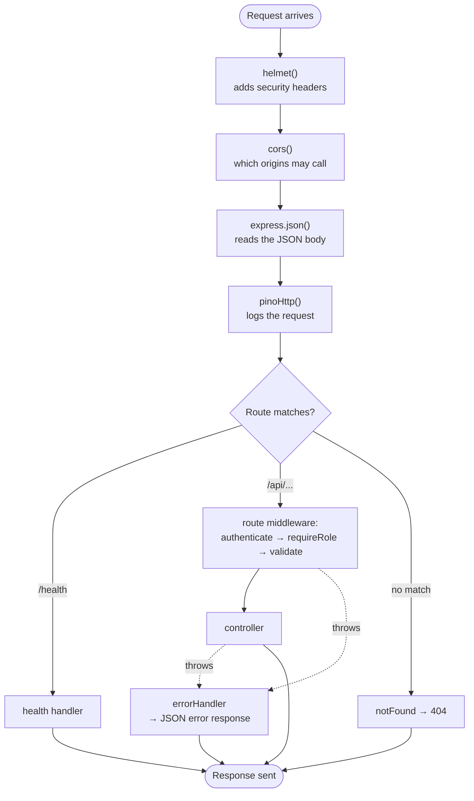

# Week 3: Backend I (Express, routes, controllers, middleware)

[← Course home](README.md) · [Previous: Week 2](week-02.md)

## 1. Goal

By the end of this week you can:

- trace any API request through `server.ts` → `app.ts` → a route file → middleware → a controller, naming each file on the way;
- explain what middleware is, and why the order of `app.use(...)` lines matters;
- say which status code ClinicQ returns for every situation, and why;
- read a route file and tell, without running anything, who may call each endpoint and what gets checked first;
- add a new read-only endpoint by directing an AI, with tests.

## 2. Concept primer

### What Express does

Node.js can receive raw HTTP on its own, but raw HTTP is tedious: you'd have to parse URLs, read bodies in chunks and set headers by hand. **Express** is a small framework that does the plumbing. You tell it "for `GET /api/doctors`, run this function", and it gives that function two objects:

- `req` (**request**): what came in, such as `req.params`, `req.body`, `req.headers` and, after login checks, `req.user`.
- `res` (**response**): what you send back, using `res.status(201)`, `res.json({...})`.

ClinicQ uses Express 5. Version 5 matters for one detail: if an `async` handler throws, Express 5 automatically passes the error to the error handler. Express 4 didn't, and code written for it wraps every handler to do this by hand. AI assistants trained on older examples still sometimes add those wrappers. Now you'll recognise them as unnecessary here.

### Middleware: a pipeline

**Middleware** is a function that sits in the path of a request. It can look at the request, change it, reject it, or pass it on by calling `next()`. Express runs middleware **in the order it was added**, like stations on an assembly line:



Two kinds of middleware appear in ClinicQ:

- **Global middleware**, added with `app.use(...)` in [`app.ts`](../../apps/api/src/app.ts), runs for every request.
- **Route middleware**, listed in a route definition, runs only for that route: `router.post('/', validate(...), controller.book)`.

A middleware stops the pipeline either by sending a response or by **throwing**. Throwing skips everything else and jumps straight to the **error handler**, the last `app.use` in `app.ts`.

### Layers: why a request passes through so many files

ClinicQ's backend is **layered**. Each layer does one kind of job and only talks to the layer below it:

- **Routes** map a URL and method to a list of middleware plus a controller. They're a table of contents with no logic.
- **Middleware** answers "may this request continue?": is the user logged in, do they have the right role, is the input valid?
- **Controllers** translate between HTTP and plain function calls. They read `req`, call a service, and choose the status code.
- **Services** hold the business logic and rules, and talk to the database (Week 4).
- **Prisma** turns function calls into SQL (Week 5).

Why not do it all in one function? Because each layer then changes for its own reasons. A new business rule touches a service, not the URL table. A new URL doesn't touch the business logic. And services can be tested without HTTP at all. This is the **separation of concerns** you'll hear about in reviews.

### Status codes ClinicQ uses

Every error response has the same JSON shape: `{"error": {"code": "...", "message": "..."}}`. The **code** is stable, and the frontend and tests rely on it. The **message** is human-readable, and could change or be translated.

- **200 OK**: read or updated successfully (list doctors, cancel).
- **201 Created**: something new exists now (register, book).
- **400 Bad Request**: the request is malformed. `VALIDATION_ERROR` (fields missing or wrong), `INVALID_JSON`.
- **401 Unauthorized**: not logged in, or the token is bad. `UNAUTHENTICATED`, `INVALID_TOKEN`, `INVALID_CREDENTIALS`. (The name is historical; it really means _unauthenticated_.)
- **403 Forbidden**: logged in, but not allowed. `FORBIDDEN` (wrong role), `NOT_YOUR_APPOINTMENT`.
- **404 Not Found**: the thing doesn't exist. `NOT_FOUND` (no such URL), `DOCTOR_NOT_FOUND`, `SLOT_NOT_FOUND`, `APPOINTMENT_NOT_FOUND`.
- **409 Conflict**: clashes with the current state. `EMAIL_TAKEN`, `SLOT_ALREADY_BOOKED`, `ALREADY_CANCELLED`.
- **422 Unprocessable Content**: well-formed, but breaks a business rule. `SLOT_IN_PAST`, `CANCELLATION_WINDOW_PASSED`.
- **500 Internal Server Error**: a bug. `INTERNAL_ERROR`, with details only in the server log.

**Master:** the difference between 400, 409 and 422. Teams argue about these. ClinicQ's convention is: 400 means "your request is badly formed"; 409 means "valid, but the current state of the data won't allow it"; 422 means "valid, but a business rule forbids it". What matters most is that a project picks a convention and sticks to it.

## 3. Reading path

1. [`apps/api/src/server.ts`](../../apps/api/src/server.ts) (**master**). Starts the server. _Why it's separate from `app.ts`:_ tests need the app without a running server on a port.
2. [`apps/api/src/app.ts`](../../apps/api/src/app.ts) (**master**). The global middleware and the order of everything. _Why:_ one place to see every step a request takes; without it, security headers or logging are easily forgotten on some routes.
3. [`apps/api/src/routes/index.ts`](../../apps/api/src/routes/index.ts) (**master**). Mounts the four route groups.
4. [`apps/api/src/routes/appointments.routes.ts`](../../apps/api/src/routes/appointments.routes.ts) (**master**). The richest route file: auth, roles, validation. _Why route files exist:_ a readable table of every endpoint and its guards. A reviewer can check permissions at a glance.
5. [`apps/api/src/routes/doctors.routes.ts`](../../apps/api/src/routes/doctors.routes.ts), [`auth.routes.ts`](../../apps/api/src/routes/auth.routes.ts), [`admin.routes.ts`](../../apps/api/src/routes/admin.routes.ts) (**master**). Short, and the same pattern.
6. [`apps/api/src/controllers/appointments.controller.ts`](../../apps/api/src/controllers/appointments.controller.ts) (**master**). Three thin controllers. _Why controllers are thin:_ if business logic creeps in here, it can't be reused or tested without HTTP.
7. [`apps/api/src/middleware/authenticate.ts`](../../apps/api/src/middleware/authenticate.ts) and [`requireRole.ts`](../../apps/api/src/middleware/requireRole.ts) (**master the flow**, details in Week 6).
8. [`apps/api/src/middleware/notFound.ts`](../../apps/api/src/middleware/notFound.ts) and [`errorHandler.ts`](../../apps/api/src/middleware/errorHandler.ts) (**master the idea**, details in Week 4).
9. [`apps/api/tests/admin.test.ts`](../../apps/api/tests/admin.test.ts) (**skim**). See how the tests call endpoints and check status codes.

## 4. Block-by-block walkthrough

### Starting the server (`server.ts`)

```ts
const app = createApp();

const server = app.listen(env.PORT, () => {
  logger.info(`ClinicQ API listening on http://localhost:${env.PORT}`);
});
```

- **What it does:** it builds the app and starts listening for HTTP requests on the configured port (3000). When ready, it logs a line; you see it in the terminal after `npm run dev:api`.
- **Syntax decoded:** `app.listen(port, callback)` starts the server; the arrow function runs once it's listening. `env.PORT` comes from the validated settings (Week 4).
- **Connects to:** `createApp` in [`app.ts`](../../apps/api/src/app.ts), and [`config/env.ts`](../../apps/api/src/config/env.ts).
- **Dev-speak:** "`server.ts` is the entry point; `app.ts` is the composition root."

```ts
function shutdown(signal: string) {
  logger.info(`${signal} received, shutting down`);
  server.close(async () => {
    await prisma.$disconnect();
    process.exit(0);
  });
}

process.on('SIGTERM', () => shutdown('SIGTERM'));
process.on('SIGINT', () => shutdown('SIGINT'));
```

- **What it does:** when the process is asked to stop, it stops accepting new requests, finishes the ones in progress, closes the database connection, and exits. Pressing `Ctrl+C` sends **SIGINT**; Docker and servers send **SIGTERM**.
- **Syntax decoded:** `process.on(event, handler)` means "when the operating system sends this signal, run this". `process.exit(0)` ends the program; `0` means success.
- **Connects to:** [`lib/prisma.ts`](../../apps/api/src/lib/prisma.ts) (the connection being closed). Docker Compose sends SIGTERM on `docker compose down`.
- **Dev-speak:** "Graceful shutdown: drain in-flight requests on SIGTERM so deploys don't drop requests."

### Global middleware, in order (`app.ts`)

```ts
app.use(helmet());
app.use(cors({ origin: env.CORS_ORIGIN }));
app.use(express.json({ limit: '100kb' }));
```

- **What it does:** three steps for every request.
  - **helmet** adds security-related response headers (Week 6).
  - **cors** tells browsers which other origin (the web app's address) may call this API.
  - **express.json** reads a JSON body into `req.body`, and rejects bodies over 100 KB.
- **Syntax decoded:** `helmet()` and `cors({...})` are calls that return a middleware function; `app.use` adds it to the pipeline. `{ limit: '100kb' }` is an options object.
- **Connects to:** `CORS_ORIGIN` in [`.env.example`](../../apps/api/.env.example). Without `express.json`, every controller would see `req.body` as undefined.
- **Dev-speak:** "Standard middleware stack: helmet, CORS, body parser with a size limit."

```ts
      customLogLevel: (_req, res, err) => {
        if (err || res.statusCode >= 500) return 'error';
        if (res.statusCode >= 400) return 'warn';
        return 'info';
      },
```

- **What it does:** it sets how serious each request's log line is: 5xx or a crash is an **error**, 4xx a **warning**, anything else **info**. Monitoring tools usually alert on errors, so this decides what wakes someone up at night.
- **Syntax decoded:** a function that receives the request, the response and any error, and returns a level name. `return` ends the function with that value; the first `if` that matches wins.
- **Connects to:** [`lib/logger.ts`](../../apps/api/src/lib/logger.ts), the logger it uses (Week 4).
- **Dev-speak:** "4xx logs at warn, 5xx at error, so alerts only fire on real failures."

### A route file: guards you can read at a glance (`appointments.routes.ts`)

```ts
// Every appointment route needs a logged-in patient.
appointmentsRouter.use(authenticate, requireRole('PATIENT'));

appointmentsRouter.get('/', appointmentsController.listMine);
appointmentsRouter.post(
  '/',
  validate({ body: bookAppointmentSchema }),
  appointmentsController.book,
);
appointmentsRouter.post(
  '/:id/cancel',
  validate({ params: idParamSchema }),
  appointmentsController.cancel,
);
```

- **What it does:** it defines the three appointment endpoints. Before any of them, every request must pass `authenticate` (valid login) and `requireRole('PATIENT')`. Booking also validates the body; cancelling also validates the `:id` in the URL.
- **Syntax decoded:**
  - `router.use(a, b)` runs `a` then `b` for every route in this router.
  - `router.post(path, ...handlers)` lists handlers that run left to right.
  - `'/'` here means `/api/appointments` (the prefix comes from `routes/index.ts`), and `'/:id/cancel'` means `/api/appointments/<some id>/cancel`.
  - `requireRole('PATIENT')` is a function that _returns_ a middleware configured for that role.
- **Connects to:** [`appointments.controller.ts`](../../apps/api/src/controllers/appointments.controller.ts), the middleware in [`middleware/`](../../apps/api/src/middleware/), and the schemas in [`schemas/`](../../apps/api/src/schemas/).
- **Dev-speak:** "The router applies auth and a role guard, then per-route validation, then the handler."

Compare with [`doctors.routes.ts`](../../apps/api/src/routes/doctors.routes.ts): no `authenticate` at all, because browsing doctors is public. Checking which guards each route has is one of the most valuable things a reviewer can do. A missing `requireRole` is a security bug that no test catches unless someone wrote that test.

### Controllers: translate, call, respond (`appointments.controller.ts`)

```ts
export async function book(req: Request, res: Response) {
  const user = getAuthUser(req);
  const appointment = await appointmentsService.bookAppointment(user.id, req.body.slotId);
  res.status(201).json({ appointment });
}
```

- **What it does:** it takes the logged-in user and the `slotId` from the (already validated) body, asks the service to book, and replies `201 Created` with the new appointment.
- **Syntax decoded:**
  - `getAuthUser(req)` returns the user that `authenticate` attached, or throws 401.
  - `res.status(201)` sets the status, and `.json({ appointment })` sends the body `{"appointment": {...}}`. The calls are **chained**: each returns `res`, so the next can follow.
  - `{ appointment }` is shorthand for `{ appointment: appointment }`.
- **Connects to:** `bookAppointment` in [`appointments.service.ts`](../../apps/api/src/services/appointments.service.ts). If the service throws (for example 409), Express 5 hands the error to [`errorHandler.ts`](../../apps/api/src/middleware/errorHandler.ts). There's no `try`/`catch` here, on purpose.
- **Dev-speak:** "Thin controller: no business logic, just HTTP in and out."

```ts
export async function cancel(req: Request<{ id: string }>, res: Response) {
  const user = getAuthUser(req);
  const appointment = await appointmentsService.cancelAppointment(user.id, req.params.id);
  res.json({ appointment });
}
```

- **What it does:** it cancels the appointment whose ID is in the URL, on behalf of the logged-in patient, and replies 200 with the updated appointment.
- **Syntax decoded:** `Request<{ id: string }>` tells TypeScript that this request has a route parameter `id`. `req.params.id` reads it. `res.json(...)` without `.status(...)` sends 200.
- **Connects to:** `cancelAppointment` in the service, where the ownership and 2-hour rules live.
- **Dev-speak:** "It's a state transition, so it's a 200 with the updated resource, not a 204."

### Middleware that guards (`authenticate.ts`, `requireRole.ts`)

```ts
export function authenticate(req: Request, _res: Response, next: NextFunction) {
  const header = req.headers.authorization;

  if (!header?.startsWith('Bearer ')) {
    throw new HttpError(401, 'UNAUTHENTICATED', 'You need to log in');
  }
```

```ts
  next();
}
```

- **What it does:** it reads the `Authorization` header. With no `Bearer` token it rejects with 401; with a valid token it attaches the user to the request and calls `next()` to continue down the pipeline. (Verifying the token is Week 6.)
- **Syntax decoded:** a middleware has three parameters: `req`, `res`, and `next`, the function that means "carry on". `!header?.startsWith('Bearer ')` is true when the header is missing or doesn't start with that text. `throw` ends this request's journey here.
- **Connects to:** [`services/token.service.ts`](../../apps/api/src/services/token.service.ts) (checks the token) and [`types/express.d.ts`](../../apps/api/src/types/express.d.ts), which teaches TypeScript that `req.user` exists.
- **Dev-speak:** "The auth middleware decorates `req` with the user, and downstream handlers trust it."

```ts
export function requireRole(...allowed: Role[]) {
  return (req: Request, _res: Response, next: NextFunction) => {
    if (!req.user || !allowed.includes(req.user.role)) {
      throw new HttpError(403, 'FORBIDDEN', 'You do not have permission to do this');
    }
    next();
  };
}
```

- **What it does:** it builds a middleware that lets through only users whose role is in the allowed list, and answers 403 for everyone else.
- **Syntax decoded:**
  - `...allowed: Role[]` is a **rest parameter**: any number of roles, collected into an array. `requireRole('ADMIN')` gives `['ADMIN']`.
  - The function returns another function. The outer one runs once, when routes are set up; the inner one runs on every request.
  - `.includes(x)` checks whether an array contains `x`.
- **Connects to:** used in [`appointments.routes.ts`](../../apps/api/src/routes/appointments.routes.ts) and [`admin.routes.ts`](../../apps/api/src/routes/admin.routes.ts).
- **Dev-speak:** "`requireRole` is a middleware factory for RBAC." (**RBAC**, role-based access control, is Week 6.)

### The end of the line (`notFound.ts`, `errorHandler.ts`)

```ts
export function notFound(req: Request, res: Response) {
  res.status(404).json({
    error: { code: 'NOT_FOUND', message: `No route for ${req.method} ${req.originalUrl}` },
  });
}
```

- **What it does:** if a request got past every route without matching, it replies with a JSON 404 that names the method and URL.
- **Syntax decoded:** `req.originalUrl` is the full path as requested. Template strings (`` `...${}...` ``) insert values.
- **Connects to:** added after `app.use('/api', apiRouter)` in `app.ts`. Position matters: anything added after it would never be reached.
- **Dev-speak:** "Catch-all 404 so clients always get JSON, never Express's default HTML page."

```ts
export function errorHandler(err: unknown, req: Request, res: Response, _next: NextFunction) {
  if (err instanceof HttpError) {
    res.status(err.status).json({
      error: { code: err.code, message: err.message, details: err.details },
    });
    return;
  }
```

- **What it does:** it catches every error thrown anywhere in the pipeline. For the deliberate ones (`HttpError`), it sends their status, code and message. Anything unexpected becomes a 500 and gets logged (Week 4 covers the rest of the file).
- **Syntax decoded:** four parameters is how Express recognises an **error handler**, which is why `_next` stays even though it's unused. `instanceof` checks what kind of object `err` is.
- **Connects to:** every `throw new HttpError(...)` in services and middleware.
- **Dev-speak:** "Centralised error handling: services throw domain errors, one middleware maps them to HTTP."

## 5. Hands-on: follow a request through the pipeline

With the API running (`npm run dev:api`), watch its terminal while you run these. Predict the status code and the `code` before each one.

```bash
curl -i http://localhost:3000/api/nope                                    # which middleware answers?
curl -i -X POST http://localhost:3000/api/appointments                    # stopped where? by what?
curl -i -X POST http://localhost:3000/api/auth/login \
  -H "Content-Type: application/json" -d '{"email": '                     # broken JSON: which step fails?
```

Then, in VS Code, open `appointments.routes.ts` and temporarily remove the role guard: change `appointmentsRouter.use(authenticate, requireRole('PATIENT'));` to `appointmentsRouter.use(authenticate);`. Log in as the admin with curl (Week 1) and call `GET /api/appointments` with the admin token. The admin now reaches a patient-only endpoint. Run `npm test --workspace apps/api` and see which test catches it (`admin.test.ts` → "do not let admins book appointments"). Undo with `git restore .`.

## 6. PA lens

**Each acceptance criterion maps to a guard or a status code.** For any story that touches the API, you can ask for a small table in the PBI: endpoint → who may call it → what's validated → possible responses. It's the fastest way to find missing ACs: "what happens if a patient calls the admin endpoint?" should have an answer before development starts.

**Refinement questions for this layer:**

- Is this endpoint public, any logged-in user, or a specific role?
- What should happen for each failure: not logged in, wrong role, invalid input, not found, conflicting state? Which status code and error code?
- Is this a new endpoint or a change to an existing one? Could existing clients (the web app, tests) break?
- Should it be a 403 or a 404 when the user asks for something that isn't theirs? (Open question in ClinicQ, see `PROGRESS.md`.)

**Typical UAT bugs from this layer:**

- **A page works for one role and errors for another.** Usually a `requireRole` that's too strict (legitimate users get 403) or missing (the wrong users get data).
- **A generic "Something went wrong".** That's a 500: a bug, not a rule. It always deserves a ticket with the time it happened, so developers can find the log line.
- **HTML error page instead of JSON.** A route or error handler missing from the pipeline; ClinicQ's `notFound` prevents this.
- **"Not found" for a URL that should exist.** Often a mismatch between the frontend path and the route (a typo, a missing prefix, a different method).

## 7. Build with AI: add `GET /api/doctors/:id`

Now you add a new endpoint across three layers, with tests. It's read-only and public, so the risk is low.

### The spec

```markdown
## Story

As a web developer building a doctor profile page, I want an endpoint that returns one doctor,
so that the page doesn't have to download the whole list.

## Acceptance criteria

- Given a doctor exists, when I call GET /api/doctors/:id, then I get 200 with
  {"doctor": {"id", "name", "specialty"}} and no other fields.
- Given no doctor has that id, then I get 404 with code DOCTOR_NOT_FOUND.
- Given the id is not a UUID, then I get 400 with code VALIDATION_ERROR.
- The endpoint is public (no login needed), like the doctor list.

## Out of scope

- The web app. Slots (GET /api/doctors/:id/slots stays as it is).

## Where I expect changes

- apps/api/src/routes/doctors.routes.ts: new route with idParamSchema validation
- apps/api/src/controllers/doctors.controller.ts: new controller function
- apps/api/src/services/doctors.service.ts: new service function (or reuse of existing code)
- apps/api/tests/doctors.test.ts: tests for 200, 404 and 400
- apps/api/README.md: one new row in the endpoint table

## How I'll test it

- Automated: npm test --workspace apps/api
- Manual: curl -i for each of the three cases
```

### Example prompt

```text
In ClinicQ's API (apps/api), add a public endpoint GET /api/doctors/:id that returns one
doctor as {"doctor": {id, name, specialty}}.

Follow the existing layering exactly:
- route in src/routes/doctors.routes.ts, validating :id with the existing idParamSchema
- controller function in src/controllers/doctors.controller.ts
- service function in src/services/doctors.service.ts that throws
  HttpError(404, 'DOCTOR_NOT_FOUND', 'Doctor not found') when missing, like
  getDoctorWithAvailableSlots does
- tests in tests/doctors.test.ts for 200, 404 (random UUID) and 400 (not-a-uuid),
  following the style of the existing tests there
- add the endpoint to the table in apps/api/README.md

Don't change other endpoints. No new packages. Explain your plan first, then show the diff.
```

### Checklist for reviewing the diff

- [ ] Five files changed, matching your prediction.
- [ ] Route order: the new `/:id` route doesn't break `/:id/slots`. Both should work, and the tests should prove it (the existing slots tests must still pass).
- [ ] The route uses `validate({ params: idParamSchema })`, the existing schema, not a new copy.
- [ ] The controller has no logic beyond calling the service and `res.json({ doctor })`.
- [ ] The service `select`s only `id`, `name` and `specialty`, the same fields as the list.
- [ ] Three new tests, each checking both the status **and** the error `code`.
- [ ] If the AI refactored `getDoctorWithAvailableSlots` to reuse the new function, that's reasonable, but check that the existing slots tests still pass, unchanged.
- [ ] No `authenticate` on this route, because the spec says public. Adding it would be a wrong "safety" improvement, and one you should catch.

### How to test it

Predict all three responses first. Then:

```bash
npm test --workspace apps/api
curl -i http://localhost:3000/api/doctors                       # copy one doctor's id
curl -i http://localhost:3000/api/doctors/<that-id>             # 200
curl -i http://localhost:3000/api/doctors/00000000-0000-4000-8000-000000000000   # 404
curl -i http://localhost:3000/api/doctors/not-a-uuid            # 400
```

Commit on a branch: `feat(api): add endpoint to fetch a single doctor`.

## 8. Vocabulary

| Term                   | Meaning, and where it shows up in ClinicQ                                                                      |
| ---------------------- | -------------------------------------------------------------------------------------------------------------- |
| Express                | The web framework that routes requests to functions. `const app = express()` in `app.ts`.                      |
| `req` / `res`          | The request coming in and the response going out, passed to every handler.                                     |
| Route                  | A method + path mapped to handlers, like `appointmentsRouter.post('/', ...)`.                                  |
| Router                 | A group of routes mounted under a prefix, like `apiRouter.use('/doctors', doctorsRouter)`.                     |
| Route parameter        | A variable part of the path: `:id` in `/:id/cancel`, read as `req.params.id`.                                  |
| Middleware             | A function in the request pipeline that can inspect, reject or pass on (`next()`): `authenticate`, `validate`. |
| `next()`               | "Continue to the next step in the pipeline." Called by middleware that lets a request through.                 |
| Controller             | Thin function that translates HTTP to a service call and back, e.g. `book` in `appointments.controller.ts`.    |
| Error handler          | Four-argument middleware at the end that turns thrown errors into JSON responses (`errorHandler.ts`).          |
| Guard                  | Informal name for middleware that blocks unauthorised requests: `authenticate`, `requireRole`.                 |
| Layered architecture   | Routes → controllers → services → data, each with one job.                                                     |
| Separation of concerns | Keeping different kinds of logic (HTTP, rules, data) in different places.                                      |
| 401 vs 403             | 401: we don't know who you are. 403: we know, and you're not allowed.                                          |
| 409 vs 422             | 409: conflicts with current data (slot taken). 422: breaks a business rule (slot in the past).                 |
| Graceful shutdown      | Finishing in-flight requests before exiting, in `server.ts`.                                                   |

## 9. Quiz

1. A request to `POST /api/appointments` without a token: which file stops it, with which status and code? Does the controller run?
2. Why does `notFound` have to be added after `app.use('/api', apiRouter)` and before `errorHandler`?
3. Where would you look to find out whether admins can call `GET /api/appointments`, and what's the answer?
4. `book` in the controller has no `try`/`catch`. What happens when the service throws `HttpError(409, ...)`?
5. A developer proposes checking "is the slot in the past?" inside the controller, "since it's just one line". What's the argument against?

<details>
<summary>Answers</summary>

1. `authenticate` in `middleware/authenticate.ts` throws `401 UNAUTHENTICATED`. The controller never runs, and neither do `requireRole` and `validate`.
2. Express runs middleware in order. `notFound` must come after the routes so it only catches requests nothing else handled, and before `errorHandler` because the error handler must be last to catch errors from everything, including `notFound` itself.
3. `appointments.routes.ts`: `appointmentsRouter.use(authenticate, requireRole('PATIENT'))`. No, an admin gets `403 FORBIDDEN`.
4. Express 5 sees the rejected promise and passes the error to `errorHandler`, which recognises the `HttpError` and replies 409 with its code and message.
5. Business rules belong in the service layer. There they're tested without HTTP, reused by any other caller (a future reschedule endpoint, say), and found in one place when the rule changes. A rule in a controller is easy to miss and easy to duplicate inconsistently.

</details>

---

Next: [Week 4: Backend II](week-04.md)
