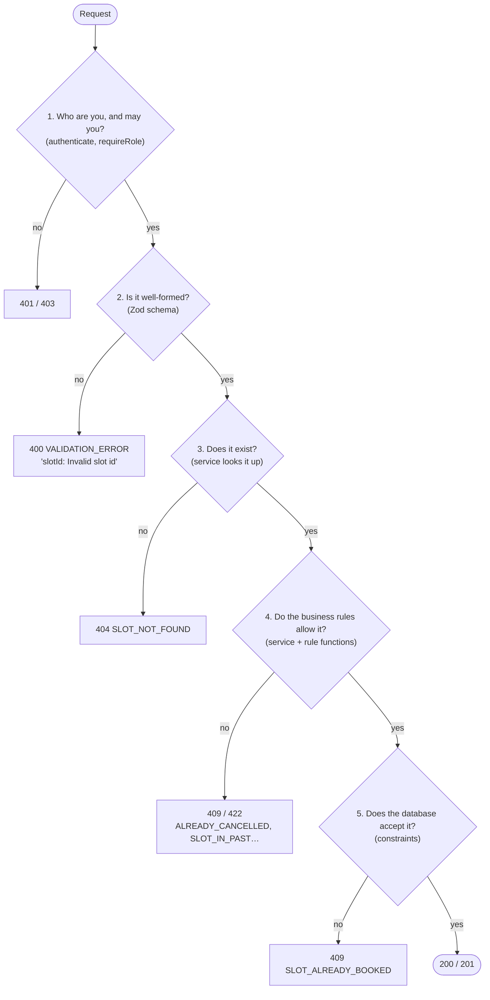

# Week 4: Backend II (services, business rules, validation, errors, logging)

[← Course home](README.md) · [Previous: Week 3](week-03.md)

## 1. Goal

By the end of this week you can:

- find exactly where each of ClinicQ's business rules is enforced, and explain the order the checks run in;
- tell apart the three kinds of "no" an API gives: _malformed_ (validation), _not allowed_ (authorization) and _against the rules_ (business logic);
- read a Zod schema and list every input it rejects;
- explain what happens to an error from the moment it's thrown until the user sees a message;
- read a log line and know what's in it, and what must never be;
- add a new business rule by directing an AI, with tests at the boundaries.

This is the week where acceptance criteria and code line up most directly.

## 2. Concept primer

### Services: where the rules live

A **service** is a set of functions that do the real work of the application: booking, cancelling, registering. Services don't know about HTTP. They take plain values (`patientId`, `slotId`), return plain values, and **throw** when something isn't allowed. The controller (Week 3) is the only part that speaks HTTP.

This makes services the natural home for **business rules**, the statements from the brief that must always be true:

- A slot can't be double-booked → `bookAppointment` + a database constraint (Week 5).
- No booking in the past → `bookAppointment` + `isInPast`.
- Patients cancel only their own appointments, and only more than 2 hours ahead → `cancelAppointment` + `isOutsideCancellationWindow`.

### Three kinds of "no"

A request can be refused for very different reasons. ClinicQ checks them in this order, cheapest first:



This is the order on the booking route. Public routes, such as the doctor list or register, skip step 1. The order of the route-level checks is set in each route file (Week 3).

**Validation** asks "does this data have the right _shape_?": is `slotId` present, and is it a UUID? It knows nothing about the database or who's asking.

**Business rules** ask "does this make sense _right now_?": is this slot in the future, and is this appointment yours? They need data from the database and the current time.

Keeping them separate means each is simple, and each error tells the user something precise.

### Validation with Zod

The API can't trust anything that arrives in a request (Week 2). **Zod** lets you describe what valid input looks like, as a **schema**, and then check real data against it. If the data doesn't match, Zod returns a list of problems, field by field. ClinicQ's `validate` middleware runs the schema before the controller and turns any problems into a `400`.

Zod can also **transform** data while validating. ClinicQ lower-cases emails and trims names, so `Alice@Example.com` and `alice@example.com` are the same account.

### Errors: expected and unexpected

ClinicQ treats errors in two categories:

- **Expected errors** are the "no" answers above. Code throws an `HttpError` with a status, a stable code and a friendly message. The error handler sends exactly that to the client. Nothing is logged as an error, because nothing is broken.
- **Unexpected errors** are bugs: a database outage, a typo that slipped through, a null nobody expected. The error handler logs the full details (the stack trace, which lists the functions that were running when the error happened) and sends the client only `500 INTERNAL_ERROR` / "Something went wrong". Internal details can reveal how the system works, which helps attackers, and they mean nothing to patients.

### Logging

A **log** is the server's diary. ClinicQ uses **pino**, which writes **structured logs**: one JSON object per line, with named fields, instead of free text. Machines can then search and aggregate them: "show every request with status 500 in the last hour".

<!-- example -->

```json
{
  "level": 30,
  "time": 1790498009627,
  "pid": 7409,
  "hostname": "vm",
  "req": { "id": 2, "method": "GET", "url": "/api/doctors" },
  "res": { "statusCode": 200 },
  "responseTime": 129,
  "msg": "request completed"
}
```

(In development, `pino-pretty` prints the same data in a friendlier layout.) The `level` is how serious the entry is: 30 is info, 40 warn, 50 error.

**Master:** logs must not contain secrets or patient data. Passwords, tokens and personal health information in logs are a classic breach: logs get copied to many tools and kept for a long time. ClinicQ **redacts** (blanks out) password and authorization fields, and logs only the method, URL and status of each request, never the body.

### Configuration that fails fast

The API reads its settings from environment variables (Week 1). [`config/env.ts`](../../apps/api/src/config/env.ts) validates them with Zod **at startup**. If `JWT_SECRET` is missing or too short, the API refuses to start, with a clear message. That's **fail fast**: better to crash on start than to run half-configured and fail on the first login.

## 3. Reading path

1. [`apps/api/src/services/appointments.service.ts`](../../apps/api/src/services/appointments.service.ts) (**master; the most important file in the API**). Booking, cancelling and listing, with every rule. _Why real projects have a service layer:_ one place per business capability. When a rule changes, there's one file to change and one set of tests to update.
2. [`apps/api/src/services/appointment.rules.ts`](../../apps/api/src/services/appointment.rules.ts) (**master**, from Week 2).
3. [`apps/api/src/services/doctors.service.ts`](../../apps/api/src/services/doctors.service.ts) (**master**). What "available" means, expressed as a query.
4. [`apps/api/src/schemas/auth.schema.ts`](../../apps/api/src/schemas/auth.schema.ts), [`appointment.schema.ts`](../../apps/api/src/schemas/appointment.schema.ts), [`common.schema.ts`](../../apps/api/src/schemas/common.schema.ts) (**master**). Every input rule. _Why:_ validation written once, as data, instead of `if` statements scattered through controllers.
5. [`apps/api/src/middleware/validate.ts`](../../apps/api/src/middleware/validate.ts) (**master the idea**). Runs a schema and turns failures into a 400.
6. [`apps/api/src/errors/HttpError.ts`](../../apps/api/src/errors/HttpError.ts) and [`middleware/errorHandler.ts`](../../apps/api/src/middleware/errorHandler.ts) (**master**). How errors become responses.
7. [`apps/api/src/lib/logger.ts`](../../apps/api/src/lib/logger.ts) (**master the redact line**). _Why:_ without a shared logger, every file logs differently, and sooner or later one logs a password.
8. [`apps/api/src/config/env.ts`](../../apps/api/src/config/env.ts) (**master the idea**).
9. [`apps/api/tests/appointments.test.ts`](../../apps/api/tests/appointments.test.ts) (**skim**). One test per rule; notice the test names read like acceptance criteria.

## 4. Block-by-block walkthrough

### Booking (`appointments.service.ts`)

```ts
export async function bookAppointment(patientId: string, slotId: string, now = new Date()) {
  const slot = await prisma.timeSlot.findUnique({ where: { id: slotId } });
  if (!slot) {
    throw new HttpError(404, 'SLOT_NOT_FOUND', 'Time slot not found');
  }

  if (isInPast(slot.startsAt, now)) {
    throw new HttpError(422, 'SLOT_IN_PAST', 'You cannot book an appointment in the past');
  }
```

- **What it does:** it loads the slot. If there's no such slot, 404. If it starts now or earlier, 422. Only then does it try to book.
- **Syntax decoded:** these are **guard clauses**: each `if` handles one failure and leaves (by throwing), so the rest of the function is the "happy path" without nesting. `now = new Date()` makes the clock injectable for tests (Week 2).
- **Connects to:** `isInPast` in [`appointment.rules.ts`](../../apps/api/src/services/appointment.rules.ts); the "cannot be booked in the past" test in [`appointments.test.ts`](../../apps/api/tests/appointments.test.ts).
- **Dev-speak:** "Guard clauses up front, then the write."

```ts
  try {
    return await prisma.appointment.create({
      data: { patientId, slotId, status: 'BOOKED' },
      include: appointmentInclude,
    });
  } catch (err) {
    // The database's unique index allows only one BOOKED appointment per slot.
    // Relying on it (rather than checking first) also covers two people booking at the same moment.
    if (err instanceof Prisma.PrismaClientKnownRequestError && err.code === 'P2002') {
      throw new HttpError(409, 'SLOT_ALREADY_BOOKED', 'This time slot is already booked');
    }
    throw err;
  }
}
```

- **What it does:** it inserts the appointment. If the database refuses because the slot already has a booked appointment (Prisma error code `P2002`, "unique constraint failed"), it translates that into a friendly 409. Any other database error is re-thrown unchanged, so it becomes a 500.
- **Syntax decoded:** `try { ... } catch (err) { ... }` catches the failure from `create`. `instanceof` checks the error's kind. `&&` requires both conditions. The final `throw err;` re-throws anything this code doesn't recognise, rather than hiding it.
- **Connects to:** the partial unique index in [`schema.prisma`](../../apps/api/prisma/schema.prisma) (Week 5); the "two patients booking the same slot at the same moment" test.
- **Dev-speak:** "We don't check-then-insert, because that's racy. We let the DB constraint decide and map P2002 to a 409."

**Why not just check first?** Suppose the code first asked "is the slot free?" and then inserted. Two patients clicking at the same moment could both get "yes, free" before either insert happens, and both would be booked. This is a **race condition**. A database constraint is checked at the moment of writing, so it can't be raced. It's the only fully reliable way.

### Cancelling: four rules in a row (`appointments.service.ts`)

```ts
if (!appointment) {
  throw new HttpError(404, 'APPOINTMENT_NOT_FOUND', 'Appointment not found');
}

if (appointment.patientId !== patientId) {
  throw new HttpError(403, 'NOT_YOUR_APPOINTMENT', 'You can only cancel your own appointments');
}

if (appointment.status === 'CANCELLED') {
  throw new HttpError(409, 'ALREADY_CANCELLED', 'This appointment is already cancelled');
}

if (!isOutsideCancellationWindow(appointment.slot.startsAt, now)) {
  throw new HttpError(
    422,
    'CANCELLATION_WINDOW_PASSED',
    `Appointments can only be cancelled more than ${CANCELLATION_CUTOFF_HOURS} hours before they start`,
  );
}

return prisma.appointment.update({
  where: { id: appointmentId },
  data: { status: 'CANCELLED', cancelledAt: now },
  include: appointmentInclude,
});
```

- **What it does:** it checks four things in order: the appointment exists (404), it's yours (403), it isn't already cancelled (409), and it's more than 2 hours away (422). If all pass, it marks it cancelled and records when.
- **Syntax decoded:** `!==` means "not equal". `!isOutsideCancellationWindow(...)` means "NOT more than 2 hours away". `update({ where, data })` changes one row. Note that cancelling **doesn't delete** anything; the status changes, so the history survives.
- **Connects to:** the four cancellation tests in [`appointments.test.ts`](../../apps/api/tests/appointments.test.ts), one per rule.
- **Dev-speak:** "It's a soft cancel: status transition plus timestamp. Ownership is checked before state."

**The order is a product decision.** Suppose Bob tries to cancel Alice's appointment 1 hour before it starts. Should he hear "not yours" or "too late"? The code says "not yours", because ownership is checked first. That's the safer order: telling Bob "too late" would confirm the appointment exists and when it is. Order of checks is worth asking about in refinement.

### What "available" means (`doctors.service.ts`)

```ts
const slots = await prisma.timeSlot.findMany({
  where: {
    doctorId,
    startsAt: { gt: now },
    appointments: { none: { status: 'BOOKED' } },
  },
  select: { id: true, startsAt: true, endsAt: true },
  orderBy: { startsAt: 'asc' },
});
```

- **What it does:** it finds this doctor's slots that start after now **and** have no booked appointment, earliest first. A slot whose only appointment was cancelled counts as available again.
- **Syntax decoded:**
  - `where` lists conditions that must all be true.
  - `{ gt: now }` means "greater than now".
  - `appointments: { none: { status: 'BOOKED' } }` means "has no related appointment with status BOOKED".
  - `select` picks the fields to return, and `orderBy` sorts.
- **Connects to:** the booking page's slot list; the test "returns the doctor and only their future slots that are not booked" in [`doctors.test.ts`](../../apps/api/tests/doctors.test.ts).
- **Dev-speak:** "Availability is derived. We don't store an `isBooked` flag, so it can't get out of sync."

### Schemas: the input rules (`auth.schema.ts`)

```ts
const email = z.email('Enter a valid email address').transform((value) => value.toLowerCase());

export const registerSchema = z.object({
  email,
  name: z.string().trim().min(1, 'Name is required').max(100),
  password: z.string().min(8, 'Password must be at least 8 characters').max(72),
});
```

- **What it does:** it defines a valid registration.
  - `email` must look like an email, and it's stored lower-cased.
  - `name` is text, trimmed of spaces at both ends, 1–100 characters.
  - `password` is 8–72 characters.
- **Syntax decoded:** each `z.something()` creates a rule; `.min()`, `.max()` and `.trim()` add constraints or clean-ups in order. The text in quotes is the message the user sees. `.transform(fn)` changes the value after validating. `z.object({...})` combines field rules into one object rule.
- **Connects to:** [`auth.routes.ts`](../../apps/api/src/routes/auth.routes.ts) (`validate({ body: registerSchema })`) and the `RegisterInput` type (Week 2).
- **Dev-speak:** "Zod schema at the edge; we normalise the email so lookups are case-insensitive."

**Why 72?** bcrypt, the password-hashing library (Week 6), only uses the first 72 bytes of a password. Longer passwords would be silently cut short, so the schema refuses them instead. A rule like this looks arbitrary but has a precise reason, so it's worth asking about in review.

```ts
export const idParamSchema = z.object({
  id: z.uuid('Invalid id'),
});
```

- **What it does:** it requires the `:id` in a URL to be a UUID (the long ID format ClinicQ uses, like `5c2d6a81-a0b0-4a04-b038-53188e797253`).
- **Syntax decoded:** `z.uuid(message)` accepts only the UUID format.
- **Connects to:** the doctor-slots and cancel routes. Rejecting nonsense IDs early means the database is never asked about them, and the user gets a 400 rather than a confusing 404.
- **Dev-speak:** "Validate path params too, not just bodies."

### The validation middleware (`validate.ts`)

```ts
function parseOrThrow(schema: z.ZodType, data: unknown) {
  const result = schema.safeParse(data);
  if (!result.success) {
    throw new HttpError(
      400,
      'VALIDATION_ERROR',
      'The request is invalid',
      z.flattenError(result.error).fieldErrors,
    );
  }
  return result.data;
}
```

- **What it does:** it checks data against a schema. On failure, it throws a 400 whose `details` list the problems per field, e.g. `{"password": ["Password must be at least 8 characters"]}`. On success, it returns the cleaned-up data: lower-cased email, trimmed name.
- **Syntax decoded:** `safeParse` never throws; it returns `{ success: true, data }` or `{ success: false, error }`. `z.flattenError(...).fieldErrors` reshapes Zod's error into a simple field → messages object.
- **Connects to:** the `details` field sent by [`errorHandler.ts`](../../apps/api/src/middleware/errorHandler.ts); the test "rejects invalid input with field errors" in [`auth.test.ts`](../../apps/api/tests/auth.test.ts).
- **Dev-speak:** "Validation errors come back as a field map, so the UI can show them inline."

### The error handler, all of it (`errorHandler.ts`)

```ts
  // express.json() throws this when the request body isn't valid JSON.
  if (err instanceof SyntaxError && 'body' in err) {
    res
      .status(400)
      .json({ error: { code: 'INVALID_JSON', message: 'Request body is not valid JSON' } });
    return;
  }

  // Anything else is a bug. Log the details, but don't leak them to the client.
  logger.error({ err, method: req.method, url: req.originalUrl }, 'Unhandled error');
  res.status(500).json({ error: { code: 'INTERNAL_ERROR', message: 'Something went wrong' } });
}
```

- **What it does:** after handling `HttpError` (Week 3), it handles broken JSON bodies with a 400. Everything else is treated as a bug: the full error goes to the log, and the client gets a generic 500.
- **Syntax decoded:** `'body' in err` checks whether the error object has a `body` field; express's JSON errors do. `logger.error(details, message)` writes one structured log entry at error level.
- **Connects to:** [`lib/logger.ts`](../../apps/api/src/lib/logger.ts); the test "returns 400 for a malformed JSON body" in [`app.test.ts`](../../apps/api/tests/app.test.ts).
- **Dev-speak:** "Unknown errors are logged with context and masked as a 500. No stack traces leak to clients."

### The logger (`logger.ts`)

```ts
export const logger = pino({
  level: env.LOG_LEVEL,
  // Never write passwords or tokens to the logs.
  redact: ['req.headers.authorization', 'req.headers.cookie', '*.password', '*.passwordHash'],
  transport: env.NODE_ENV === 'development' ? { target: 'pino-pretty' } : undefined,
});
```

- **What it does:** it creates the one logger everything uses. It only writes entries at or above `LOG_LEVEL`, replaces any authorization header, cookie, password or password hash with `[Redacted]`, and pretty-prints in development only.
- **Syntax decoded:** `redact` takes a list of paths into the log objects; `*.password` means "a `password` field one level down in any object". `condition ? a : b` picks the pretty printer only in development.
- **Connects to:** `app.ts` (request logging), `server.ts` (startup and shutdown), `errorHandler.ts` (bugs).
- **Dev-speak:** "Structured JSON logs in prod, pretty in dev, with PII redaction." (**PII**: personally identifiable information.)

### Settings validated at startup (`env.ts`)

```ts
const parsed = envSchema.safeParse(process.env);

if (!parsed.success) {
  console.error('Invalid environment variables:', z.flattenError(parsed.error).fieldErrors);
  process.exit(1);
}

export const env = parsed.data;
```

- **What it does:** it checks all environment variables against `envSchema` when the API starts. If anything is wrong, it prints exactly which variables and why, and exits. Otherwise it exports a typed, validated `env` object the rest of the code uses.
- **Syntax decoded:** `process.env` holds every environment variable as a string. `process.exit(1)` stops the program; `1` means failure. Everything else is the same Zod pattern as request validation.
- **Connects to:** every file that imports `env`: `app.ts`, `server.ts`, `prisma.ts`, `token.service.ts`, `logger.ts`.
- **Dev-speak:** "Config is schema-validated at boot. Fail fast."

## 5. Hands-on

1. With `npm run dev:api` running, register with a too-short password and an invalid email in one request, and read the `details`:

   ```bash
   curl -s -X POST http://localhost:3000/api/auth/register \
     -H "Content-Type: application/json" \
     -d '{"email":"nope","name":"","password":"short"}'
   ```

2. Stop the API (`Ctrl+C`), temporarily change `JWT_SECRET` in `apps/api/.env` to `short`, and start it again. Read the startup error. Put the secret back.
3. In `appointment.rules.ts`, change `>` to `>=` in `isOutsideCancellationWindow`. Run `npm test --workspace apps/api` and read which test fails and why. Undo with `git restore .`. You've just seen a boundary test do its job.

## 6. PA lens

**Every rule in the brief should map to one place in a service, one error code, and at least one test.** For ClinicQ it looks like this:

- "No double-booking" → `bookAppointment` + database constraint → `409 SLOT_ALREADY_BOOKED` → "cannot be double-booked" and "same moment" tests.
- "Not in the past" → `bookAppointment` + `isInPast` → `422 SLOT_IN_PAST` → "cannot be booked in the past" test.
- "Only your own" → `cancelAppointment` → `403 NOT_YOUR_APPOINTMENT` → "cannot cancel someone else's" test.
- "More than 2 hours" → `cancelAppointment` + `isOutsideCancellationWindow` → `422 CANCELLATION_WINDOW_PASSED` → the 2-hour tests, including exactly 2 hours.

When you write ACs, write them so they can be traced this way. Name the boundary explicitly ("exactly 2 hours before: not allowed"), and name the error the user sees.

**Refinement questions for this layer:**

- What exactly is the boundary: "more than" or "at least"? In whose time zone?
- If two rules fail at once, which message wins? (The order of checks.)
- Is this a validation rule (shape: always the same answer) or a business rule (depends on data or time)?
- Does "cancel" delete, or change a status? What history do we need to keep?
- What must never appear in logs for this feature?

**Typical UAT bugs from this layer:**

- **Boundary errors.** Exactly 2 hours allowed when it shouldn't be, or midnight handled wrong.
- **Wrong message when two rules fail.** It's technically correct, but it confuses the user or leaks information.
- **Validation too strict or too loose.** Names with apostrophes rejected; emails with capitals treated as different accounts; spaces not trimmed.
- **A 500 where a 4xx was expected.** A rule forgot to `throw HttpError`, and the database error escaped. Always a real bug.
- **Rules enforced in the UI only.** The button is hidden, but a direct API call still works. Test the API with `curl`, not just the screen.

## 7. Build with AI: limit patients to three upcoming appointments

This is the first time you add a **new business rule**, with a design decision in the spec and tests at the boundary.

### The spec

```markdown
## Story

As the clinic manager, I want each patient to hold at most 3 upcoming appointments,
so that a few patients can't block most of the calendar.

## Acceptance criteria

- Given I have 2 upcoming booked appointments, when I book another, then it succeeds (201).
- Given I have 3 upcoming booked appointments, when I book another,
  then I get 422 with code BOOKING_LIMIT_REACHED and the message
  "You can have at most 3 upcoming appointments".
- Cancelled appointments don't count towards the limit.
- Past appointments don't count towards the limit.
- The limit is checked after "slot not found" (404) and "slot in the past" (422).

## Out of scope

- Showing the limit in the web app (the existing error display is enough for now).
- Making the limit configurable per clinic.

## Where I expect changes

- apps/api/src/services/appointment.rules.ts: MAX_UPCOMING_APPOINTMENTS = 3
- apps/api/src/services/appointments.service.ts: count and check in bookAppointment
- apps/api/tests/appointments.test.ts: tests for 3rd OK, 4th rejected, cancelled and past not counted
- apps/api/README.md: new error code in the status table

## How I'll test it

- Automated: npm test --workspace apps/api
- Manual: as Alice (who has 1 seeded booking), book 2 more, then a 3rd: see the error in the UI.
```

### Example prompt

```text
In ClinicQ's API, add a business rule: a patient may hold at most 3 upcoming BOOKED
appointments (slot starts in the future). Cancelled and past appointments don't count.

- Add MAX_UPCOMING_APPOINTMENTS = 3 to src/services/appointment.rules.ts.
- In bookAppointment (src/services/appointments.service.ts), after the SLOT_NOT_FOUND
  and SLOT_IN_PAST checks, count the patient's BOOKED appointments whose slot starts after
  `now`, and throw HttpError(422, 'BOOKING_LIMIT_REACHED',
  'You can have at most 3 upcoming appointments') when the count is already 3 or more.
  Use the constant in the message.
- Add tests in tests/appointments.test.ts using the existing helpers: 3rd booking succeeds,
  4th is rejected with the code, a cancelled appointment doesn't count, a past one doesn't count.
- Add BOOKING_LIMIT_REACHED to the 422 row in apps/api/README.md.

Explain your plan first, including exactly which query you'll use to count.
Then show the diff. No new packages. Don't change other rules.
```

### Checklist for reviewing the diff

- [ ] The count query filters on **all three**: this patient, `status: 'BOOKED'`, and slot `startsAt` **greater than** `now`. Missing any one of them is a bug the spec's ACs describe.
- [ ] The comparison is `>= MAX_UPCOMING_APPOINTMENTS` (reject the 4th), not `>` (which would allow a 4th). Check it against "given I have 3 … then I get 422".
- [ ] The new check comes after the 404 and past checks, and before the insert.
- [ ] The number 3 appears once, as the constant. The message uses it, and the tests either use it or create exactly that many appointments.
- [ ] Four new tests, each with a name that reads like an AC. The existing tests are unchanged and still pass.
- [ ] **Honesty check:** the count happens _before_ the insert, so two bookings sent at the exact same moment could both pass. Did the AI mention this? (A perfect fix needs a transaction or a constraint, which is Week 5 material. For this rule, the small risk is usually acceptable, but it should be a known, written-down decision.)

### How to test it

```bash
npm test --workspace apps/api
```

Then in the app as Alice: she has one seeded booking, so book two more (3 upcoming), then try a fourth and read the error. Cancel one and book again: it should work.

## 8. Vocabulary

| Term                         | Meaning, and where it shows up in ClinicQ                                                                 |
| ---------------------------- | --------------------------------------------------------------------------------------------------------- |
| Service                      | Functions holding business logic, independent of HTTP: `appointments.service.ts`.                         |
| Business rule                | A statement that must always hold, like "no booking in the past" (`isInPast` + `SLOT_IN_PAST`).           |
| Guard clause                 | An early `if … throw` that handles a failure first, keeping the happy path flat.                          |
| Validation                   | Checking the shape of input: `bookAppointmentSchema` requires a UUID `slotId`.                            |
| Schema (Zod)                 | A description of valid data that can check real data: `registerSchema`.                                   |
| Transform / normalise        | Cleaning input while validating: lower-casing emails, trimming names.                                     |
| Expected vs unexpected error | `HttpError` with a code (a "no"), vs a bug (500, logged).                                                 |
| Race condition               | Two operations interleaving so a check-then-act goes wrong; solved for double-booking by a DB constraint. |
| Soft delete / status change  | Marking something cancelled instead of deleting it: `status: 'CANCELLED'`, `cancelledAt`.                 |
| Structured logging           | Log entries as JSON objects with fields, written by pino.                                                 |
| Log level                    | Seriousness of a log entry: info, warn, error; set by `LOG_LEVEL`.                                        |
| Redaction                    | Blanking sensitive fields in logs: `redact: ['req.headers.authorization', ...]`.                          |
| PII / PHI                    | Personally identifiable / protected health information. Must not leak into logs or errors.                |
| Fail fast                    | Crash at startup on bad config rather than misbehave later: `env.ts`.                                     |
| Boundary test                | A test at the exact edge of a rule: "exactly 2 hours: not allowed".                                       |

## 9. Quiz

1. A booking request has an invalid `slotId` and no login token. Which error does the user get, and why that one?
2. Why does `bookAppointment` let the database reject a double booking instead of checking "is it free?" first?
3. Bob tries to cancel Alice's already-cancelled appointment. Which error does he get? Is that the right choice?
4. A developer adds `logger.info({ body: req.body }, 'booking')` to debug a problem. What's wrong with that in ClinicQ?
5. Someone deploys the API to a new server and forgets to set `JWT_SECRET`. What happens, and why is that better than the alternative?

<details>
<summary>Answers</summary>

1. `401 UNAUTHENTICATED`. On the appointments router, `authenticate` runs (via `router.use`) before the route's `validate`, so it rejects first.
2. Check-then-insert is a race: two simultaneous requests can both see "free". The unique index is enforced at the moment of the write, so only one insert can succeed. The code maps the other one's `P2002` error to `409 SLOT_ALREADY_BOOKED`.
3. `403 NOT_YOUR_APPOINTMENT`, because ownership is checked before status. Yes: it doesn't tell Bob anything about Alice's appointment.
4. Request bodies can contain passwords (login, register) and, in a real clinic, health information. The redact list covers `*.password` one level deep, but it's a safety net, not permission to log bodies. Logging bodies is exactly how sensitive data ends up in log tools.
5. It doesn't start. `env.ts` validates the environment at startup, prints an error naming `JWT_SECRET`, and exits with code 1. The deploy fails loudly and immediately, instead of the API running and then failing on every login in front of users.

</details>

---

Next: [Week 5: Database](week-05.md)
