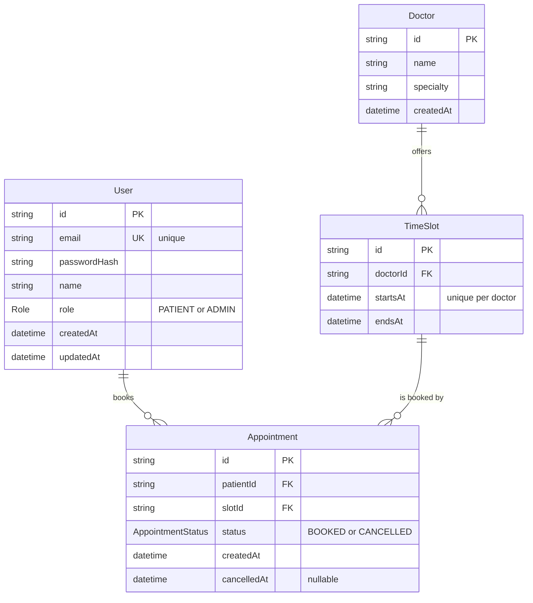
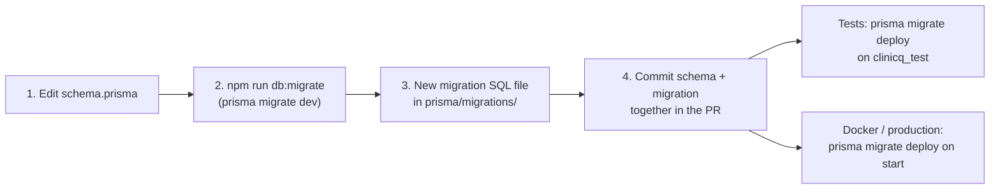

# Week 5: Database (Prisma, relations, migrations, constraints)

[← Course home](README.md) · [Previous: Week 4](week-04.md)

## 1. Goal

By the end of this week you can:

- read ClinicQ's Prisma schema and draw the tables and their relationships from memory;
- explain primary keys, foreign keys, unique constraints and indexes in plain English, with a ClinicQ example of each;
- explain what a migration is, why it's never edited after it's applied, and how it reaches every environment;
- read a Prisma query (`findMany`, `where`, `include`, `select`) and write down the SQL it roughly becomes;
- turn an acceptance criterion into a database constraint, and explain when that's better than code;
- add a new column end to end, with a migration, by directing an AI.

## 2. Concept primer

### Relational databases in five ideas

**PostgreSQL** is a **relational database**. It stores data in **tables**, which are like spreadsheets with strict rules.

1. A **table** holds one kind of thing: `User`, `Doctor`, `TimeSlot`, `Appointment`.
2. A **row** is one thing (one appointment). A **column** is one fact about it (its `status`). Every column has a type (text, timestamp, …) and may or may not allow empty values (**NULL**).
3. A **primary key** uniquely identifies each row. In ClinicQ every table has an `id` column holding a UUID.
4. A **foreign key** is a column that points at another table's primary key. `Appointment.slotId` points at `TimeSlot.id`. The database refuses a `slotId` that doesn't exist, so you can never have an appointment for a slot that isn't there. This is **referential integrity**.
5. A **constraint** is a rule the database enforces on every write, no matter which code does the writing: "email is unique", "status is BOOKED or CANCELLED", "at most one BOOKED appointment per slot".

You ask a relational database questions in **SQL** (Structured Query Language): `SELECT * FROM "Doctor" ORDER BY name;`. ClinicQ's code rarely writes SQL itself; **Prisma** writes it.

### ClinicQ's data model



Read the lines between boxes as sentences. `||--o{` means "one … to zero or more": one doctor offers zero or more time slots. One slot can have **many** appointments over time (a cancelled one, then a new booking), but only **one** at a time can be `BOOKED`. That "only one at a time" is not something the diagram can show; it's a constraint (below).

**Why is there a `TimeSlot` table at all?** Why not just store a time on the appointment? Because slots are the clinic's _supply_: they exist before anyone books them, the availability list is built from them, and the double-booking rule is about them. Modelling the real-world thing separately usually makes rules simpler.

### Prisma: schema, client, migrations

**Prisma** is an **ORM** (object-relational mapper): a library that lets TypeScript code work with database rows as objects. It has three parts in ClinicQ:

- **The schema** ([`schema.prisma`](../../apps/api/prisma/schema.prisma)) describes the tables in Prisma's own language. It's the source of truth for the data model.
- **The client** is TypeScript code _generated_ from the schema (into `src/generated/prisma`, recreated on `npm install`). It gives you fully typed functions: `prisma.appointment.findMany(...)`. A typo in a field name is a compile error.
- **Migrations** are SQL files that change the database step by step, recorded in [`prisma/migrations/`](../../apps/api/prisma/migrations/).

### Migrations: version control for the database

Code changes are easy to roll out: replace the files. A database is different, because it holds data that must survive the change. A **migration** is a small SQL script that moves the database from one version of the schema to the next ("add a `reason` column to `Appointment`"). Migrations run in order, and each runs once per database.



- `prisma migrate dev` (development only) compares the schema with the database, **writes** a new migration file, and applies it.
- `prisma migrate deploy` (tests, Docker, production) **only applies** migration files that haven't run yet. It never invents new ones.
- Prisma records which migrations have run in a table called `_prisma_migrations`, inside each database.

**Master:** never edit a migration that has been applied anywhere else. Other databases (your colleague's, CI's, production's) have already run the old version, and editing it makes them disagree silently. To change something, write a new migration.

### Constraints: acceptance criteria the database enforces

Rules can live in code (Week 4) or in the database. The database is stronger: it applies to _every_ write, from every code path, including a future feature, a script, or two requests at the same instant. ClinicQ puts these rules in the schema:

- "An email can only have one account" → `email String @unique`.
- "A doctor can't have two slots at the same time" → `@@unique([doctorId, startsAt])`.
- "A slot can't be double-booked" → a **partial unique index**: `@@unique([slotId], where: { status: "BOOKED" })`. At most one row per slot _among the BOOKED ones_. Cancelled rows don't count, so a freed slot can be booked again.
- "An appointment belongs to a real patient and a real slot" → foreign keys from the `@relation` fields.
- "A status is one of the allowed values" → `enum AppointmentStatus`.

Other rules can't be constraints, because they depend on _time_ ("not in the past", "more than 2 hours before") or on _who is asking_ ("only your own"). Those stay in services. A good design uses both: the service gives a clear, early error, and the constraint is the safety net that can't be bypassed.

### Transactions

A **transaction** groups several writes so that either **all** of them happen or **none** do. The classic example is a bank transfer: debit one account and credit another, never just one of the two.

ClinicQ doesn't use an explicit transaction yet, because each operation is a single write (one `create` or one `update`), and a single write is already all-or-nothing. You'll need one in the capstone. "Reschedule" means cancelling the old appointment _and_ booking the new slot. If the second step fails (someone took the slot), the first must be undone, or the patient loses both appointments. Prisma provides `prisma.$transaction(...)` for this.

## 3. Reading path

1. [`apps/api/prisma/schema.prisma`](../../apps/api/prisma/schema.prisma) (**master; read it until you could redraw the diagram**). _Why real projects have a schema file:_ one reviewed, versioned definition of the data. Without it, the database's shape is whatever someone last typed into a console.
2. [`apps/api/prisma/migrations/`](../../apps/api/prisma/migrations/), especially the one `migration.sql` inside (**master the idea, skim the SQL**). _Why:_ migrations let every environment reach exactly the same schema, in the same steps, automatically.
3. [`apps/api/prisma.config.ts`](../../apps/api/prisma.config.ts) (**skim**). Where Prisma finds the schema, the migrations, the seed and the database URL.
4. [`apps/api/src/lib/prisma.ts`](../../apps/api/src/lib/prisma.ts) (**master**). The one shared database client. _Why one client:_ each client keeps a pool of connections. Creating one per request would exhaust the database quickly.
5. [`apps/api/prisma/seed.ts`](../../apps/api/prisma/seed.ts) (**master**). Sample data, and a good example of queries in action.
6. The queries in [`appointments.service.ts`](../../apps/api/src/services/appointments.service.ts) and [`doctors.service.ts`](../../apps/api/src/services/doctors.service.ts) (**master**; you read the logic in Week 4, now read the queries).
7. [`apps/api/tests/helpers.ts`](../../apps/api/tests/helpers.ts) and [`tests/globalSetup.ts`](../../apps/api/tests/globalSetup.ts) (**skim**). How tests get a clean database.

## 4. Block-by-block walkthrough

### Where the database is (`schema.prisma`, top)

```prisma
datasource db {
  provider = "postgresql"
}
```

- **What it does:** it tells Prisma the database is PostgreSQL. The address itself isn't here: it comes from `DATABASE_URL`, via `prisma.config.ts`.
- **Syntax decoded:** Prisma's own language: `block name { key = value }`.
- **Connects to:** [`prisma.config.ts`](../../apps/api/prisma.config.ts) (`url: process.env.DATABASE_URL`), and [`lib/prisma.ts`](../../apps/api/src/lib/prisma.ts), which connects at runtime with the `pg` driver.
- **Dev-speak:** "Postgres datasource; the URL is injected from env."

### An enum and a model (`User`)

```prisma
enum Role {
  PATIENT
  ADMIN
}
```

```prisma
model User {
  id           String        @id @default(uuid())
  email        String        @unique
  passwordHash String
  name         String
  role         Role          @default(PATIENT)
  createdAt    DateTime      @default(now())
  updatedAt    DateTime      @updatedAt
  appointments Appointment[]
}
```

- **What it does:** it defines the `User` table.
  - `id` is the primary key, filled with a new UUID automatically.
  - `email` must be unique.
  - `role` is `PATIENT` unless set otherwise.
  - `createdAt` and `updatedAt` are maintained automatically.
  - `appointments` isn't a column at all: it's the other side of the relation, so code can ask for "this user's appointments".
- **Syntax decoded:**
  - Each line is `name Type attributes`.
  - `@id` marks the primary key, and `@default(...)` supplies a value when none is given.
  - `@unique` becomes a unique constraint.
  - `@updatedAt` is set to the current time on every update.
  - `Appointment[]` means a list of related appointments.
  - A type without `?` is **required** (the SQL says `NOT NULL`).
- **Connects to:** the `CREATE TABLE "User"` SQL in the migration; `prisma.user.findUnique(...)` in [`auth.service.ts`](../../apps/api/src/services/auth.service.ts).
- **Dev-speak:** "Email has a unique constraint, so the duplicate check in the service is for a nice error, and the DB is the real guard."

Notice that the table stores `passwordHash`, never the password (Week 6).

### A relation with a rule (`TimeSlot`)

```prisma
model TimeSlot {
  id           String        @id @default(uuid())
  doctorId     String
  doctor       Doctor        @relation(fields: [doctorId], references: [id], onDelete: Cascade)
  startsAt     DateTime
  endsAt       DateTime
  appointments Appointment[]

  // A doctor can't have two slots starting at the same time.
  @@unique([doctorId, startsAt])
}
```

- **What it does:** every slot belongs to one doctor (`doctorId` is the foreign key). Deleting a doctor deletes their slots too (`Cascade`). No doctor can have two slots with the same start time.
- **Syntax decoded:**
  - `@relation(fields: [doctorId], references: [id])` means "`doctorId` here points at `id` in `Doctor`".
  - `onDelete: Cascade` means "when the parent row is deleted, delete these too".
  - `@@unique([a, b])`, with a double `@@`, is a table-level rule: the _combination_ must be unique.
- **Connects to:** `createSlot` in [`tests/helpers.ts`](../../apps/api/tests/helpers.ts) and `buildSlotTimes` in [`seed.ts`](../../apps/api/prisma/seed.ts).
- **Dev-speak:** "Composite unique on (doctorId, startsAt); slots cascade with the doctor."

**A question worth asking:** `Appointment`'s relations have no `onDelete`, so the default applies: **Restrict** (the migration says `ON DELETE RESTRICT`). You can't delete a slot that has appointments. So deleting a doctor who has any appointment history fails, even though slots would cascade. That's usually what you want in healthcare, where history must be kept. But it's a product decision, and it's the kind of thing that surprises people in UAT ("why can't admin delete this doctor?").

### The double-booking rule as a constraint (`Appointment`)

```prisma
model Appointment {
  id          String            @id @default(uuid())
  patientId   String
  patient     User              @relation(fields: [patientId], references: [id])
  slotId      String
  slot        TimeSlot          @relation(fields: [slotId], references: [id])
  status      AppointmentStatus @default(BOOKED)
  createdAt   DateTime          @default(now())
  cancelledAt DateTime?

  // Business rule: a slot can't be double-booked.
  // Only one BOOKED appointment per slot; cancelled ones don't count.
  @@unique([slotId], where: { status: "BOOKED" }, map: "Appointment_slotId_booked_key")
  @@index([patientId])
}
```

- **What it does:** it links each appointment to a patient and a slot, with a status and an optional cancellation time. Two table-level rules:
  - among rows with status `BOOKED`, each `slotId` appears at most once;
  - there's an index on `patientId`, so "my appointments" is fast.
- **Syntax decoded:**
  - `DateTime?`: the `?` means optional (`NULL` allowed).
  - `where: { status: "BOOKED" }` makes the unique rule **partial**: it applies only to rows matching the condition. This uses Prisma's `partialIndexes` preview feature, enabled at the top of the file.
  - `map:` names the index in the database.
  - `@@index` creates a plain (non-unique) index.
- **Connects to:** the migration SQL below; the `P2002` handling in `bookAppointment` (Week 4); the "same moment" test.
- **Dev-speak:** "Partial unique index on slotId where status = BOOKED, so it's race-safe and cancelled slots free up."

**Why not a plain `@unique` on `slotId`?** Then a slot could only ever have one appointment row, even a cancelled one. Cancelling would lock the slot forever. The partial index expresses the real rule: one _active_ booking.

### The migration it produced (`migration.sql`)

```sql
-- CreateIndex
CREATE UNIQUE INDEX "Appointment_slotId_booked_key" ON "Appointment"("slotId") WHERE ("status" = 'BOOKED');
```

```sql
-- AddForeignKey
ALTER TABLE "Appointment" ADD CONSTRAINT "Appointment_slotId_fkey" FOREIGN KEY ("slotId") REFERENCES "TimeSlot"("id") ON DELETE RESTRICT ON UPDATE CASCADE;
```

- **What it does:** the first statement creates the partial unique index. The second makes `slotId` a foreign key: every appointment must point at a real slot, and a slot with appointments can't be deleted (`RESTRICT`).
- **Syntax decoded:** `--` starts a SQL comment. Names in double quotes keep their capital letters. `ON UPDATE CASCADE` means that if a slot's `id` ever changed, the appointments would follow (IDs don't change in practice).
- **Connects to:** generated from `schema.prisma` by `prisma migrate dev` in Session 1; applied to the test database by [`tests/globalSetup.ts`](../../apps/api/tests/globalSetup.ts) and to Docker's database by the `CMD` in [`apps/api/Dockerfile`](../../apps/api/Dockerfile).
- **Dev-speak:** "The migration is checked in; deploy runs `migrate deploy` before the app starts."

### One shared client (`lib/prisma.ts`)

```ts
const adapter = new PrismaPg({ connectionString: env.DATABASE_URL });

export const prisma = new PrismaClient({ adapter });
```

- **What it does:** it creates the database client once, connected through the `pg` driver to the validated `DATABASE_URL`. Every service imports this same `prisma`.
- **Syntax decoded:** `new` creates an object from a class. `{ adapter }` is shorthand for `{ adapter: adapter }`. Prisma 7 requires a **driver adapter**, the piece that actually talks to PostgreSQL.
- **Connects to:** every service; `server.ts`, which calls `prisma.$disconnect()` on shutdown.
- **Dev-speak:** "Singleton Prisma client with the pg adapter."

### Reading queries (`appointments.service.ts`)

```ts
const appointmentInclude = {
  slot: {
    select: {
      id: true,
      startsAt: true,
      endsAt: true,
      doctor: { select: { id: true, name: true, specialty: true } },
    },
  },
} satisfies Prisma.AppointmentInclude;
```

```ts
export async function listPatientAppointments(patientId: string) {
  return prisma.appointment.findMany({
    where: { patientId },
    include: appointmentInclude,
    orderBy: { slot: { startsAt: 'asc' } },
  });
}
```

- **What it does:** it lists one patient's appointments, soonest first. Each comes with its slot's times and the slot's doctor (name and specialty), so the web app gets everything it needs in one response.
- **Syntax decoded:**
  - `findMany` returns a list, and `where` filters.
  - `include` adds related records **in addition to** all the appointment's own fields.
  - `select` returns **only** the listed fields. It's used on the slot and doctor, so nothing extra leaks.
  - `orderBy` can sort by a related table's field.
  - `satisfies Prisma.AppointmentInclude` checks the object's shape against Prisma's types without changing its type (**skim**).
- **Connects to:** the `Appointment` type in [`apps/web/src/types.ts`](../../apps/web/src/types.ts), which describes exactly this shape.

  Roughly, the SQL it becomes (Prisma may split it into more than one query):

  <!-- example -->

  ```sql
  SELECT a.*, s."id", s."startsAt", s."endsAt", d."id", d."name", d."specialty"
  FROM "Appointment" a
  JOIN "TimeSlot" s ON s."id" = a."slotId"
  JOIN "Doctor" d ON d."id" = s."doctorId"
  WHERE a."patientId" = $1
  ORDER BY s."startsAt" ASC;
  ```

- **Dev-speak:** "`include` pulls in the relations, `select` whitelists the fields. That's our DTO shape."

**Master:** `select` vs `include`. `include` means "everything, plus these relations"; `select` means "only these". When a response must never contain a field (like `passwordHash`), prefer `select`. The admin list does exactly that for the patient: `patient: { select: { id: true, name: true, email: true } }`.

### Seed data: queries in bulk (`seed.ts`)

```ts
// Start from a clean slate. Children first, because of foreign keys.
await prisma.appointment.deleteMany();
await prisma.timeSlot.deleteMany();
await prisma.doctor.deleteMany();
await prisma.user.deleteMany();
```

```ts
for (const doctor of DOCTORS) {
  await prisma.doctor.create({
    data: { ...doctor, slots: { create: slotTimes } },
  });
}
```

- **What it does:** it deletes everything, in an order the foreign keys allow (appointments before the slots they point at). Then it creates each doctor _together with_ all their slots in one call.
- **Syntax decoded:** `deleteMany()` with no `where` deletes every row. `{ ...doctor, slots: { create: slotTimes } }` is a **nested write**: create the doctor and create related slots, linked automatically.
- **Connects to:** `npm run db:seed`, and the E2E test's [`global-setup.ts`](../../apps/web/e2e/global-setup.ts), which reseeds its own database before every run.
- **Dev-speak:** "Idempotent-ish seed: wipe and recreate. Guarded against production."

### A clean database for every test (`tests/helpers.ts`)

```ts
export async function resetDatabase() {
  await prisma.$executeRawUnsafe(
    'TRUNCATE TABLE "Appointment", "TimeSlot", "Doctor", "User" RESTART IDENTITY CASCADE',
  );
}
```

- **What it does:** before each test, it empties all four tables in one fast statement, so tests can't affect each other.
- **Syntax decoded:** `$executeRawUnsafe` runs raw SQL. "Unsafe" means Prisma doesn't escape anything, which is fine for a fixed string with no user input. `TRUNCATE` empties tables; `CASCADE` includes tables that point at them.
- **Connects to:** `beforeEach(resetDatabase)` in every API test file. It only ever runs against `clinicq_test`, because Vitest loads `.env.test`.
- **Dev-speak:** "Truncate between tests for isolation."

## 5. Hands-on: look inside the database

With the database running (`docker compose up -d db`), open a SQL prompt inside the container:

```bash
docker compose exec db psql -U clinicq -d clinicq
```

Try these. Type each one and press Enter; the `;` at the end matters.

```text
\dt
\d "Appointment"
SELECT name, specialty FROM "Doctor" ORDER BY name;
SELECT status, COUNT(*) FROM "Appointment" GROUP BY status;
SELECT migration_name, finished_at FROM "_prisma_migrations";
```

In `\d "Appointment"`, find the partial index and its `WHERE` condition, and the foreign keys. Now try to break the double-booking rule directly in SQL, bypassing all the API code:

```text
INSERT INTO "Appointment" (id, "patientId", "slotId", status)
SELECT gen_random_uuid(), "patientId", "slotId", 'BOOKED' FROM "Appointment" WHERE status = 'BOOKED' LIMIT 1;
```

PostgreSQL refuses with `duplicate key value violates unique constraint "Appointment_slotId_booked_key"`. That's the difference between a rule in code and a rule in the database. Type `\q` to leave.

## 6. PA lens

**Acceptance criteria that describe "always" or "never" are candidates for constraints.** "An email can only register once", "a slot is never double-booked", "an appointment always belongs to a patient". When you see one, ask in refinement: "Is this enforced by the database, or only in code?". The database answer is stronger. Criteria that depend on time or on who's asking ("more than 2 hours before", "only your own") belong in services.

**Data changes are features.** Adding a field isn't only a UI change: it needs a migration, a decision about existing rows (default value? empty?), validation, and a decision about who may see it. A new field of patient information is also a privacy decision.

**Refinement questions for this layer:**

- Is this new field required? What should existing rows get?
- Is this field unique? Unique per what (per doctor, per day, globally)?
- What happens to related records when something is deleted: block, cascade, or keep history?
- Should this be a status change (history kept) or a delete?
- Does the migration change or drop existing data? How long will it run on the real database?
- Does this field contain patient health information? Who may read it; does it appear in logs, exports, the admin screen?

**Typical UAT bugs from this layer:**

- **"Works on dev, fails on staging."** A migration wasn't applied, or was edited after being applied.
- **Duplicate records.** A uniqueness rule lived only in code, and two quick clicks or two users created two.
- **"Can't delete X".** A foreign key restricts it; often correct, but the UI should explain why.
- **Missing data on old records.** A new required field with no sensible value for existing rows.
- **Slow pages as data grows.** A missing index on a column the page filters on.

## 7. Build with AI: add an optional "reason for visit"

This is your first **schema change**: schema, migration, validation, service and tests. It also carries a privacy decision.

### The spec

```markdown
## Story

As a patient, I want to add a short reason when I book, so that the doctor can prepare.

## Acceptance criteria

- Given I book with {"slotId": "...", "reason": "Follow-up on blood test"},
  then the appointment is created and the response includes "reason": "Follow-up on blood test".
- Given I book without a reason, then booking works as today and "reason" is null.
- Given a reason longer than 200 characters, then I get 400 VALIDATION_ERROR with a message on "reason".
- Leading and trailing spaces are trimmed; an empty or all-spaces reason is stored as null.
- The reason appears in "my appointments" and in the admin list.
- Existing appointments keep working (their reason is null).
- The reason is never written to the logs.

## Out of scope

- The web app form (a later week), editing a reason after booking.

## Where I expect changes

- apps/api/prisma/schema.prisma: reason String? on Appointment
- apps/api/prisma/migrations/<timestamp>_add_appointment_reason/migration.sql (generated)
- apps/api/src/schemas/appointment.schema.ts: optional reason, trimmed, max 200
- apps/api/src/services/appointments.service.ts + appointments.controller.ts: pass and store it
- apps/api/tests/appointments.test.ts: with reason, without, too long, whitespace-only
- apps/web/src/types.ts: reason: string | null on Appointment (type only)

## How I'll test it

- Automated: npm test; npm run typecheck
- Manual: curl a booking with a reason; check My appointments JSON in the Network tab.
```

### Example prompt

```text
In ClinicQ, add an optional "reason" (max 200 characters) to appointments.

1. apps/api/prisma/schema.prisma: add `reason String?` to Appointment.
   Then generate the migration by running:
   npm run db:migrate --workspace apps/api -- --name add_appointment_reason
   Don't write the migration SQL by hand, and don't reset the database.
2. apps/api/src/schemas/appointment.schema.ts: add reason as optional; trim it; max 200;
   treat an empty string after trimming as absent.
3. Pass the reason from the controller to bookAppointment and store it.
4. Tests in apps/api/tests/appointments.test.ts: booking with a reason, without one,
   with 201 characters (400 on field "reason"), and with only spaces (stored as null).
5. apps/web/src/types.ts: add `reason: string | null` to Appointment.

Constraints: follow existing patterns; no new packages; don't log the reason.
Explain the plan first, then show the diff including the generated migration.
```

### Checklist for reviewing the diff

- [ ] A **new** folder in `prisma/migrations/` was generated. The existing `init` migration is untouched: check `git diff --stat` shows no change to it.
- [ ] The migration SQL is one `ALTER TABLE "Appointment" ADD COLUMN "reason" TEXT;`. It's nullable (no `NOT NULL`), so existing rows are fine.
- [ ] The schema says `String?` (optional), matching the migration.
- [ ] The Zod rule rejects 201 characters, and the test uses exactly 201 (the boundary), not 500.
- [ ] Whitespace-only becomes `null`, not `""`. Look for the test.
- [ ] Nothing new in `logger` calls, and no `console.log(reason)` left over.
- [ ] The web type change is just the one field. TypeScript still passes (`npm run typecheck`).
- [ ] If the AI said "I reset the database" or ran `migrate reset`, stop and ask why. It wasn't needed, and it deletes data.

### How to test it

```bash
npm test                       # API tests run the new migration on clinicq_test automatically
npm run typecheck
```

Book with `curl` (Week 1), adding `"reason":"Follow-up"` to the JSON, then call `GET /api/appointments` and find the field. Then in `psql`, run `\d "Appointment"` to see the new column.

## 8. Vocabulary

| Term                              | Meaning, and where it shows up in ClinicQ                                                                  |
| --------------------------------- | ---------------------------------------------------------------------------------------------------------- |
| Table / row / column              | A kind of thing / one of them / one fact about it: the `Appointment` table, one appointment, its `status`. |
| Primary key                       | The column that uniquely identifies a row: `id String @id @default(uuid())`.                               |
| Foreign key                       | A column pointing at another table's key: `Appointment.slotId` → `TimeSlot.id`.                            |
| Relation (one-to-many)            | One doctor has many slots; one slot has many appointments over time.                                       |
| NULL / optional                   | "No value". `cancelledAt DateTime?` is NULL until cancelled.                                               |
| Unique constraint                 | The database refuses duplicates: `email @unique`, `@@unique([doctorId, startsAt])`.                        |
| Partial unique index              | Unique only among rows matching a condition: one BOOKED appointment per slot.                              |
| Index                             | A lookup structure that makes filtering fast: `@@index([patientId])`.                                      |
| Enum                              | A fixed set of allowed values: `Role`, `AppointmentStatus`.                                                |
| ORM / Prisma                      | A library mapping tables to typed objects: `prisma.appointment.findMany(...)`.                             |
| Schema (Prisma)                   | `schema.prisma`, the source of truth for the data model.                                                   |
| Migration                         | A versioned SQL change to the database, in `prisma/migrations/`, applied once per database.                |
| `migrate dev` vs `migrate deploy` | Create and apply (dev only) vs apply existing ones (tests, Docker, prod).                                  |
| Seed                              | Sample data loaded by `prisma/seed.ts`.                                                                    |
| Transaction                       | Several writes that succeed or fail together; needed for rescheduling in the capstone.                     |

## 9. Quiz

1. Why can the double-booking rule be a database constraint, but "no booking in the past" can't?
2. A colleague fixes a typo in an already-merged migration file and pushes. What goes wrong?
3. What's the difference between `include` and `select` in a Prisma query, and which is safer for returning user data?
4. An admin asks for a "delete doctor" button. With today's schema, what happens when they delete a doctor who has past appointments?
5. Rescheduling will cancel one appointment and book another. Why does that need a transaction, when booking alone doesn't?

<details>
<summary>Answers</summary>

1. The double-booking rule depends only on the data in the table (one BOOKED row per slot), which is exactly what a unique index checks on every write. "Not in the past" depends on the current time at the moment of booking. A constraint that compares with "now" would make old rows invalid as time passes, so time-based rules belong in the service.
2. Databases that already ran the old version (CI, other developers, production) won't run it again, so they now differ from anyone who runs the edited file fresh. The fix is always a new migration.
3. `include` returns all of the record's fields plus the named relations; `select` returns only the fields you list. `select` is safer: a new sensitive column added later won't start appearing in responses by accident.
4. The doctor's slots would cascade-delete, but any slot with appointments is protected by the appointments' foreign key (`ON DELETE RESTRICT`). So the delete fails with an error. The history is protected. The UI would need to explain this, or the feature should "deactivate" doctors instead.
5. Booking is one insert, and one statement is already all-or-nothing. Rescheduling is two writes. If the cancel succeeds and the new booking fails (slot just taken), the patient would lose their appointment. A transaction makes both succeed or both roll back.

</details>

---

Next: [Week 6: Auth and security](week-06.md)
