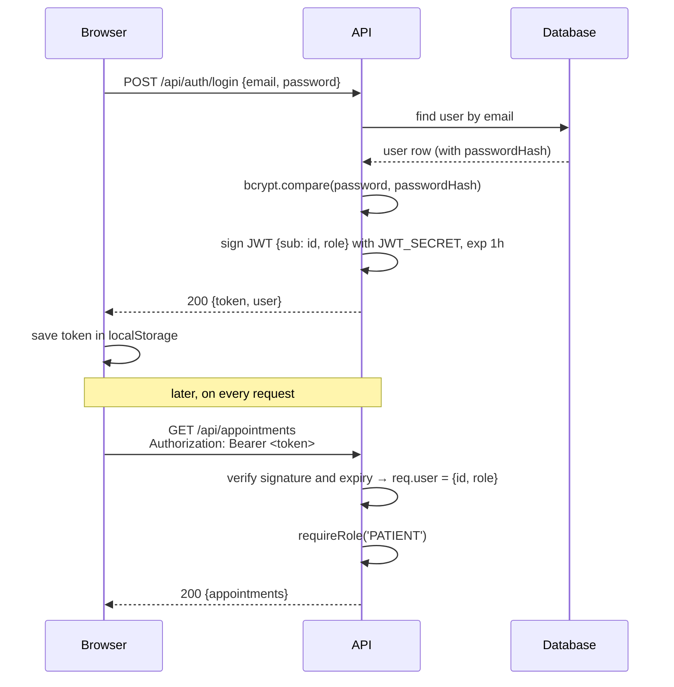

# Week 6: Auth and security

[← Course home](README.md) · [Previous: Week 5](week-05.md)

## 1. Goal

By the end of this week you can:

- explain the difference between **authentication** (who are you?) and **authorization** (what may you do?), and point to where ClinicQ does each;
- explain why passwords are hashed rather than encrypted, and what bcrypt adds;
- read a JWT, say what's inside ClinicQ's tokens, and explain what signing does and doesn't protect;
- find the three levels of authorization in ClinicQ: logged in, right role, and owns the record;
- explain CORS, security headers and secrets in plain English;
- discuss what changes when an app holds **health information**, and ask the right refinement questions;
- add a role-protected action by directing an AI, and review it with a security eye.

## 2. Concept primer

### Authentication vs authorization

- **Authentication** (often "authn") proves **who** you are. In ClinicQ that's logging in with an email and password, then proving it on each request with a token.
- **Authorization** (often "authz") decides **what** you may do. ClinicQ checks three levels:
  1. **Logged in?** `authenticate` → otherwise `401`.
  2. **Right role?** `requireRole('ADMIN')` → otherwise `403`.
  3. **Your record?** The ownership check in `cancelAppointment` → otherwise `403 NOT_YOUR_APPOINTMENT`.

The third level is the one most often forgotten. Checking "is a patient" is not enough: Bob is a patient, but that doesn't let him cancel Alice's appointment. The security community calls a missing ownership check an **IDOR** (insecure direct object reference). Broken access control of this kind has been at or near the top of the [OWASP Top 10](https://owasp.org/Top10/) list of web application risks for years.

### Passwords: hashing, not encryption

ClinicQ never stores passwords. It stores a **hash**: the output of a one-way function. Given the hash, you can't work backwards to the password; you can only take a password someone types, hash it the same way, and compare.

- **Encryption** is two-way: with the key you can decrypt. If the key leaks, every password leaks. Passwords should never be encrypted.
- **Hashing** is one-way. A leaked table of hashes doesn't directly reveal passwords.

Plain fast hashes aren't enough, because attackers can try billions of guesses per second. **bcrypt** adds two defences:

- A **salt**: random data mixed in per password, so two users with the same password get different hashes, and precomputed tables are useless.
- A **cost factor**: bcrypt is deliberately slow, and ClinicQ's `SALT_ROUNDS = 10` sets how slow. Guessing becomes expensive, while a single login is still fast enough.

A bcrypt hash looks like `$2b$10$N9qo8uLOickgx2ZMRZoMye...`. The `10` in it is the cost factor, and the salt is stored inside the hash itself.

### Tokens: how the API remembers you

HTTP is stateless (Week 1), so after login the browser needs something to show on every request. ClinicQ uses a **JWT** (JSON Web Token): three base64url-encoded parts joined by dots.

<!-- example -->

```text
eyJhbGciOiJIUzI1NiIsInR5cCI6IkpXVCJ9 . eyJyb2xlIjoiUEFUSUVOVCIsImlhdCI6MTc5MDQ5ODAwNCwiZXhwIjoxNzkwNTAxNjA0LCJzdWIiOiJiZTBhODc1Yy0uLi4ifQ . 3kPq...
            header                                              payload                                                              signature
```

Decoded, the payload of a ClinicQ token is:

<!-- example -->

```json
{
  "role": "PATIENT",
  "iat": 1790498004,
  "exp": 1790501604,
  "sub": "be0a875c-1d0b-4aba-9f85-f0a36bb7a329"
}
```

- `sub` (subject): the user's ID.
- `role`: `PATIENT` or `ADMIN`.
- `iat`: issued at, as seconds since 1970.
- `exp`: expires. It's one hour later, from `JWT_EXPIRES_IN=1h`.

The **signature** is computed from the header, the payload and the server's `JWT_SECRET`. If anyone changes one character of the payload (say `PATIENT` → `ADMIN`), the signature no longer matches, and the server rejects the token.

**Master:** a JWT is **signed, not encrypted**. Anyone holding one can read its payload; only the server can _create_ a valid one. So never put secrets or health information in a token. ClinicQ's contains only an ID and a role.

Stateless tokens have a trade-off. The server doesn't keep a list of logged-in users, so it can't "log out" a token early. Logging out in ClinicQ just deletes the token in the browser. A stolen token keeps working until it expires. That's why the expiry is short (1 hour). Real systems add refresh tokens or a server-side deny list; see the known issues in `PROGRESS.md`.



### Where the browser keeps the token

ClinicQ stores the token in the browser's `localStorage`. It's simple, and it survives page reloads, but any JavaScript running on the page can read it. If an attacker ever injected a script into ClinicQ (**XSS**, cross-site scripting), they could steal the token. React escapes text it displays, which blocks the common injection routes, but it's not a guarantee.

The main alternative is an **httpOnly cookie**, which JavaScript can't read at all. It's safer against XSS, but needs protection against a different attack (**CSRF**, cross-site request forgery) and more server setup. It's a real trade-off that teams debate. For a healthcare product, the cookie approach is usually preferred.

### CORS: which websites may call the API

Browsers enforce the **same-origin policy**: JavaScript on one origin (say `evil.example`) can't read responses from another (`api.clinicq.example`), unless that server says it's allowed. **CORS** (cross-origin resource sharing) is how a server says so. ClinicQ's API allows exactly one origin, `CORS_ORIGIN` (the web app).

**Master:** CORS protects **users' browsers**, not the API. `curl` and scripts ignore it completely. CORS is not access control; authentication and authorization are.

### Security headers and HTTPS

**helmet** adds response headers that tell browsers to be stricter. For example: don't let other sites frame this page (which defends against clickjacking), don't guess file types, and only connect over HTTPS. They're cheap defence in depth.

**HTTPS** encrypts everything between browser and server, including passwords and tokens in transit. Locally ClinicQ uses plain HTTP; any real deployment must use HTTPS. Usually a load balancer or proxy in front of the app handles it (Week 10).

### Secrets

A **secret** is any value that grants power if leaked: `JWT_SECRET` (whoever has it can mint admin tokens), database passwords, API keys. The rules:

- Never commit secrets. `.env` is in `.gitignore`; `.env.example` has placeholders.
- Different secrets per environment.
- In production, secrets come from a secret manager, not files.
- If a secret leaks, **rotate** it (replace it). With `JWT_SECRET`, rotating also logs everyone out, because old tokens stop verifying.

`JWT_SECRET` values in `.env.test` and `docker-compose.yml` are for local use only, which is why they're allowed in the repo. They must never be used anywhere real.

### Healthcare: what's different about PHI

ClinicQ holds names, emails and appointment times with specific doctors. Even "Alice has an appointment with a cardiologist on Monday" is **protected health information** (PHI) in many jurisdictions, because it links a person to their health care. Laws differ by country: the US has HIPAA, the EU has GDPR (health data is a special category), and India has the Digital Personal Data Protection Act, 2023. Your compliance team decides what applies. The engineering principles that show up in all of them:

- **Minimum necessary.** Collect, show and return only what's needed. ClinicQ's `select`s (Week 5) return names and emails, never password hashes. The admin list shows email because admins need it.
- **Access control and least privilege.** Every endpoint has an explicit guard; admin-only data is behind `requireRole('ADMIN')`.
- **Audit trails.** Record who accessed or changed what, and when. ClinicQ logs requests but not "who viewed which patient". That's a known gap, and a real product would need it.
- **Protect data in transit and at rest.** HTTPS; encrypted databases and backups.
- **Keep PHI out of places it doesn't belong**: logs, error messages, tokens, URLs (URLs end up in logs and browser history), analytics, and test data copied from production.
- **Retention and deletion.** How long is data kept, and how is it removed?

## 3. Reading path

1. [`apps/api/src/services/auth.service.ts`](../../apps/api/src/services/auth.service.ts) (**master**). Registration, login, hashing, generic errors. _Why real projects isolate auth logic:_ it's the most attacked code, so it should be small, reviewed carefully, and in one place.
2. [`apps/api/src/services/token.service.ts`](../../apps/api/src/services/token.service.ts) (**master**). Signing and verifying JWTs. _Why:_ one place decides the token's contents, algorithm and expiry.
3. [`apps/api/src/middleware/authenticate.ts`](../../apps/api/src/middleware/authenticate.ts) and [`requireRole.ts`](../../apps/api/src/middleware/requireRole.ts) (**master**, re-read with this week's eyes).
4. `cancelAppointment` in [`apps/api/src/services/appointments.service.ts`](../../apps/api/src/services/appointments.service.ts) (**master the ownership check**).
5. [`apps/api/src/app.ts`](../../apps/api/src/app.ts) (**master the helmet and cors lines**) and [`apps/api/src/config/env.ts`](../../apps/api/src/config/env.ts) (**master the `JWT_SECRET` rule**).
6. [`apps/web/src/api/client.ts`](../../apps/web/src/api/client.ts) (**master `getToken`/`setToken`**) and [`apps/web/src/auth/ProtectedRoute.tsx`](../../apps/web/src/auth/ProtectedRoute.tsx) (**skim**: UI-only protection).
7. [`apps/api/tests/auth.test.ts`](../../apps/api/tests/auth.test.ts) (**master the test names**). Security behaviour pinned down by tests: tampered tokens, sneaky role, same error for unknown email.

## 4. Block-by-block walkthrough

### Hashing on registration (`auth.service.ts`)

```ts
const SALT_ROUNDS = 10;
```

```ts
const passwordHash = await bcrypt.hash(input.password, SALT_ROUNDS);

// Self-registration always creates a patient. Admins are created by the seed script.
const user = await prisma.user.create({
  data: { email: input.email, name: input.name, passwordHash, role: 'PATIENT' },
});
```

- **What it does:** it hashes the password with bcrypt at cost 10, then creates the user with the hash, **never** the password. The role is hard-coded to `PATIENT`, whatever the request says.
- **Syntax decoded:** `bcrypt.hash(password, rounds)` returns a promise of the hash string, hence `await`. `passwordHash` alone is shorthand for `passwordHash: passwordHash`.
- **Connects to:** the `passwordHash` column in [`schema.prisma`](../../apps/api/prisma/schema.prisma); the test "ignores an attempt to register as an admin" in [`auth.test.ts`](../../apps/api/tests/auth.test.ts).
- **Dev-speak:** "We hash with bcrypt, cost 10. The role is server-assigned, so there's no mass assignment." (**Mass assignment**: copying request fields straight into a database row, letting attackers set fields like `role` themselves. The Zod schema also drops unknown fields such as `role`.)

### Login without leaking information (`auth.service.ts`)

```ts
const passwordMatches = user ? await bcrypt.compare(input.password, user.passwordHash) : false;

// Same message for "no such user" and "wrong password", so attackers can't probe for emails.
if (!user || !passwordMatches) {
  throw new HttpError(401, 'INVALID_CREDENTIALS', 'Invalid email or password');
}

return { token: signToken({ userId: user.id, role: user.role }), user: toPublicUser(user) };
```

- **What it does:** it compares the typed password with the stored hash. For an unknown email _or_ a wrong password, the answer is identical, so the login form can't be used to discover who has an account. On success it returns a token and a "public" version of the user.
- **Syntax decoded:** `bcrypt.compare(plain, hash)` hashes `plain` with the salt stored inside `hash` and compares the two. `toPublicUser` copies only `id`, `email`, `name` and `role`.
- **Connects to:** `signToken` in [`token.service.ts`](../../apps/api/src/services/token.service.ts); the test "gives the same error for an unknown email".
- **Dev-speak:** "Generic auth error to avoid user enumeration."

Nuance worth knowing: when the email is unknown, this code skips the slow bcrypt step, so the response is measurably faster. A patient attacker could still tell "no such account" from "wrong password" by timing. Hardened systems compare against a dummy hash to even this out. The registration endpoint also says `EMAIL_TAKEN` openly, a common trade-off for usability. Both are good questions for a security review.

### Signing and verifying tokens (`token.service.ts`)

```ts
export function signToken({ userId, role }: TokenPayload): string {
  return jwt.sign({ role }, env.JWT_SECRET, {
    subject: userId,
    expiresIn: env.JWT_EXPIRES_IN as SignOptions['expiresIn'],
    algorithm: 'HS256',
  });
}
```

- **What it does:** it creates a token containing the role, the user ID as the subject, and an expiry. It's signed with `JWT_SECRET` using the HS256 algorithm.
- **Syntax decoded:** `({ userId, role }: TokenPayload)` destructures the parameter, taking the two fields out of the object passed in. `as SignOptions['expiresIn']` is a type assertion. It's needed because the library's type is stricter than "any string from the environment", and it's one of the `as` casts worth a second look (Week 2).
- **Connects to:** `register` and `login` in [`auth.service.ts`](../../apps/api/src/services/auth.service.ts); the test helper `createUser` in [`tests/helpers.ts`](../../apps/api/tests/helpers.ts).
- **Dev-speak:** "HS256 JWT with a one-hour expiry; `sub` is the user ID."

```ts
export function verifyToken(token: string): TokenPayload {
  const decoded = jwt.verify(token, env.JWT_SECRET, { algorithms: ['HS256'] });

  if (typeof decoded === 'string' || !decoded.sub) {
    throw new Error('Malformed token');
  }
  if (decoded.role !== Role.PATIENT && decoded.role !== Role.ADMIN) {
    throw new Error('Unknown role in token');
  }

  return { userId: decoded.sub, role: decoded.role };
}
```

- **What it does:** it checks the signature and expiry. `jwt.verify` throws if either fails. It then checks that the payload has a subject and a known role, and returns them.
- **Syntax decoded:** `{ algorithms: ['HS256'] }` accepts only this algorithm. `typeof decoded === 'string'` guards against a token whose payload isn't an object. `Role.PATIENT` comes from the Prisma-generated enum.
- **Connects to:** [`authenticate.ts`](../../apps/api/src/middleware/authenticate.ts), which turns any error here into `401 INVALID_TOKEN`; the test "rejects a tampered token".
- **Dev-speak:** "We pin the algorithm on verify, which prevents algorithm-confusion attacks, and validate the claims we rely on."

### Telling TypeScript about `req.user` (`types/express.d.ts`, **skim**)

```ts
declare global {
  namespace Express {
    interface Request {
      // Set by the authenticate middleware once the token is verified.
      user?: { id: string; role: Role };
    }
  }
}
```

- **What it does:** it adds an optional `user` field to Express's `Request` type, so code can use `req.user` with type checking.
- **Syntax decoded:** `declare global` extends a type defined by a library; this is called **declaration merging**. `user?` is optional, because before `authenticate` runs, there is no user.
- **Connects to:** `authenticate` (sets it), `requireRole` and `getAuthUser` (read it).
- **Dev-speak:** "We augment the Express Request type."

### Ownership: the check that roles can't do (`appointments.service.ts`)

```ts
if (appointment.patientId !== patientId) {
  throw new HttpError(403, 'NOT_YOUR_APPOINTMENT', 'You can only cancel your own appointments');
}
```

- **What it does:** it compares the appointment's owner with the logged-in patient, and refuses if they differ.
- **Syntax decoded:** `!==` means "not equal". `patientId` here is `user.id` from the token, passed by the controller. It's never taken from the request body, which the user controls.
- **Connects to:** the test "a patient cannot cancel someone else's appointment", which also checks the appointment is still `BOOKED` afterwards.
- **Dev-speak:** "Object-level authz: the resource owner must match the principal." (**Principal**: the authenticated user.)

**Master:** the user's identity always comes from the verified token, never from the request. If a request body contained `"patientId": "..."` and the code trusted it, anyone could act as anyone.

### Browser-side protections (`app.ts`)

```ts
app.use(helmet());
app.use(cors({ origin: env.CORS_ORIGIN }));
```

- **What it does:** helmet adds security headers to every response. CORS allows only the configured web origin to read responses from browser JavaScript.
- **Syntax decoded:** `cors({ origin })` is configured with one allowed origin string.
- **Connects to:** `CORS_ORIGIN` in [`.env.example`](../../apps/api/.env.example) and [`docker-compose.yml`](../../docker-compose.yml) (`http://localhost:8080` for Docker).
- **Dev-speak:** "Helmet defaults plus a strict CORS allowlist."

To see the headers helmet adds (`strict-transport-security`, `x-frame-options`, `content-security-policy`, …), run `curl -i http://localhost:3000/health`, or open DevTools → Network → any API request → Response Headers.

### A secret that must be strong (`env.ts`)

```ts
  JWT_SECRET: z.string().min(32, 'JWT_SECRET must be at least 32 characters'),
```

- **What it does:** it refuses to start the API with a short signing secret. A short secret can be guessed by brute force, and whoever guesses it can forge admin tokens.
- **Syntax decoded:** the same Zod pattern as request validation (Week 4).
- **Connects to:** `signToken` and `verifyToken`, the only users of the secret.
- **Dev-speak:** "Minimum-entropy check on the signing key at boot."

### The token in the browser (`client.ts`)

```ts
export function getToken(): string | null {
  return localStorage.getItem(TOKEN_KEY);
}
```

```ts
if (response.status === 401 && token) {
  onUnauthorized?.();
}
```

- **What it does:** it reads the saved token for every request. If the API ever answers 401 to a request that carried a token (so the token has expired or is invalid), it tells the auth context to log the user out everywhere.
- **Syntax decoded:** `localStorage.getItem(key)` returns the saved string or `null`. `onUnauthorized?.()` calls the function only if one was registered.
- **Connects to:** [`AuthContext.tsx`](../../apps/web/src/auth/AuthContext.tsx), which registers `logout` as the handler; the test "calls the unauthorized handler when a logged-in request gets 401" in [`client.test.ts`](../../apps/web/src/api/client.test.ts).
- **Dev-speak:** "A 401 interceptor clears the session globally."

**Remember:** [`ProtectedRoute.tsx`](../../apps/web/src/auth/ProtectedRoute.tsx) hides pages from users with the wrong role, but it's only **user experience**. Anyone can call the API directly. The real protection is always on the server.

## 5. Hands-on

1. **See a hash.** In `psql` (Week 5): `SELECT email, "passwordHash" FROM "User";`. Alice and Bob have the same password, but different hashes. That's the salt.
2. **Read a token.** Log in with `curl` (Week 1) and copy the token. Decode the payload locally. Don't paste real tokens into websites.

   ```bash
   node -e "console.log(JSON.parse(Buffer.from(process.argv[1].split('.')[1], 'base64url')))" "$TOKEN"
   ```

   Find `sub`, `role`, `iat` and `exp`. Work out the lifetime: `exp - iat` = 3600 seconds.

3. **Forge a token, and fail.** This command copies the token with `PATIENT` changed to `ADMIN` in the payload, keeping the original signature:

   ```bash
   FORGED=$(node -e "const [h,p,s]=process.argv[1].split('.'); const d=JSON.parse(Buffer.from(p,'base64url')); d.role='ADMIN'; console.log([h, Buffer.from(JSON.stringify(d)).toString('base64url'), s].join('.'))" "$TOKEN")
   curl -i http://localhost:3000/api/admin/appointments -H "Authorization: Bearer $FORGED"
   ```

   You get `401 INVALID_TOKEN`: the signature no longer matches the payload. The automated version of this is the "rejects a tampered token" test.

4. **Try the IDOR.** Log in as Bob, and try to cancel Alice's appointment by its ID (find it as admin via `GET /api/admin/appointments`). You get `403 NOT_YOUR_APPOINTMENT`.
5. **See CORS.** Open any other website in Chrome (for example `https://example.com`), open the Console, and run `fetch('http://localhost:3000/api/doctors').then(r => r.json()).then(console.log)`. The browser blocks it; the Console shows a CORS error (or, in recent Chrome, a related private-network error). Now fetch the same URL with `curl`, and it works. CORS protects browsers, not APIs.

## 6. PA lens

**Every story needs an authorization line.** Add it to your PBI template: "Who can do this? Who must not? What do they see instead?" Then give the ACs for each role, including the ones that must be refused:

<!-- example -->

```text
Given I am logged in as a patient
When I call the admin appointment list
Then I get 403 and no appointment data

Given I am patient Bob
When I try to cancel Alice's appointment
Then I get 403 NOT_YOUR_APPOINTMENT and her appointment is unchanged
```

**Refinement questions for this layer:**

- Which roles can do this? Is there an ownership rule (their own records only)?
- What should a refused user see: 403 "not allowed", or 404 "doesn't exist" (to hide that it exists)?
- Does this feature show, store or send health information? To whom? Is it the minimum necessary?
- Does it need an audit record (who did what, when)?
- Does it introduce a new secret or third-party key? Where will it be stored?
- What happens when the session expires mid-task?

**Typical UAT and security findings from this layer:**

- **A hidden button, but an open API.** The UI hides it for the role, but a direct call succeeds. Test with `curl` using another role's token.
- **Changing an ID in the URL shows someone else's data** (IDOR). Always try this in UAT for any page with an ID.
- **Error messages that reveal too much**: "No account with this email", stack traces, SQL errors.
- **Session problems**: still logged in after logout in another tab; the token still works after a password change (ClinicQ has no password change yet, but this will matter).
- **PHI in the wrong places**: patient names in URLs, logs, analytics events or error-tracking tools.

## 7. Build with AI: let admins cancel any appointment

This settles one of the refinement questions from `PROGRESS.md`, so **you** must make the product decision first. The spec below assumes: admins may cancel any booked appointment at any time (no 2-hour window), and the action is logged for audit. Change the spec if you decide differently. The AI should build what you decided, not decide for you.

### The spec

```markdown
## Story

As a clinic admin, I want to cancel any patient's appointment (e.g. when a doctor is ill),
so that the slot is freed and the patient's record shows it as cancelled.

## Acceptance criteria

- Given I am an admin and the appointment is BOOKED, when I call
  POST /api/admin/appointments/:id/cancel, then I get 200, the status is CANCELLED,
  and cancelledAt is set, even if it starts in less than 2 hours.
- Given the appointment is already CANCELLED, then I get 409 ALREADY_CANCELLED.
- Given no appointment has that id, then I get 404 APPOINTMENT_NOT_FOUND; a non-UUID id gives 400.
- Given I am a patient, when I call this endpoint, then I get 403 FORBIDDEN and nothing changes.
- Given I am not logged in, then I get 401.
- Each admin cancellation writes one info log line with the admin's user id and the appointment id,
  and no patient name or email.
- The patient cancel endpoint behaves exactly as before (ownership and 2-hour rules unchanged).

## Out of scope

- The admin web page button (Week 8 material), notifying the patient.

## Where I expect changes

- apps/api/src/routes/admin.routes.ts: new route with idParamSchema validation
- apps/api/src/controllers/admin.controller.ts: new controller
- apps/api/src/services/appointments.service.ts: new adminCancelAppointment (patient function untouched)
- apps/api/tests/admin.test.ts: tests for 200 (inside 2 hours), 409, 404, 400, 403, 401
- apps/api/README.md: endpoint table
```

### Example prompt

```text
In ClinicQ's API, add POST /api/admin/appointments/:id/cancel for admins.

- Route in src/routes/admin.routes.ts (the router already applies authenticate and
  requireRole('ADMIN')); validate :id with idParamSchema.
- New service function adminCancelAppointment(adminId, appointmentId, now = new Date())
  in src/services/appointments.service.ts: 404 if missing, 409 ALREADY_CANCELLED if
  cancelled, otherwise set CANCELLED and cancelledAt. No ownership check and no 2-hour
  rule for admins. Log one info line with adminId and appointmentId only (use the shared
  logger from src/lib/logger.ts). Do NOT modify cancelAppointment.
- Controller in src/controllers/admin.controller.ts using getAuthUser(req).
- Tests in tests/admin.test.ts: admin cancels an appointment 1 hour away (200), already
  cancelled (409), unknown id (404), bad id (400), patient token (403), no token (401).
- Add the endpoint to apps/api/README.md.

Explain the plan first, then show the diff. No new packages.
```

### Checklist for reviewing the diff (security eyes)

- [ ] The route is inside `admin.routes.ts`, after `adminRouter.use(authenticate, requireRole('ADMIN'))`, so it inherits both guards. A route added to a _different_ router would be unprotected.
- [ ] There's a test proving a **patient** gets 403 **and** that the appointment is unchanged afterwards (not just the status code).
- [ ] `cancelAppointment` (the patient one) is byte-for-byte unchanged: `git diff` shows no lines inside it. Relaxing the patient rules by accident is the biggest risk here.
- [ ] The admin's ID comes from `getAuthUser(req)`, not from the request body.
- [ ] The log line contains IDs only, with no patient name, email or appointment time.
- [ ] The 2-hour rule really is skipped: the test uses an appointment less than 2 hours away.
- [ ] No new response field leaks anything (the response uses the existing `appointmentInclude`).

### How to test it

```bash
npm test --workspace apps/api
```

Then with `curl`: log in as the admin, find an appointment ID via `GET /api/admin/appointments`, and cancel it. Then log in as Alice and try the same endpoint with her token (403). Watch the API terminal for the audit line.

## 8. Vocabulary

| Term                 | Meaning, and where it shows up in ClinicQ                                                                             |
| -------------------- | --------------------------------------------------------------------------------------------------------------------- |
| Authentication       | Proving who you are: login, then `authenticate` on each request (401 if not).                                         |
| Authorization        | Deciding what you may do: `requireRole` and the ownership check (403 if not).                                         |
| RBAC                 | Role-based access control: `PATIENT` vs `ADMIN`, enforced by `requireRole(...)`.                                      |
| IDOR                 | A missing ownership check that lets users access others' records by changing an ID. Prevented in `cancelAppointment`. |
| Hash / salt / bcrypt | One-way fingerprint of a password / random data mixed in per user / slow hashing library (`SALT_ROUNDS = 10`).        |
| JWT                  | Signed token carrying `sub`, `role`, `iat`, `exp`, created by `signToken`.                                            |
| Signature            | Proof that the server created the token and nobody changed it; checked by `verifyToken`.                              |
| Token expiry         | When a token stops working: `JWT_EXPIRES_IN=1h`.                                                                      |
| Secret               | A value that grants power if leaked: `JWT_SECRET`, database passwords. Never committed.                               |
| CORS                 | Browser rule on which origins may read API responses: `cors({ origin: env.CORS_ORIGIN })`.                            |
| Security headers     | Browser instructions added by `helmet()`: framing, HTTPS-only, content policy.                                        |
| XSS                  | Injected script running in the app's page; could steal a `localStorage` token.                                        |
| User enumeration     | Finding out which emails have accounts; prevented by the generic login error.                                         |
| PHI                  | Protected health information. Includes "who sees which doctor, when".                                                 |
| Least privilege      | Give each user and each component only the access it needs.                                                           |

## 9. Quiz

1. A patient opens DevTools and changes `role: 'PATIENT'` to `'ADMIN'` in the `user` object in memory. The Admin page appears. What can they actually do, and why?
2. Why does ClinicQ store `passwordHash` rather than an encrypted password?
3. What stops someone from editing the `role` in their JWT payload?
4. The web app hides the Cancel button on other people's appointments. Why does the API still need the ownership check?
5. Name two places patient information must never appear in ClinicQ, and the code that protects each.

<details>
<summary>Answers</summary>

1. They see the admin _page shell_, but every admin API call sends their real token, whose role is `PATIENT`. `requireRole('ADMIN')` answers 403, so no data loads. The UI check is convenience; the server check is security.
2. Encryption can be reversed by anyone with the key, so one leak exposes every password. A bcrypt hash can't be reversed; with salt and a slow cost factor, even guessing is expensive.
3. The signature. It's computed with `JWT_SECRET`, which only the server knows. An edited payload doesn't match its signature, so `verifyToken` throws and `authenticate` answers `401 INVALID_TOKEN`.
4. Because the API can be called without the web app: with `curl`, a script, or a modified page. Only the server can enforce rules. The hidden button is just a nicer experience.
5. Any two of:
   - **Logs**: `redact` in `logger.ts`, and request logs that include only method, URL and status.
   - **Error responses**: `errorHandler.ts` returns a generic 500 message.
   - **JWTs**: `signToken` puts only the ID and role in the token.
   - **API responses beyond what's needed**: `select` in the services, and `toPublicUser`.

</details>

---

Next: [Week 7: Frontend I](week-07.md)
