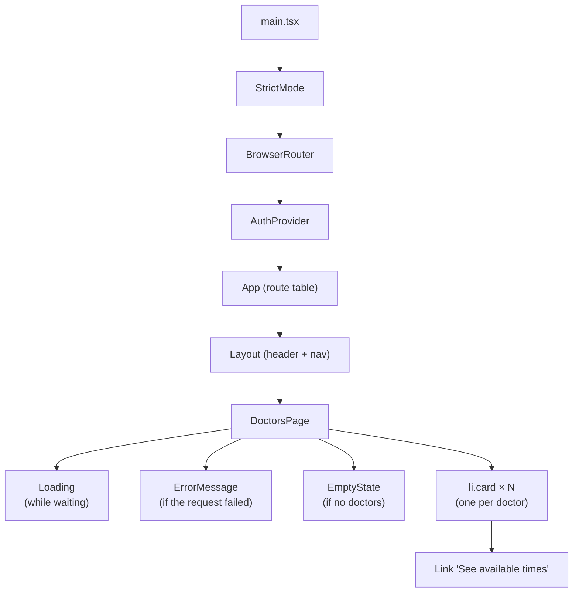
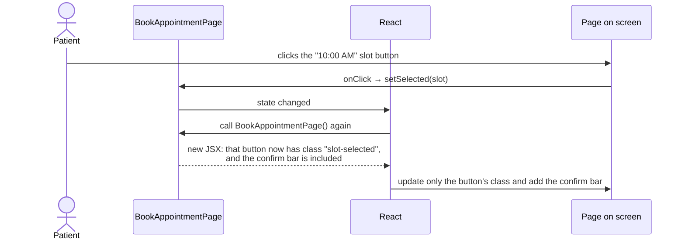

# Week 7: Frontend I (React components, JSX, props, state, hooks)

[← Course home](README.md) · [Previous: Week 6](week-06.md)

## 1. Goal

By the end of this week you can:

- look at any ClinicQ screen and name the components that draw it;
- read JSX and translate it into "what the user sees";
- explain props (what a component is given) and state (what a component remembers), and say which is which in a real file;
- explain why the screen updates when state changes, and what `useState`, `useEffect` and `useCallback` are for;
- follow a click from a button to the state change to the new screen;
- add an interactive filter to a page by directing an AI.

## 2. Concept primer

### React in one paragraph

**React** is a library for building user interfaces out of **components**: functions that return a description of what should be on screen. You don't tell React "change this label's text". Instead you change your data, and React calls your component again, compares the new description with the old one, and updates only what changed in the page. The page is a **function of the data**: `UI = f(state)`.

That's why React code rarely touches the page directly. It changes **state**, and the screen follows.

### Components and JSX

A component is a function whose name starts with a capital letter and which returns **JSX**, an HTML-like syntax inside TypeScript:

<!-- example -->

```tsx
function Greeting({ name }: { name: string }) {
  return <p className="muted">Hello, {name}!</p>;
}

// used elsewhere as:
<Greeting name="Alice" />;
```

JSX looks like HTML, with a few differences you'll see everywhere in ClinicQ:

- `{ ... }` inside JSX means "insert this TypeScript value or expression here".
- `className` instead of `class` (because `class` is a TypeScript keyword).
- Event handlers are camelCase and take functions: `onClick={handleLogout}`.
- A component can only return **one** root element. `<>...</>` (a **fragment**) groups several without adding a wrapper element to the page.
- Lowercase tags (`<div>`, `<button>`) are HTML elements; capitalised tags (`<Loading />`, `<Link />`) are components.

Components nest to form a **tree**. ClinicQ's Doctors page, for example:



### Props: what a component is given

**Props** (properties) are the inputs a parent passes to a child, like arguments to a function. `<ErrorMessage error={error} onRetry={reload} />` gives the `ErrorMessage` component two props. A component must **not** change its props. They belong to the parent.

A special prop, **`children`**, is whatever is written between the opening and closing tags: `<EmptyState title="…"> this part </EmptyState>`.

### State: what a component remembers

**State** is data a component keeps between renders and can change, such as which slot is selected, whether a request is in progress, or which filter is chosen. You create it with the `useState` hook:

<!-- example -->

```tsx
const [selected, setSelected] = useState<Slot | null>(null);
//     current value  setter                  initial value
```

Calling `setSelected(slot)` stores the new value and tells React to **re-render** the component, calling the function again. This time `selected` holds the new value, so the JSX it returns is different.

**Master:** never change state directly (`selected = slot` does nothing useful). Always use the setter. The setter is how React knows something changed.

Values that can be **calculated** from props or state shouldn't be state themselves. The admin page stores only the `filter`, and calculates the filtered list on every render. Two copies of the same information drift apart; one source can't.

### Hooks

**Hooks** are functions starting with `use` that give components abilities: memory (`useState`), side effects (`useEffect`), stable functions (`useCallback`), shared data (`useContext`), and more. ClinicQ also has its own hooks: `useApiData` and `useAuth`. Two rules: call hooks only at the **top level** of a component (not inside `if` or loops), and only from components or other hooks. The ESLint plugin `react-hooks` enforces this, which is why it's in [`eslint.config.js`](../../eslint.config.js).

- **`useEffect(fn, [deps])`** runs `fn` _after_ the component appears on screen, and again whenever something in `[deps]` changes. It's for **side effects**: work that reaches outside React, like fetching data. It can return a **cleanup** function that runs before the next effect, or when the component disappears.
- **`useCallback(fn, [deps])`** returns the _same_ function object between renders, unless a dependency changed. It matters when a function is itself a dependency of an effect, as in `BookAppointmentPage`.

### The render cycle for one click



## 3. Reading path

1. [`apps/web/index.html`](../../apps/web/index.html) and [`apps/web/src/main.tsx`](../../apps/web/src/main.tsx) (**master**). The one HTML page, and where React takes it over. _Why:_ a single-page app has one real HTML page, and everything else is drawn by JavaScript.
2. [`apps/web/src/components/`](../../apps/web/src/components/): `Loading`, `ErrorMessage`, `EmptyState`, `StatusBadge` (**master**). Small, reusable components with props. _Why real projects have shared components:_ every page shows loading and errors the same way, and fixing one fixes all.
3. [`apps/web/src/pages/DoctorsPage.tsx`](../../apps/web/src/pages/DoctorsPage.tsx) (**master**). The simplest page: load, then show one of four states.
4. [`apps/web/src/pages/AdminAppointmentsPage.tsx`](../../apps/web/src/pages/AdminAppointmentsPage.tsx) (**master**). State for a filter, and a derived list.
5. [`apps/web/src/pages/BookAppointmentPage.tsx`](../../apps/web/src/pages/BookAppointmentPage.tsx) (**master**). Several pieces of state, a click handler, and conditional UI.
6. [`apps/web/src/hooks.ts`](../../apps/web/src/hooks.ts) (**master the idea, skim the details**). `useApiData`, built from `useState`, `useEffect` and `useCallback`.
7. [`apps/web/src/components/Layout.tsx`](../../apps/web/src/components/Layout.tsx) (**skim**; routing parts are Week 8).
8. [`apps/web/src/styles.css`](../../apps/web/src/styles.css) (**skim**). Where `className`s get their look. Colours are defined once as variables at the top.

## 4. Block-by-block walkthrough

### Where React starts (`main.tsx`)

```tsx
createRoot(document.getElementById('root')!).render(
  <StrictMode>
    <BrowserRouter>
      <AuthProvider>
        <App />
      </AuthProvider>
    </BrowserRouter>
  </StrictMode>,
);
```

- **What it does:** it finds the empty `<div id="root">` in `index.html` and tells React to draw the app inside it. The app is wrapped in three **providers**:
  - `StrictMode` adds extra development-time checks;
  - `BrowserRouter` handles URLs (Week 8);
  - `AuthProvider` provides the login state (Week 8).
- **Syntax decoded:** `document.getElementById('root')` finds the element. The `!` tells TypeScript "this is definitely not null" (another assertion to notice). Nesting tags means nesting components: everything inside `<AuthProvider>` can use the login state.
- **Connects to:** [`index.html`](../../apps/web/index.html) (`<div id="root">`), [`App.tsx`](../../apps/web/src/App.tsx) and [`AuthContext.tsx`](../../apps/web/src/auth/AuthContext.tsx).
- **Dev-speak:** "The root render wraps the app in the router and auth providers."

A detail that surprises people: in development, `StrictMode` deliberately runs effects twice to expose bugs. That's why you may see requests twice in the Network tab during development, but not in the production build.

### A component with props (`ErrorMessage.tsx`)

```tsx
interface ErrorMessageProps {
  error: Error;
  onRetry?: () => void;
}

export function ErrorMessage({ error, onRetry }: ErrorMessageProps) {
  return (
    <div className="alert alert-error" role="alert">
      <span>{error.message}</span>
      {onRetry && (
        <button type="button" className="button button-small" onClick={onRetry}>
          Try again
        </button>
      )}
    </div>
  );
}
```

- **What it does:** it shows an error's message in a red box. If the parent passed an `onRetry` function, it also shows a "Try again" button that calls it.
- **Syntax decoded:**
  - `interface ErrorMessageProps` lists the props and their types; `onRetry?` is optional, a function taking nothing and returning nothing.
  - `({ error, onRetry }: ErrorMessageProps)` destructures the props.
  - `{error.message}` inserts text.
  - `{onRetry && ( <button …> )}` is **conditional rendering**: if `onRetry` exists, render the button; otherwise nothing.
  - `role="alert"` makes screen readers announce the message (accessibility).
- **Connects to:** every page that loads data; `reload` from `useApiData` is what they pass as `onRetry`.
- **Dev-speak:** "A presentational component: props in, markup out, no state."

### A tiny lookup component (`StatusBadge.tsx`)

```tsx
const LABELS: Record<AppointmentStatus, string> = {
  BOOKED: 'Booked',
  CANCELLED: 'Cancelled',
};

export function StatusBadge({ status }: { status: AppointmentStatus }) {
  return <span className={`badge badge-${status.toLowerCase()}`}>{LABELS[status]}</span>;
}
```

- **What it does:** it turns `BOOKED` into a teal "Booked" pill and `CANCELLED` into a grey "Cancelled" pill.
- **Syntax decoded:** `Record<AppointmentStatus, string>` is "an object with one string for **every** status". If someone adds a new status to the type and forgets a label here, TypeScript complains. The `className` is a template string, so it becomes `badge badge-booked` or `badge badge-cancelled`, which match rules in `styles.css`.
- **Connects to:** `MyAppointmentsPage` and `AdminAppointmentsPage`; the `.badge-booked` and `.badge-cancelled` styles.
- **Dev-speak:** "Exhaustive label map keyed by the status union."

### Four states of a page (`DoctorsPage.tsx`)

```tsx
export function DoctorsPage() {
  const { data, error, isLoading, reload } = useApiData(fetchDoctors);

  return (
    <section>
      <h1>Doctors</h1>
      <p className="muted">Choose a doctor to see their available times.</p>

      {isLoading && <Loading label="Loading doctors…" />}
      {error && <ErrorMessage error={error} onRetry={reload} />}
      {data && data.doctors.length === 0 && <EmptyState title="No doctors are listed yet." />}
```

- **What it does:** it loads the doctors, then shows exactly one of: a spinner while loading, an error with "Try again", an empty-state message if the list is empty, or the list itself.
- **Syntax decoded:** `const { data, error, isLoading, reload } = useApiData(...)` destructures the hook's result. Each `{condition && <Component />}` line renders its component only when the condition is true.
- **Connects to:** `fetchDoctors` in [`api/doctors.ts`](../../apps/web/src/api/doctors.ts), and `useApiData` in [`hooks.ts`](../../apps/web/src/hooks.ts).
- **Dev-speak:** "Handles loading, error, empty and success states explicitly."

```tsx
<ul className="grid">
  {data.doctors.map((doctor) => (
    <li key={doctor.id} className="card doctor-card">
      <h2>{doctor.name}</h2>
      <p className="muted">{doctor.specialty}</p>
      <Link to={`/doctors/${doctor.id}`} className="button">
        See available times
      </Link>
    </li>
  ))}
</ul>
```

- **What it does:** it draws one card per doctor, each linking to that doctor's booking page.
- **Syntax decoded:**
  - `array.map(item => <JSX/>)` turns a list of data into a list of elements. This is how every list in React is drawn.
  - `key={doctor.id}` gives each item a stable identity, so React can tell which card is which when the list changes. Keys must be unique among siblings, and should come from the data, not from the position in the list.
- **Connects to:** `BookAppointmentPage` (the link target), and the `doctors` array from the API (Week 1).
- **Dev-speak:** "Map over the doctors with a stable key."

### State plus derived data (`AdminAppointmentsPage.tsx`)

```tsx
type Filter = 'ALL' | AppointmentStatus;
```

```tsx
const [filter, setFilter] = useState<Filter>('ALL');
```

```tsx
const appointments =
  filter === 'ALL' ? data.appointments : data.appointments.filter((a) => a.status === filter);
```

```tsx
<select value={filter} onChange={(e) => setFilter(e.target.value as Filter)}>
  <option value="ALL">All</option>
  <option value="BOOKED">Booked</option>
  <option value="CANCELLED">Cancelled</option>
</select>
```

- **What it does:** the page remembers which status filter is chosen (initially "All"). On every render, it calculates the visible list from the full data and the filter. Choosing an option updates the state, and the table redraws.
- **Syntax decoded:**
  - `useState<Filter>('ALL')` creates state of type `Filter`, starting at `'ALL'`.
  - `.filter(a => a.status === filter)` keeps only matching items. (The array method `filter` and the state called `filter` share a name, which is confusing but legal.)
  - `value={filter}` makes the dropdown show the state. `onChange` receives the event `e`, and `e.target.value` is the chosen option's value. This pattern is called a **controlled input**: React state is the single source of truth for what the input shows.
- **Connects to:** `fetchAllAppointments` via `useApiData`; the "Showing N of M" line below reuses both lists.
- **Dev-speak:** "The filter is local state; the list is derived, not stored."

### Several pieces of state and a handler (`BookAppointmentPage.tsx`)

```tsx
const [selected, setSelected] = useState<Slot | null>(null);
const [bookingError, setBookingError] = useState<Error | null>(null);
const [isBooking, setIsBooking] = useState(false);
```

- **What it does:** it tracks three things: the slot the patient picked (none at first), any error from booking, and whether a booking request is in flight.
- **Syntax decoded:** three independent `useState` calls. `useState(false)` doesn't need `<boolean>`, because TypeScript infers the type from the initial value.
- **Connects to:** everything below in the same file.
- **Dev-speak:** "Local UI state for selection, submission and error."

```tsx
<button
  key={slot.id}
  type="button"
  className={`slot ${selected?.id === slot.id ? 'slot-selected' : ''}`}
  aria-pressed={selected?.id === slot.id}
  onClick={() => setSelected(slot)}
>
  {formatTime(slot.startsAt)}
</button>
```

- **What it does:** each time slot is a button. Clicking it selects that slot. The selected one gets the `slot-selected` style and is marked "pressed" for screen readers.
- **Syntax decoded:** `onClick={() => setSelected(slot)}` passes a **new arrow function** that calls the setter with this slot. Writing `onClick={setSelected(slot)}` instead would call it immediately during rendering, which is a classic bug. `selected?.id === slot.id` is safe when nothing is selected yet.
- **Connects to:** the confirm bar below, which appears only when `selected` is set.
- **Dev-speak:** "A toggle-style selection with `aria-pressed` for accessibility."

```tsx
async function handleConfirm() {
  if (!selected) return;
  setBookingError(null);
  setIsBooking(true);
  try {
    await bookAppointment(selected.id);
    navigate('/appointments', { state: { message: 'Your appointment is booked.' } });
  } catch (err) {
    setBookingError(err as Error);
    setIsBooking(false);
    // Someone else got the slot first: refresh the list so it disappears.
    if (err instanceof ApiError && err.code === 'SLOT_ALREADY_BOOKED') {
      setSelected(null);
      reload();
    }
  }
}
```

- **What it does:** when the patient confirms, it clears any old error, marks "booking in progress" (which disables the button and shows "Booking…"), and calls the API.
  - On success, it goes to My appointments with a message.
  - On failure, it shows the error and re-enables the button. If the reason was "slot already booked", it also clears the selection and reloads the slots, so the taken slot disappears.
- **Syntax decoded:** a normal `async` function with `try`/`catch` (Week 2). `if (!selected) return;` is a guard clause. `err as Error` is a type assertion, needed because anything can be thrown.
- **Connects to:** `bookAppointment` in [`api/appointments.ts`](../../apps/web/src/api/appointments.ts); `ApiError` in [`client.ts`](../../apps/web/src/api/client.ts); the API's 409 from Week 4.
- **Dev-speak:** "Optimistic UI isn't needed here. We disable while submitting and handle the 409 by refetching."

### Building a custom hook (`hooks.ts`, **skim the details**)

```tsx
  useEffect(() => {
    // Ignore the response if the component has moved on (e.g. navigated away).
    let ignore = false;
```

```tsx
    return () => {
      ignore = true;
    };
  }, [load, reloadCount]);
```

- **What it does:** after the component appears (and whenever `load` or `reloadCount` changes), it runs `load()` and stores the result or error in state. If the component disappears, or a newer load starts before this one finishes, the cleanup sets `ignore`, so a stale response can't overwrite newer data.
- **Syntax decoded:** `useEffect(fn, [deps])` with a cleanup function returned from `fn`. `reload()` works by increasing `reloadCount`, a dependency, so the effect runs again.
- **Connects to:** every data page. `BookAppointmentPage` wraps its loader in `useCallback(..., [doctorId])` so that `load` only changes when the doctor changes. Without that, the effect would re-run on every render and fetch in a loop.
- **Dev-speak:** "A data-fetching hook with a stale-response guard. The loader must be memoised."

## 5. Hands-on

1. Install the **React Developer Tools** extension for Chrome. Open the Components tab on the Book page, click a slot, and watch `selected` change in the state panel.
2. In `DoctorsPage.tsx`, temporarily change `key={doctor.id}` to remove the key entirely. Open the browser console and read React's warning. Undo.
3. In `BookAppointmentPage.tsx`, change `onClick={() => setSelected(slot)}` to `onClick={setSelected(slot)}`. Read the error in the browser and in `npm run typecheck`. Undo with `git restore .`.
4. Make the API slow on purpose to see the loading state: in Chrome DevTools → Network, set throttling to **Slow 4G** and reload the Doctors page.
5. Stop the API (`Ctrl+C` in its terminal) and reload the Doctors page: you see the error state and "Try again". Start the API and click "Try again".

## 6. PA lens

**Every screen has at least four states, and ACs should cover each:** loading, error, empty and success, plus in-progress states for actions ("Booking…", disabled button). Designs often show only the happy state. Ask for the others in refinement, or write them as ACs yourself:

<!-- example -->

```text
Given the doctor list is loading, then I see "Loading doctors…"
Given the list failed to load, then I see the error and a "Try again" button that reloads it
Given there are no doctors, then I see "No doctors are listed yet."
Given I click Confirm booking, then the button shows "Booking…" and can't be clicked again
```

**Refinement questions for this layer:**

- What does the user see while waiting, if it fails, and if there's nothing to show?
- Can the user double-click and submit twice? (ClinicQ disables the button while booking.)
- What happens to the screen after a successful action: stay, navigate, show a message?
- Is the filter or selection remembered after a reload? (ClinicQ's admin filter isn't: it's local state.)
- Is it usable with a keyboard and a screen reader? (Buttons, labels, `role="alert"`.)

**Typical UAT bugs from this layer:**

- **A spinner that never ends.** An error path that never sets loading to false.
- **Stale screen after an action.** The action succeeded, but the list wasn't reloaded.
- **Double submissions.** A button not disabled while the request is in flight.
- **Wrong item updated in a list.** Missing or unstable `key`s.
- **Flash of wrong content.** For example, "No appointments" briefly shown before the data arrives, because the empty check ran before the loading check.

## 7. Build with AI: filter doctors by specialty

Your first **interactive UI change**: new state, a controlled input, a derived list, and an extra empty state.

### The spec

```markdown
## Story

As a patient, I want to filter the doctor list by specialty, so that I find the right doctor quickly.

## Acceptance criteria

- Given the Doctors page has loaded, then I see a "Specialty" dropdown above the list
  with "All specialties" first, then every specialty present in the list, alphabetically, each once.
- Given I choose "Cardiology", then only cardiologists are shown.
- Given I choose "All specialties", then every doctor is shown again.
- The dropdown is not shown while loading or when the request failed.
- The filter is not remembered after a page reload (that's fine for now).

## Out of scope

- API changes (the filter works on the list already loaded), URL query parameters (Week 8).

## Where I expect changes

- apps/web/src/pages/DoctorsPage.tsx only (maybe a line of CSS in styles.css).

## How I'll test it

- Automated: npm run typecheck; npm run lint; npm test --workspace apps/web still passes;
  npm run test:e2e still passes (it clicks a doctor card).
- Manual: choose each option; check the list and the "All" option.
```

### Example prompt

```text
In ClinicQ's web app, add a specialty filter to apps/web/src/pages/DoctorsPage.tsx.

- Keep the selected specialty in useState ('' means all).
- Derive the specialty options from the loaded doctors: unique, sorted alphabetically.
- Derive the visible doctors from the loaded list and the selected specialty. Don't store
  the filtered list in state.
- Render a labelled <select> ("Specialty") only when the data has loaded, using the same
  controlled-input pattern and inline-label class as AdminAppointmentsPage.tsx.
- Keep the existing loading, error and empty states working.

Change only DoctorsPage.tsx (and styles.css only if needed). No new packages.
Explain the plan first, then show the diff.
```

### Checklist for reviewing the diff

- [ ] Exactly one piece of new state (the selected specialty). The filtered list and the options are **calculated**, not stored with `useState` or updated in a `useEffect`. Storing derived data is the most common AI mistake in React code.
- [ ] The options come from the data (no hard-coded specialty names).
- [ ] Options are unique and sorted; "All specialties" is first, with value `''`.
- [ ] The `<select>` has `value={...}` and `onChange={...}` (controlled) and a visible label.
- [ ] Loading, error and empty states render as before; the dropdown isn't shown during loading.
- [ ] The `key={doctor.id}` on list items is kept.
- [ ] Nothing changed in `api/`, `hooks.ts` or other pages.

### How to test it

```bash
npm run typecheck && npm run lint
npm test --workspace apps/web
npm run test:e2e
```

Then in the browser: pick each specialty, then "All specialties". Use React DevTools to watch the one piece of state change. Add a fifth doctor with the same specialty as an existing one (your Week 0 change!) and check that the specialty appears only once.

## 8. Vocabulary

| Term                   | Meaning, and where it shows up in ClinicQ                                                 |
| ---------------------- | ----------------------------------------------------------------------------------------- |
| React                  | The UI library: components describe the screen; React updates the page when data changes. |
| Component              | A function returning JSX, like `DoctorsPage`, `ErrorMessage`, `StatusBadge`.              |
| JSX                    | HTML-like syntax in TypeScript: `<p className="muted">{doctor.specialty}</p>`.            |
| Props                  | Inputs passed from parent to child: `<ErrorMessage error={error} onRetry={reload} />`.    |
| `children`             | The content between a component's tags, used by `EmptyState` and `AppointmentRow`.        |
| State                  | Data a component remembers and can change: `selected`, `isBooking`, `filter`.             |
| `useState`             | Hook that creates state and its setter: `const [filter, setFilter] = useState('ALL')`.    |
| Re-render              | React calling a component again after state or props change.                              |
| Derived data           | Values calculated from state on each render: the admin page's filtered `appointments`.    |
| Conditional rendering  | Showing elements only when a condition holds: `{error && <ErrorMessage … />}`.            |
| List rendering / `key` | `array.map(...)` to draw lists; `key={doctor.id}` gives each item a stable identity.      |
| Event handler          | A function run on user action: `onClick`, `onChange`.                                     |
| Controlled input       | An input whose value comes from state: the admin status `<select>`.                       |
| `useEffect`            | Hook for side effects after rendering, like fetching data in `useApiData`.                |
| Custom hook            | Your own `use…` function combining hooks: `useApiData`, `useAuth`.                        |

## 9. Quiz

1. On the admin page, why is the filtered `appointments` list calculated on every render instead of kept in its own `useState`?
2. What's wrong with `onClick={setSelected(slot)}`?
3. `DoctorsPage` has no `useState` of its own. Where does its data live, and what makes it re-render when the doctors arrive?
4. Why does `BookAppointmentPage` wrap its loader in `useCallback`, while `DoctorsPage` passes `fetchDoctors` directly?
5. After a successful cancellation, how does My appointments update to show the appointment under "Past and cancelled"?

<details>
<summary>Answers</summary>

1. Because it can be derived from `data` and `filter`. A second copy in state would have to be kept in sync by hand. Forget one update, and the table shows the wrong rows.
2. It calls `setSelected(slot)` immediately while rendering, instead of passing a function to run on click. That causes a state update during render, which leads to an error or an infinite loop. The correct form is `onClick={() => setSelected(slot)}`.
3. In the state inside the `useApiData` hook, which the page calls. When the request finishes, the hook calls `setData(...)`. That state belongs to the page's component, so React re-renders `DoctorsPage` with the new data.
4. `useApiData` re-runs its effect whenever `load` changes. `fetchDoctors` is defined outside the component, so it's the same function every render. The booking page's loader is created inside the component (it needs `doctorId`), so without `useCallback` it would be a new function every render, and the effect would fetch in an endless loop.
5. `handleCancel` calls the API, then sets a success message and calls `reload()`. `reload` bumps `reloadCount`, so `useApiData`'s effect fetches the list again. The new data re-renders the page, and `isUpcoming` now puts that appointment in the second section.

</details>

---

Next: [Week 8: Frontend II](week-08.md)
