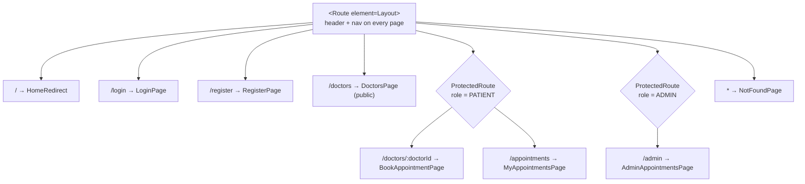
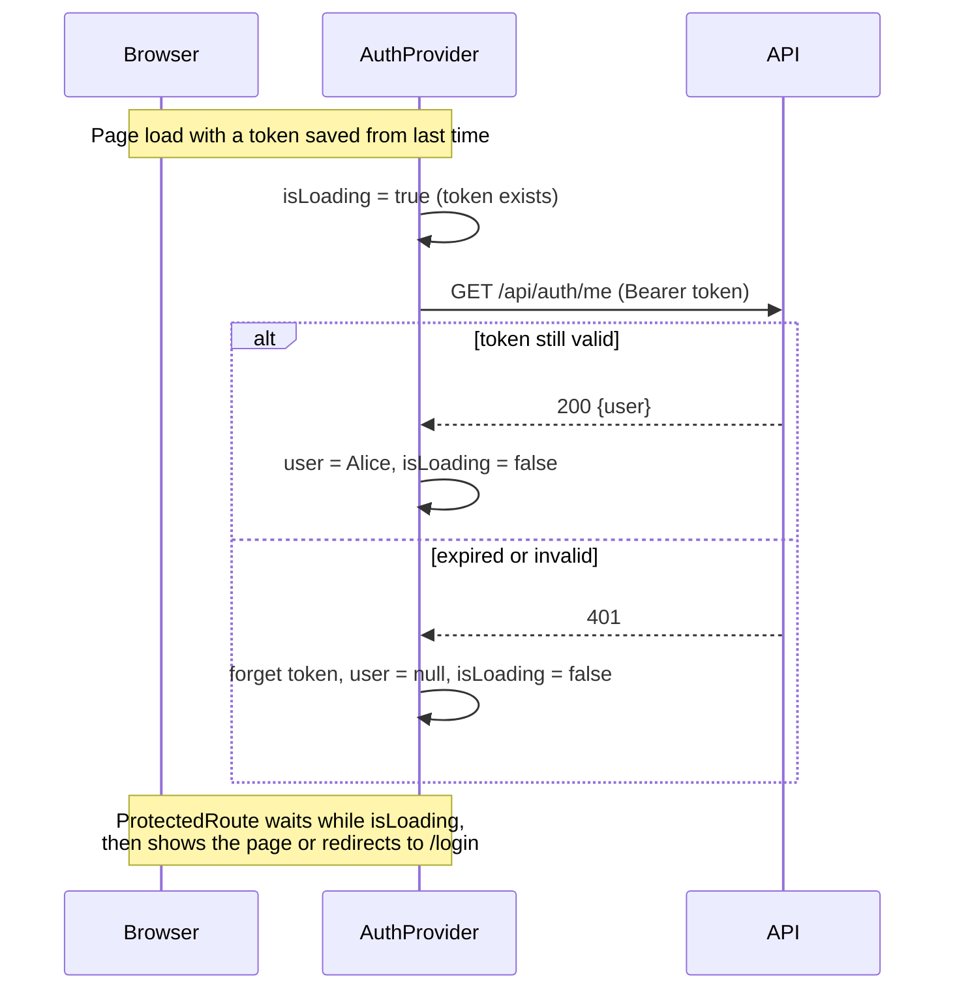

# Week 8: Frontend II (routing, forms, calling the API, auth context)

[← Course home](README.md) · [Previous: Week 7](week-07.md)

## 1. Goal

By the end of this week you can:

- read `App.tsx` and say, for any URL, which page shows and who may see it;
- explain how a single-page app changes pages without reloading, and why the server needs a fallback for deep links;
- follow a form from typing, to submit, to API call, to error or success, to navigation;
- explain how the whole app knows who's logged in (context) and what happens on reload and on session expiry;
- trace every call from a page, through the API client, to its endpoint;
- improve a form's error handling end to end by directing an AI.

## 2. Concept primer

### Single-page apps and client-side routing

In a traditional website, every link click asks the server for a new HTML page. ClinicQ is a **single-page application** (SPA): the browser loads one HTML page once, and JavaScript draws everything after that. When you click "My appointments", the URL changes to `/appointments`, but no new page is downloaded. **React Router** reads the URL and shows the matching component. This is **client-side routing**.

Two consequences:

- Moving between pages is fast, and state like the logged-in user survives navigation.
- If you **reload** or open `http://localhost:8080/appointments` directly, the browser asks the _server_ for `/appointments`. There's no such file, so the server must answer with `index.html` anyway, and React Router takes it from there. In Docker, nginx does this with `try_files $uri $uri/ /index.html;` in [`nginx.conf`](../../apps/web/nginx.conf). The Vite dev server does it automatically. This is called the **SPA fallback**.

### The route table



**Layout routes** (a `<Route>` with an `element` but no `path`) wrap their children: the `Layout` draws the header, and `<Outlet />` inside it is where the child page appears. `ProtectedRoute` is a layout route too, one that decides whether to show its children at all.

### Forms in React

HTML forms normally reload the page on submit. React forms use **controlled inputs** (Week 7) and a submit handler that:

1. calls `event.preventDefault()`, which stops the browser's own submission;
2. sets "submitting" state, which disables the button;
3. calls the API;
4. on success navigates or updates the screen, and on failure shows the error and re-enables the button.

Browsers also validate some things themselves: `required`, `type="email"` and `minLength={8}` stop obviously bad submissions before any code runs. This is a convenience only. The API validates everything again (Week 4), because the browser checks are easy to bypass.

### Context: data the whole app can see

Some data is needed almost everywhere, like the logged-in user. Passing it as props through every layer ("prop drilling") gets messy. **Context** lets a **provider** component near the top make a value available to every component below it. Any of them can read it with `useContext`. ClinicQ wraps this in `useAuth()`.



The `isLoading` flag matters. Without it, a logged-in user reloading `/appointments` would be bounced to `/login` for a split second, before `/api/auth/me` answered.

### The API client: one door out

Every request goes through `apiRequest` in [`client.ts`](../../apps/web/src/api/client.ts). It adds the token, sends and reads JSON, turns error responses into `ApiError` (carrying the API's `code`), reports network failures in plain language, and triggers a global logout on 401. Pages never call `fetch` directly. The small files in [`src/api/`](../../apps/web/src/api/) give each endpoint a named, typed function.

## 3. Reading path

1. [`apps/web/src/App.tsx`](../../apps/web/src/App.tsx) (**master**). The route table. _Why real projects keep routes in one place:_ one file answers "what pages exist, and who can see them?", which is the first thing a reviewer or tester needs.
2. [`apps/web/src/auth/ProtectedRoute.tsx`](../../apps/web/src/auth/ProtectedRoute.tsx) (**master**).
3. [`apps/web/src/auth/AuthContext.tsx`](../../apps/web/src/auth/AuthContext.tsx) (**master**). _Why:_ one owner of "who is logged in", instead of every page reading `localStorage` its own way.
4. [`apps/web/src/components/Layout.tsx`](../../apps/web/src/components/Layout.tsx) (**master**). Navigation that changes with the role.
5. [`apps/web/src/pages/LoginPage.tsx`](../../apps/web/src/pages/LoginPage.tsx) (**master**) and [`RegisterPage.tsx`](../../apps/web/src/pages/RegisterPage.tsx) (**skim**; same pattern).
6. [`apps/web/src/api/client.ts`](../../apps/web/src/api/client.ts) (**master**, all of it now) and [`api/appointments.ts`](../../apps/web/src/api/appointments.ts) (**master**).
7. [`apps/web/src/pages/MyAppointmentsPage.tsx`](../../apps/web/src/pages/MyAppointmentsPage.tsx) (**master**). An action (cancel) with confirmation, in-progress state, success message and reload.
8. [`apps/web/src/api/client.test.ts`](../../apps/web/src/api/client.test.ts) (**skim**). How the client is tested without a server.
9. [`apps/web/nginx.conf`](../../apps/web/nginx.conf) (**skim**). The SPA fallback and the `/api` forwarding in Docker.

## 4. Block-by-block walkthrough

### The route table (`App.tsx`)

```tsx
<Route element={<Layout />}>
  <Route index element={<HomeRedirect />} />
  <Route path="login" element={<LoginPage />} />
  <Route path="register" element={<RegisterPage />} />
  <Route path="doctors" element={<DoctorsPage />} />

  <Route element={<ProtectedRoute role="PATIENT" />}>
    <Route path="doctors/:doctorId" element={<BookAppointmentPage />} />
    <Route path="appointments" element={<MyAppointmentsPage />} />
  </Route>

  <Route element={<ProtectedRoute role="ADMIN" />}>
    <Route path="admin" element={<AdminAppointmentsPage />} />
  </Route>

  <Route path="*" element={<NotFoundPage />} />
</Route>
```

- **What it does:** it maps URLs to pages. Everything is inside `Layout`. Login, register and the doctor list are public; booking and My appointments need a patient; `/admin` needs an admin; any other URL shows "Page not found".
- **Syntax decoded:**
  - `<Route path="…" element={<Page />} />` means "at this URL, show this page". `index` means "the parent's own URL", here `/`.
  - `:doctorId` is a **URL parameter**, read with `useParams()`. `*` matches anything not matched above.
  - Nesting routes nests their elements, and the parent's `<Outlet />` shows the child.
- **Connects to:** every page; `ProtectedRoute`; the API's own guards (Week 6), which this mirrors for the user's benefit.
- **Dev-speak:** "Nested layout routes with role-guarded groups and a catch-all 404."

### The guard (`ProtectedRoute.tsx`)

```tsx
if (isLoading) {
  return <Loading />;
}

if (!user) {
  // Remember where they were going, so login can send them back.
  return <Navigate to="/login" replace state={{ from: location.pathname }} />;
}

if (role && user.role !== role) {
  return <Navigate to={homePathFor(user)} replace />;
}

return <Outlet />;
```

- **What it does:** while the session is being checked, it shows a spinner. If nobody's logged in, it goes to `/login`, remembering the page they wanted. If the role is wrong, it sends them to their own home page. Otherwise it shows the child route.
- **Syntax decoded:**
  - `<Navigate to=… />` is a component that redirects when rendered.
  - `replace` swaps the current history entry instead of adding one, so "Back" doesn't bounce the user into the redirect again.
  - `state={{ from: … }}` attaches invisible data to the navigation. The double braces are just an object inside a JSX expression.
  - `location.pathname` is the current path.
- **Connects to:** `LoginPage`, which reads `state.from`, and `homePathFor` in [`AuthContext.tsx`](../../apps/web/src/auth/AuthContext.tsx).
- **Dev-speak:** "An auth guard with return-to-original-URL after login."

### Who's logged in, for the whole app (`AuthContext.tsx`)

```tsx
const AuthContext = createContext<AuthContextValue | null>(null);
```

```tsx
const [user, setUser] = useState<User | null>(null);
const [isLoading, setIsLoading] = useState(() => getToken() !== null);
```

```tsx
// If a token was saved from an earlier visit, find out who it belongs to.
useEffect(() => {
  if (!getToken()) return;

  authApi
    .fetchCurrentUser()
    .then(({ user }) => setUser(user))
    .catch(() => setToken(null))
    .finally(() => setIsLoading(false));
}, []);
```

- **What it does:** it creates the context, and in the provider it keeps the current user in state.
  - On first load, if a token was saved, it asks the API who that token belongs to. If the answer comes back, that's the user; if the token is rejected, it's thrown away. Either way, loading ends.
  - With no saved token, `isLoading` starts as `false`, so there's nothing to wait for.
- **Syntax decoded:**
  - `createContext<…>(null)` creates a context with a type and a default value.
  - `useState(() => …)` takes a function that runs **once** to compute the initial value.
  - `useEffect(fn, [])`: an empty dependency list means "run once, after the first render".
  - `.then(({ user }) => …)` destructures the response.
- **Connects to:** `fetchCurrentUser` → `GET /api/auth/me` → `getCurrentUser` in the API's [`auth.service.ts`](../../apps/api/src/services/auth.service.ts).
- **Dev-speak:** "Session restore on boot via `/me`, with a loading gate."

```tsx
const login = useCallback(async (email: string, password: string) => {
  const result = await authApi.login(email, password);
  setToken(result.token);
  setUser(result.user);
  return result.user;
}, []);
```

```tsx
<AuthContext.Provider value={{ user, isLoading, login, register, logout }}>
  {children}
</AuthContext.Provider>
```

- **What it does:** `login` calls the API, saves the token, stores the user (every component using `useAuth()` re-renders), and returns the user so the caller can decide where to go. The provider hands these values to everything inside it.
- **Syntax decoded:** `useCallback(async (…) => {…}, [])` keeps the same function across renders. `AuthContext.Provider value={…}` is what makes the values visible to `useContext(AuthContext)` below it.
- **Connects to:** `LoginPage` and `RegisterPage` (call `login`/`register`), `Layout` (shows the name and Log out), `ProtectedRoute` (reads `user`/`isLoading`).
- **Dev-speak:** "Auth state lives in context; the token lives in `localStorage` via the client."

```tsx
export function useAuth() {
  const context = useContext(AuthContext);
  if (!context) {
    throw new Error('useAuth must be used inside <AuthProvider>');
  }
  return context;
}
```

- **What it does:** it's the one way components read the auth state. It fails loudly if used outside the provider (a setup mistake), instead of quietly returning nothing.
- **Syntax decoded:** a custom hook wrapping `useContext`.
- **Connects to:** every component that needs the user.
- **Dev-speak:** "A typed context hook with a guard."

### A form from start to finish (`LoginPage.tsx`)

```tsx
// Where ProtectedRoute was trying to send them before asking them to log in.
const from = (location.state as { from?: string } | null)?.from;

if (user) {
  return <Navigate to={homePathFor(user)} replace />;
}

async function handleSubmit(event: FormEvent) {
  event.preventDefault();
  setError(null);
  setIsSubmitting(true);
  try {
    const loggedIn = await login(email, password);
    navigate(from ?? homePathFor(loggedIn), { replace: true });
  } catch (err) {
    setError(err as Error);
    setIsSubmitting(false);
  }
}
```

- **What it does:** if you're already logged in, visiting `/login` sends you home. On submit, it stops the browser's default reload, clears old errors, disables the button, and logs in. On success it goes where you were originally heading (or your role's home); on failure it shows the API's message and re-enables the button.
- **Syntax decoded:**
  - `location.state as { from?: string } | null` is an assertion, because router state can be anything.
  - `useNavigate()` returns the `navigate` function for moving in code.
  - `from ?? homePathFor(loggedIn)` means "the original page if there was one, otherwise home".
  - `FormEvent` is React's type for the submit event.
- **Connects to:** `login` from `useAuth`; `ErrorMessage` for the error; the E2E test, which fills in exactly these fields by their labels.
- **Dev-speak:** "Standard submit handler: prevent default, pending state, redirect back on success."

```tsx
<input
  type="email"
  autoComplete="email"
  required
  value={email}
  onChange={(e) => setEmail(e.target.value)}
/>
```

- **What it does:** it's an email field whose content is React state. `required` and `type="email"` let the browser block empty or malformed values; `autoComplete` helps password managers.
- **Syntax decoded:** a controlled input (Week 7): `value` from state, `onChange` updates state on every keystroke. `required` with no value is JSX for "true".
- **Connects to:** the `email` state; the surrounding `<label>`, which makes "Email" its accessible name. That's how the E2E test's `getByLabel('Email')` finds it.
- **Dev-speak:** "Controlled input with native constraint validation."

### Role-aware navigation (`Layout.tsx`)

```tsx
<nav className="nav" aria-label="Main">
  {user?.role === 'ADMIN' ? (
    <NavLink to="/admin">All appointments</NavLink>
  ) : (
    <>
      <NavLink to="/doctors">Doctors</NavLink>
      {user && <NavLink to="/appointments">My appointments</NavLink>}
    </>
  )}
</nav>
```

- **What it does:** admins see one link, "All appointments". Everyone else sees "Doctors", plus "My appointments" if logged in.
- **Syntax decoded:** `condition ? (A) : (B)` chooses between two blocks of JSX. `<NavLink>` is a link that automatically gets the `active` class when its URL is the current page. That's how the current tab is highlighted in teal (see `.nav a.active` in `styles.css`). `<Link>` and `<NavLink>` change the URL without reloading the page; a plain `<a href>` would reload it.
- **Connects to:** `useAuth()` for `user`; the routes in `App.tsx`.
- **Dev-speak:** "Nav is role-driven; NavLink handles the active state."

### Calling the API for an action (`api/appointments.ts` and `MyAppointmentsPage.tsx`)

```ts
export function cancelAppointment(appointmentId: string) {
  return apiRequest<{ appointment: Appointment }>(`/appointments/${appointmentId}/cancel`, {
    method: 'POST',
  });
}
```

- **What it does:** it gives the endpoint `POST /api/appointments/:id/cancel` a typed function name.
- **Syntax decoded:** the template string inserts the ID into the path; the generic says the response is `{ appointment }`.
- **Connects to:** the API route in [`appointments.routes.ts`](../../apps/api/src/routes/appointments.routes.ts), which the path must match exactly.
- **Dev-speak:** "A thin typed wrapper per endpoint."

```tsx
async function handleCancel(appointment: Appointment) {
  const confirmed = window.confirm(
    `Cancel your appointment with ${appointment.slot.doctor.name} on ${formatDateTime(appointment.slot.startsAt)}?`,
  );
  if (!confirmed) return;

  setActionError(null);
  setMessage(null);
  setCancellingId(appointment.id);
  try {
    await cancelAppointment(appointment.id);
    setMessage('Your appointment was cancelled.');
    reload();
  } catch (err) {
    setActionError(err as Error);
  } finally {
    setCancellingId(null);
  }
}
```

- **What it does:** it asks "are you sure?" with the browser's built-in dialog, and remembers _which_ appointment is being cancelled (so only that row's button shows "Cancelling…"). Then it calls the API. On success it shows a message and reloads the list; on failure it shows the error (for example `CANCELLATION_WINDOW_PASSED` if time ran out while the page was open). Either way, it clears the in-progress marker.
- **Syntax decoded:** `window.confirm(text)` returns `true` or `false`. `finally { … }` runs after `try` or `catch`, whichever happened.
- **Connects to:** `cancelAppointment` above; `reload` from `useApiData`; the E2E test, which accepts the dialog with `page.once('dialog', …)`.
- **Dev-speak:** "Per-row pending state, refetch on success, surface server errors inline."

**Why reload instead of editing the list in place?** After a cancel, the server is the source of truth. It sets `cancelledAt` and the status. Reloading shows exactly what the server has, at the cost of one extra request. Updating the screen before the server answers (**optimistic update**) feels faster but needs undo logic when the server says no.

### The success message that travels (`BookAppointmentPage` → `MyAppointmentsPage`)

```tsx
navigate('/appointments', { state: { message: 'Your appointment is booked.' } });
```

```tsx
const [message, setMessage] = useState<string | null>(
  (location.state as { message?: string } | null)?.message ?? null,
);
```

- **What it does:** after booking, the booking page navigates to My appointments and passes a message along with the navigation. My appointments uses it as the initial value of its `message` state, and shows the green banner.
- **Syntax decoded:** router `state` travels with the navigation but isn't part of the URL. `?.message ?? null` means "the message if there is one, otherwise null".
- **Connects to:** the E2E test's check for "Your appointment is booked.".
- **Dev-speak:** "A flash message via router state."

## 5. Hands-on

1. **Deep links.** With Option B running, open `http://localhost:5173/appointments` in a new tab while logged out. You land on `/login`. Log in as Alice: you're sent back to `/appointments`, not to Doctors. That's `state.from` at work.
2. **Session restore.** While logged in, reload the page. In the Network tab, find the `me` request that restores the session.
3. **Session expiry.** Open the browser console on `localhost:5173` and run `localStorage.setItem('clinicq.token', 'garbage')`, then click My appointments. The API answers 401, the client's handler logs you out, and the guard sends you to login.
4. **Browser validation vs API validation.** On Register, type a 5-character password: the browser stops you (`minLength`). Now send the same with `curl` (Week 4): the API stops it too. Which one protects the data?
5. **Watch `replace`.** Log in, then press the browser's Back button. You don't return to the login form. Remove `replace` from `navigate(...)` in `LoginPage.tsx`, try again, and see the difference. Undo.

## 6. PA lens

**Navigation is part of the acceptance criteria.** For every action, say where the user ends up and what they see: "after booking, I'm on My appointments with a confirmation message". For every protected page, say what happens when a logged-out user opens its URL directly. Testers bookmark pages and share links; deep links must work.

**Refinement questions for this layer:**

- After the action, where does the user go? What message do they see, and for how long?
- What happens if they open this page's URL directly: logged out, as the wrong role, or with an ID that doesn't exist?
- Should filters or tabs be in the URL (so they can be shared and survive a reload), or just remembered in the page?
- What happens if the session expires while they're filling in the form? Is their input lost?
- Which errors can this form get from the API, and where is each shown (next to the field, or at the top)?

**Typical UAT bugs from this layer:**

- **Reloading a page gives a 404.** The server has no SPA fallback. (ClinicQ's nginx has one.)
- **Bounced to login on reload although logged in.** A guard that doesn't wait for the session check (ClinicQ's `isLoading`).
- **After login, landing on the wrong page**, or a Back button that loops through the login form.
- **Form errors only at the top, not next to the field**, or only the first of several errors shown. That's this week's Build with AI.
- **Lost input after an error.** A form that clears itself when the API rejects it.
- **The menu shows a link the role can't use**, or hides one it can.

## 7. Build with AI: show validation errors next to each field on Register

This change goes **end to end** in the web app: the API client, a page, and tests. The API already sends field-level details (Week 4); the web app currently ignores them.

### The spec

```markdown
## Story

As a new patient, I want to see exactly which fields need fixing when registration fails,
so that I can correct them without guessing.

## Acceptance criteria

- Given the API rejects registration with 400 VALIDATION_ERROR and details
  {"email": ["Enter a valid email address"], "password": ["Password must be at least 8 characters"]},
  then each message appears directly under its field, and the top error box shows
  "The request is invalid".
- Given I change a field that had an error, then that field's message disappears
  (the others stay until I submit again).
- Given the API rejects with 409 EMAIL_TAKEN, then the message appears at the top (as today).
- What I typed is kept after an error.
- Screen readers announce each field error (aria-describedby / aria-invalid).

## Out of scope

- The login form, and client-side re-implementation of the API's rules.

## Where I expect changes

- apps/web/src/api/client.ts: ApiError gets an optional `details` (field → messages)
- apps/web/src/api/client.test.ts: a test that details are passed through
- apps/web/src/pages/RegisterPage.tsx: show per-field messages
- apps/web/src/styles.css: a small style for field errors

## How I'll test it

- Automated: npm test --workspace apps/web; npm run typecheck; npm run lint; npm run test:e2e
- Manual: to bypass the browser's own checks, temporarily remove minLength/type="email"
  in the page, or use DevTools to edit the input, and submit bad values.
```

### Example prompt

```text
In ClinicQ's web app, show API validation errors next to each field on the Register page.

1. apps/web/src/api/client.ts: add an optional `details?: Record<string, string[]>` to
   ApiError and fill it from data?.error?.details when present. Keep existing behaviour.
2. apps/web/src/api/client.test.ts: add a test that a 400 response with details produces
   an ApiError whose details match.
3. apps/web/src/pages/RegisterPage.tsx: keep a fieldErrors state. When the error is an
   ApiError with details, show each field's first message under its input (with an id and
   aria-describedby, and aria-invalid on the input). Clear a field's error when that
   field changes. Keep the top ErrorMessage for all errors. Keep the typed values.
4. A small .field-error style in styles.css using the existing danger colour variable.

No new packages. Don't change the API or other pages. Plan first, then the diff.
```

### Checklist for reviewing the diff

- [ ] `ApiError`'s constructor change is backwards compatible: existing `new ApiError(status, code, message)` calls still compile, and every existing test still passes.
- [ ] `details` is read defensively (`data?.error?.details`), and only when it has the expected shape. The error body is untrusted (Week 2).
- [ ] The page doesn't duplicate the API's rules (no new "password must be 8" logic in the page), beyond the existing HTML attributes.
- [ ] Field names match the API's exactly: `email`, `name`, `password`.
- [ ] Changing a field clears only that field's error; the form values are never cleared on error.
- [ ] Accessibility: each message has an `id`, and its input has `aria-describedby` pointing at it and `aria-invalid` when in error.
- [ ] The E2E test still passes (it logs in, it doesn't register, but it uses the shared client).

### How to test it

```bash
npm test --workspace apps/web
npm run typecheck && npm run lint
npm run test:e2e
```

Manually: in DevTools → Elements, remove `minlength` from the password input and change the email input's `type` to `text`. Submit `nope` / `short`, and both messages should appear under their fields. Then register with an existing email (`alice@clinicq.test`) and see the top-level message.

## 8. Vocabulary

| Term                    | Meaning, and where it shows up in ClinicQ                                                       |
| ----------------------- | ----------------------------------------------------------------------------------------------- |
| SPA                     | Single-page app: one HTML page, with JavaScript drawing every screen.                           |
| Client-side routing     | Changing screens by URL without reloading: React Router's `<Routes>` in `App.tsx`.              |
| SPA fallback            | The server returns `index.html` for unknown paths: `try_files … /index.html` in `nginx.conf`.   |
| Route / layout route    | URL → element mapping; a route without a path that wraps children (`Layout`, `ProtectedRoute`). |
| `<Outlet />`            | Where a layout route renders its child page.                                                    |
| URL parameter           | A variable path part, `:doctorId`, read with `useParams()`.                                     |
| `Link` / `NavLink`      | In-app links without reload; `NavLink` adds `active` for the current page.                      |
| `navigate` / `Navigate` | Moving in code after an action / a component that redirects when rendered.                      |
| Router state            | Invisible data passed with a navigation: `from` (return path), `message` (flash message).       |
| Context / provider      | App-wide data without prop drilling: `AuthContext`, `AuthProvider`, read via `useAuth()`.       |
| Session restore         | Rebuilding the logged-in state on page load with `GET /api/auth/me`.                            |
| Controlled form         | Inputs driven by state, with a submit handler that calls `preventDefault()`.                    |
| Native validation       | Browser checks like `required`, `type="email"`, `minLength`. A convenience, not security.       |
| API client              | The single module that performs HTTP calls: `apiRequest` in `client.ts`.                        |
| Optimistic update       | Changing the screen before the server confirms. ClinicQ reloads instead.                        |

## 9. Quiz

1. You open `http://localhost:8080/admin` directly as Alice. List the steps from the request to what you finally see.
2. Why does `ProtectedRoute` show `<Loading />` while `isLoading` is true, instead of redirecting straight away?
3. The Register form has `minLength={8}` on the password. Why does the API still check the length?
4. After a successful cancel, My appointments calls `reload()`. Name one advantage and one cost compared with updating the list in the browser directly.
5. A tester reports: "I booked, and the green message appeared, but when I pressed F5 it was still there." Where does the message come from, and why does it survive the reload?

<details>
<summary>Answers</summary>

1. nginx doesn't have a file at `/admin`, so it returns `index.html` (the SPA fallback). React starts, and `AuthProvider` restores the session with `/api/auth/me` (Alice, a patient). `App.tsx` matches `/admin` inside `ProtectedRoute role="ADMIN"`. The role doesn't match, so `<Navigate to="/doctors" replace />` happens, and she sees the Doctors page.
2. On a reload, the saved token hasn't been checked yet, so `user` is still `null` for a moment. Redirecting then would send logged-in users to `/login` every time they reload a protected page.
3. Browser checks only run in the web app's form. Anyone can call the API directly or edit the page in DevTools. The API is the only place a rule is guaranteed.
4. Advantage: the screen shows exactly what the server stored (status, `cancelledAt`), with no chance of the two disagreeing. Cost: an extra request and a brief delay. An optimistic update would feel faster, but it needs rollback when the server refuses.
5. It's router state passed by `navigate('/appointments', { state: { message } })`. Browsers keep history state across a reload of the same entry, so the page reads it again. It's harmless, but a real product might clear it after showing it once. Worth a ticket, low priority.

</details>

---

Next: [Week 9: Quality](week-09.md)
