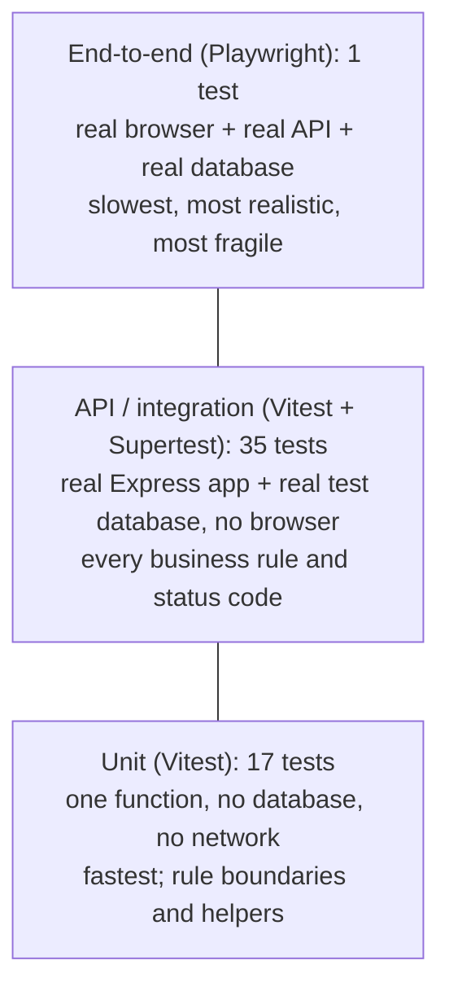
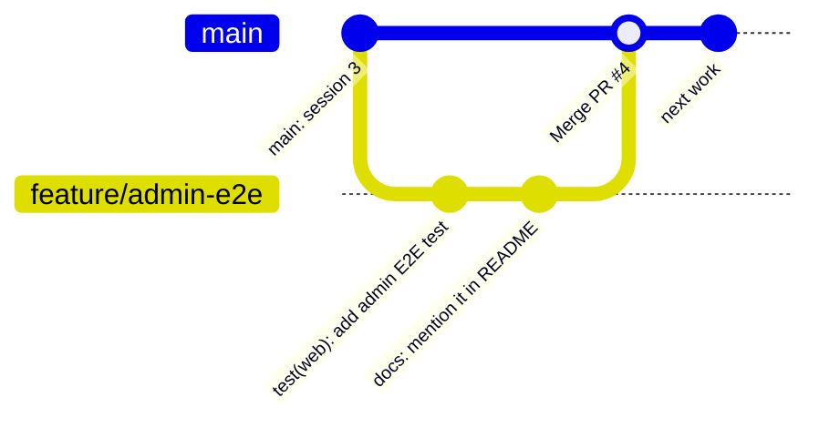

# Week 9: Quality (tests, linting, Git, pull requests, code review, CI)

[← Course home](README.md) · [Previous: Week 8](week-08.md)

## 1. Goal

By the end of this week you can:

- read any ClinicQ test and say which acceptance criterion it proves;
- explain the three levels of tests (unit, API, end-to-end), and what each is good and bad at;
- tell a good test from a weak one, including a test that can never fail;
- explain what lint, formatting and type checks catch, and what they don't;
- work the full loop yourself: branch → commits → push → pull request → CI → review → merge;
- review a PR, whether a colleague or an AI wrote it, with a checklist, and write useful review comments.

This week turns everything before it into a habit.

## 2. Concept primer

### Why automated tests

A test is code that runs other code and checks the result. Once written, it runs in seconds, every time, on every change, forever. Manual UAT can't do that. ClinicQ's 52 unit and API tests and its one browser test run on every pull request. That's why an AI (or a person) can change the code without silently breaking the double-booking rule.

A test has three parts, often called **Arrange, Act, Assert**:

<!-- example -->

```ts
it('rule: an appointment cannot be booked in the past', async () => {
  // Arrange: a patient and a slot that started an hour ago
  // Act: try to book it through the API
  // Assert: 422 SLOT_IN_PAST
});
```

**Master:** a good test name reads like an acceptance criterion. "Rule: a patient cannot cancel within 2 hours of the appointment" is something you can check against the brief without reading any code.

### The test pyramid



- **Unit tests** check one small piece in isolation: `isOutsideCancellationWindow` at exactly 2 hours, or `canCancel` in the web app. They're fast and precise, but they prove nothing about how the pieces fit together.
- **API tests** (also called **integration tests**) send real HTTP requests to the real app, with a real database, using **Supertest**. In ClinicQ they're the backbone: every business rule and status code is proven here.
- **End-to-end (E2E) tests** drive a real browser through a whole user journey with **Playwright**. They catch problems no other test can, like a wrong URL between web and API, or a broken button. But they're slow and more fragile, so projects keep few of them, covering the most important journeys.

Why pyramid-shaped? Many cheap fast tests at the bottom, a few expensive realistic ones at the top. A project with only E2E tests has a slow, flaky suite; a project with only unit tests passes while the app is broken.

### Tests that lie

A passing test is only evidence if it could fail. Watch for:

- **Assertions that can't fail**: `expect(res.status).toBeDefined()`, `expect(anything).toBeTruthy()`.
- **Checking the status but not the effect.** For example, the "can't cancel someone else's" test also checks that the appointment is still `BOOKED` afterwards, not just the 403.
- **Tests that depend on the clock or on order**: "tomorrow at 09:00" fails once a day, and tests that pass only in sequence.
- **Mocks that replace the thing being tested.** If you mock the database in a test about a database constraint, you're testing the mock.
- **Deleted, skipped (`.skip`) or loosened tests** in a diff. In review, these need a written reason.

The strongest proof a test is real is to **see it fail**: break the rule on purpose, watch the test go red, then restore it. You did this in Weeks 2 and 4.

### Static checks: lint, format, types

These read the code without running it:

- **TypeScript** (`npm run typecheck`) catches wrong types, typos in names and missing null checks (Week 2).
- **ESLint** (`npm run lint`) catches suspicious patterns: unused variables, broken React hook rules, and so on. [`eslint.config.js`](../../eslint.config.js) lists the rule sets.
- **Prettier** (`npm run format:check`) enforces one formatting style, so diffs show real changes instead of spacing arguments.

None of them know your business rules. A typed, linted, formatted function can still let Bob cancel Alice's appointment. That's what tests are for.

### Git: branches, commits and pull requests



- **`main`** is the shared, always-working branch. Nobody commits to it directly.
- A **feature branch** holds one piece of work. You commit there as often as you like.
- A **commit** is one logical step with a clear message. ClinicQ uses **Conventional Commits**: `feat:`, `fix:`, `test:`, `docs:`, `chore:`, `ci:`, `style:`, `refactor:`. Run `git log --oneline` to see the history written this way.
- **Push** uploads your branch to GitHub.
- A **pull request** (PR) asks to merge the branch into `main`. It shows the diff, runs CI, and is where review happens.
- **Merge** brings the branch into `main` once CI is green and reviewers approve.

### Continuous integration (CI)

**CI** runs the checks automatically on every PR and every push to `main`, on a clean machine. It proves the code works outside the author's laptop. ClinicQ's CI ([`.github/workflows/ci.yml`](../../.github/workflows/ci.yml)) runs on **GitHub Actions** with three jobs in parallel:

1. **Checks**: lint, format, typecheck, all unit and API tests, the lesson checks and the builds, against a fresh PostgreSQL.
2. **End-to-end**: installs Chromium and runs the Playwright test against a fresh database.
3. **Docker**: builds both images.

A red cross on a PR means "don't merge yet". Click it, open the failed step, read the first error.

### Code review

Review is a second person, or you reviewing an AI, reading the diff before it merges. It catches what tools can't:

- wrong behaviour;
- missing cases;
- security holes;
- confusing code;
- changes nobody asked for.

Good review comments are specific, and say whether they block the merge:

<!-- example -->

```text
Blocking: cancelAppointment no longer checks ownership (line 71). Bob can now cancel Alice's
appointment. Please restore the check and add the "someone else's appointment" test back.

Nit (non-blocking): "appt" → "appointment" for consistency with the rest of the file.

Question: why 3 and not MAX_UPCOMING_APPOINTMENTS here? If it's the same rule, use the constant.
```

## 3. Reading path

1. [`apps/api/tests/appointments.test.ts`](../../apps/api/tests/appointments.test.ts) (**master**). Every appointment rule as an API test. _Why real projects have API tests:_ they prove the rules through the same door real clients use, so a change in any layer that breaks a rule is caught.
2. [`apps/api/tests/appointment.rules.test.ts`](../../apps/api/tests/appointment.rules.test.ts) (**master**). Unit tests at the boundaries.
3. [`apps/api/tests/helpers.ts`](../../apps/api/tests/helpers.ts) and [`tests/globalSetup.ts`](../../apps/api/tests/globalSetup.ts), plus [`apps/api/vitest.config.ts`](../../apps/api/vitest.config.ts) (**master the idea**). A clean, separate database for tests. _Why:_ tests that share data with each other or with development are flaky and dangerous.
4. [`apps/web/src/api/client.test.ts`](../../apps/web/src/api/client.test.ts) (**skim**). A unit test that fakes `fetch`, the right place for a mock.
5. [`apps/web/e2e/booking.spec.ts`](../../apps/web/e2e/booking.spec.ts) and [`apps/web/playwright.config.ts`](../../apps/web/playwright.config.ts) (**master the spec, skim the config**).
6. [`eslint.config.js`](../../eslint.config.js) and [`.prettierrc.json`](../../.prettierrc.json) (**skim**).
7. [`.github/workflows/ci.yml`](../../.github/workflows/ci.yml) (**master the shape**). _Why:_ without CI, "it worked for me" is the only evidence a change is safe.
8. [`docs/scripts/check-lessons.mjs`](../../docs/scripts/check-lessons.mjs) (**skim**). Yes, even this course is tested: CI fails if a lesson quotes code that no longer exists.
9. `git log --oneline` in your terminal (**master**). Read the commit history of this repo as a story.

## 4. Block-by-block walkthrough

### An API test, arrange–act–assert (`appointments.test.ts`)

```ts
const app = createApp();

beforeEach(resetDatabase);
```

- **What it does:** it builds the Express app once for the file (no server, no port), and empties the test database before every test.
- **Syntax decoded:** `beforeEach(fn)` runs `fn` before each `it(...)` in the file. `resetDatabase` is passed (not called), so Vitest calls it at the right time.
- **Connects to:** `createApp` in [`app.ts`](../../apps/api/src/app.ts) (this is why `server.ts` and `app.ts` are separate, Week 3) and `resetDatabase` in [`helpers.ts`](../../apps/api/tests/helpers.ts).
- **Dev-speak:** "Each test starts from an empty DB, so tests are independent."

```ts
it('rule: a slot cannot be double-booked', async () => {
  const { user: firstPatient } = await createUser();
  const { token: secondToken } = await createUser();
  const slot = await createSlot((await createDoctor()).id, hoursFromNow(24));
  await createAppointment(firstPatient.id, slot.id, 'BOOKED');

  const res = await request(app)
    .post('/api/appointments')
    .set(authHeader(secondToken))
    .send({ slotId: slot.id });

  expect(res.status).toBe(409);
  expect(res.body.error.code).toBe('SLOT_ALREADY_BOOKED');
});
```

- **What it does:**
  - **Arrange:** two patients, a slot tomorrow, and the first patient already booked on it.
  - **Act:** the second patient tries to book the same slot through the real API.
  - **Assert:** `409` with code `SLOT_ALREADY_BOOKED`.
- **Syntax decoded:**
  - `describe`/`it` group and name tests.
  - `const { user: firstPatient } = …` destructures and renames.
  - `request(app).post(...).set(...).send(...)` is Supertest building an HTTP request step by step.
  - `expect(x).toBe(y)` fails the test if `x` isn't `y`.
- **Connects to:** the helpers; the rule in `bookAppointment` and the partial unique index (Weeks 4–5).
- **Dev-speak:** "API-level test for the double-booking invariant, asserting status and error code."

```ts
const responses = await Promise.all(
  [tokenA, tokenB].map((token) =>
    request(app).post('/api/appointments').set(authHeader(token)).send({ slotId: slot.id }),
  ),
);

expect(responses.map((res) => res.status).sort()).toEqual([201, 409]);
```

- **What it does:** it fires two bookings for the same slot **at the same time**, and asserts that exactly one succeeds and one gets 409. (The next line checks there's only one `BOOKED` row in the database.) This is the test that proves the race condition from Week 4 is handled.
- **Syntax decoded:** `Promise.all([...])` starts all the promises together and waits for all of them. `.sort()` puts the two statuses in a fixed order, so the test doesn't care which request won.
- **Connects to:** the `P2002` → 409 mapping in `bookAppointment`.
- **Dev-speak:** "A concurrency test; order-independent assertion."

### A unit test at the boundary (`appointment.rules.test.ts`)

```ts
const now = new Date('2026-03-10T10:00:00Z');
const minutes = (n: number) => new Date(now.getTime() + n * 60 * 1000);
```

```ts
it('blocks cancelling exactly 2 hours ahead', () => {
  expect(isOutsideCancellationWindow(minutes(120), now)).toBe(false);
});
```

- **What it does:** it uses a fixed "now" and a helper to build times relative to it. Then it checks the rule at 121 minutes (allowed), exactly 120 (not allowed), 119 (not allowed), and in the past.
- **Syntax decoded:** a fixed date string ending in `Z` (UTC) means the test gives the same answer on any machine, in any time zone, on any day. `minutes(120)` means "two hours after now".
- **Connects to:** `isOutsideCancellationWindow` in [`appointment.rules.ts`](../../apps/api/src/services/appointment.rules.ts).
- **Dev-speak:** "Deterministic boundary tests with an injected clock."

### A mock in the right place (`client.test.ts`)

```ts
it('reports a network failure in plain language', async () => {
  vi.stubGlobal('fetch', vi.fn().mockRejectedValue(new TypeError('Failed to fetch')));

  await expect(apiRequest('/doctors')).rejects.toMatchObject({ code: 'NETWORK_ERROR' });
});
```

- **What it does:** it replaces the browser's `fetch` with a fake that always fails like a dropped connection, then checks that the API client turns this into a friendly `NETWORK_ERROR`.
- **Syntax decoded:** `vi.stubGlobal(name, value)` temporarily replaces a global; `vi.fn().mockRejectedValue(err)` makes a fake function that returns a failed promise. `.rejects.toMatchObject({...})` asserts the promise fails with an error containing those fields.
- **Connects to:** the `catch` around `fetch` in [`client.ts`](../../apps/web/src/api/client.ts).
- **Dev-speak:** "We stub fetch at the boundary; the unit under test is the client's error mapping."

This is a good use of a mock: the thing being tested is _how the client reacts_ to the network, not the network itself.

### The browser test (`booking.spec.ts`)

```ts
await page.goto('/login');
await page.getByLabel('Email').fill('alice@clinicq.test');
await page.getByLabel('Password').fill('Password123!');
await page.getByRole('button', { name: 'Log in' }).click();
await expect(page.getByRole('heading', { name: 'Doctors' })).toBeVisible();
```

```ts
// Cancel it (accepting the browser's "are you sure?" dialog)
page.once('dialog', (dialog) => dialog.accept());
await appointment.getByRole('button', { name: 'Cancel' }).click();
await expect(page.getByText('Your appointment was cancelled.')).toBeVisible();
await expect(appointment.getByText('Cancelled')).toBeVisible();
```

- **What it does:** a real Chromium logs in as Alice, books a slot with Dr. Nguyen, checks My appointments, cancels (accepting the confirm dialog), and checks the result: the same journey as the Week 0 tour.
- **Syntax decoded:**
  - `page.getByLabel`, `getByRole` and `getByText` find elements the way a user or screen reader would: by label, role and visible text, not by CSS classes. This makes the test survive styling changes and quietly checks accessibility.
  - `await expect(...).toBeVisible()` waits (up to a timeout) until it's true.
  - `page.once('dialog', …)` handles the next browser dialog.
- **Connects to:** [`playwright.config.ts`](../../apps/web/playwright.config.ts), which starts its own API (port 3100) and web server (5174) against `clinicq_e2e`, reseeded in [`global-setup.ts`](../../apps/web/e2e/global-setup.ts).
- **Dev-speak:** "A happy-path E2E smoke test using role-based locators."

### The CI pipeline (`ci.yml`)

```yaml
on:
  push:
    branches: [main]
  pull_request:
```

```yaml
- run: npm ci
- run: npm run lint
- run: npm run format:check
- run: npm run typecheck
- run: npm test
- run: npm run build
```

- **What it does:** CI runs on every push to `main` and on every pull request. The checks job installs exactly what the lockfile says, then runs lint, format check, typecheck, all tests and all builds. The first failing step stops the job and turns the PR red.
- **Syntax decoded:**
  - YAML again (Week 0).
  - `on:` lists the triggers.
  - Each `- run:` is a shell command, run in order.
  - `npm ci` is a clean, exact install from `package-lock.json`, stricter than `npm install`.
- **Connects to:** the root [`package.json`](../../package.json) scripts. CI runs the same commands you run locally, so a failure in CI can be reproduced on your machine.
- **Dev-speak:** "CI mirrors the local scripts; `npm ci` for reproducible installs."

## 5. Hands-on

1. **Run each level on its own and time it.**

   ```bash
   npm test --workspace apps/api -- tests/appointment.rules.test.ts   # unit: one file
   npm test --workspace apps/api                                       # API: all
   npm run test:e2e                                                    # browser
   ```

2. **Run one test by name**: `npm test --workspace apps/api -- -t "double-booked"`.
3. **See a test fail for the right reason.** In `appointments.service.ts`, comment out the ownership check (the `if (appointment.patientId !== patientId) { … }` block). Run the API tests. Read the failure: expected 403, received 200. Restore with `git restore .`.
4. **Watch Playwright work.** From the `apps/web` folder, run `npx playwright test --headed` to watch the browser, or `npx playwright test --ui` for the step-by-step viewer.
5. **Read the real CI.** On GitHub, open the repo's **Actions** tab and open the latest run. Find each job, each step and its log.

## 6. PA lens

**Acceptance criteria are test cases waiting to be written.** Given/When/Then maps onto Arrange/Act/Assert almost word for word. The better your ACs, the more directly they become tests, and the more confidently the team (or an AI) can change code later. In refinement, it's reasonable to ask: "which of these ACs will have an automated test, and at which level?"

**What to automate at which level:**

- Every business rule and permission → an API test, including the boundaries and the refusals.
- Pure calculations (dates, money, eligibility) → unit tests, especially at the boundaries.
- The two or three journeys that must never break (booking!) → one E2E test each.
- Look and feel, copy, usability → manual UAT; automation is poor at judging these.

**Refinement questions for this layer:**

- Which ACs are covered by automated tests, and which only by manual UAT?
- What's the boundary case for each rule, and is it tested?
- What test data does this need, and does the seed provide it?
- Does this change need a new E2E journey, or does it fit an existing one?

**How to review a PR as a PA:**

- Read the PR description first: does it say what, why, how to test, and what to look at?
- Compare the changed files with what you'd predict. Surprises need a reason.
- Read the test names: do they match the ACs, including the unhappy paths?
- Check CI is green, and that no tests were removed or skipped.
- Try it: check out the branch (`git fetch && git switch <branch>`), run it, do the UAT.
- Comment specifically, and mark each comment blocking or not.

**Typical quality failures to look for:**

- **A green CI that doesn't test the change.** A new rule with no new test.
- **A test changed to match a bug.** `expect(res.status).toBe(200)` where the AC says 403.
- **"Flaky" tests**, sometimes red and sometimes green, usually time or order dependencies. Never accept "just re-run it" as a fix.
- **Giant PRs** that no one can review properly. Ask for smaller ones.

## 7. Build with AI: a second E2E journey, via a real pull request

This week the change is a test, and the real skill is the **workflow**: branch, commits, push, PR, CI, review, merge. You do all of it.

### The spec

```markdown
## Story

As the team, we want an end-to-end test of the admin journey,
so that the admin view can't silently break for real users.

## Acceptance criteria (for the test)

- It logs in as admin@clinicq.test / Admin123! via the login form.
- It lands on "All appointments" and sees the seeded appointments for Alice and Bob,
  with statuses "Booked" and "Cancelled".
- Choosing "Cancelled" in the Status filter leaves only cancelled rows
  (and "Showing 1 of 3 appointments.").
- Logging out returns to the login page.
- It runs in the existing Playwright setup and doesn't depend on booking.spec.ts running first.

## Out of scope

- Changing any application code. If the test can't be written without changing the app,
  stop and discuss.

## Where I expect changes

- apps/web/e2e/admin.spec.ts (new)

## How I'll test it

- npm run test:e2e (both tests pass, twice in a row)
- Break it on purpose once (e.g. expect "Showing 2 of 3") and see it fail, then fix.
- Open a PR and see all three CI jobs pass.
```

### Example prompt

```text
In ClinicQ's web app, add a Playwright E2E test at apps/web/e2e/admin.spec.ts, following
the style of apps/web/e2e/booking.spec.ts (role- and label-based locators, no CSS
selectors, no fixed waits).

The test: log in as admin@clinicq.test / Admin123!; expect the "All appointments" heading;
expect rows for Alice Morgan and Bob Lee with "Booked" and "Cancelled" statuses (seed data
from apps/api/prisma/seed.ts); select "Cancelled" in the "Status" select and expect only
cancelled rows and the text "Showing 1 of 3 appointments."; click "Log out" and expect the
"Log in" heading.

Important: the E2E database is reseeded once before all tests, and booking.spec.ts
creates and cancels an appointment. Make the admin assertions correct regardless of
whether booking.spec.ts ran first, and explain how.

Don't change application code or playwright.config.ts. Plan first, then show the diff.
```

### Checklist for reviewing the diff

- [ ] One new file, no application changes.
- [ ] Locators use roles, labels and text (`getByRole`, `getByLabel`, `getByText`), not CSS classes or `nth-child`.
- [ ] No `page.waitForTimeout(…)` (fixed sleeps make tests slow and flaky); it uses `await expect(...)` instead.
- [ ] **Test independence:** `booking.spec.ts` adds a cancelled appointment for Alice, so after it runs there are 4 appointments and 2 cancelled. Does the test assert "Showing 1 of 3" (which fails if booking ran first), or did the AI handle it? Look for an answer in the plan. For example, it could assert on the seeded rows without exact totals, or put the admin checks before any booking by ordering or isolation. This is exactly the kind of subtle issue review is for.
- [ ] The test would fail if the filter were broken. Try it.

### How to test it, and the PR workflow

```bash
git switch main && git pull
git switch -c test/admin-e2e
# ...ask the AI to write the test, review the diff...
npm run test:e2e                 # run it twice; both runs green
git add apps/web/e2e/admin.spec.ts
git commit -m "test(web): add E2E test for the admin appointment view"
git push -u origin test/admin-e2e
gh pr create --fill              # or open the PR on GitHub's website
```

On GitHub:

1. Write the PR description: what, why, how to test, what to look at.
2. Wait for the three CI jobs. If one is red, open it, read the first error, reproduce it locally, and fix it with another commit.
3. Review your own PR in the **Files changed** tab, as if a colleague wrote it. Leave one comment on a line.
4. Merge when green, then `git switch main && git pull`.

## A PR review checklist to keep

Use this for every PR, whether a person or an AI wrote it:

- **Scope:** does the diff match the PR title and the spec? Is anything unrelated in it?
- **Behaviour:** is every AC implemented? Do the unhappy paths behave as specified?
- **Tests:** is there a new or updated test for every AC? Are there boundary tests? Were no tests deleted, skipped or loosened?
- **Security:** are the guards right (who can call this)? Does it check ownership? Does it leak data in responses or logs?
- **Data:** is there a migration if the schema changed, generated and not hand-edited? Is it safe for existing rows?
- **Readability:** can you follow it? Are names clear? Does it follow the existing patterns (routes → controllers → services)?
- **Dependencies:** any new packages? Are they justified?
- **CI:** is it green on the latest commit?
- **Docs:** is the README or API table updated if behaviour or setup changed?

## 8. Vocabulary

| Term                   | Meaning, and where it shows up in ClinicQ                                                   |
| ---------------------- | ------------------------------------------------------------------------------------------- |
| Unit test              | Tests one function in isolation: `appointment.rules.test.ts`, `utils/appointments.test.ts`. |
| API / integration test | Tests the real app over HTTP with a real database: `appointments.test.ts` via Supertest.    |
| E2E test               | Drives a real browser through a journey: `booking.spec.ts` with Playwright.                 |
| Test pyramid           | Many fast unit tests, fewer API tests, very few E2E tests.                                  |
| Arrange / Act / Assert | Set up, perform the action, check the result. The shape of every test.                      |
| Assertion              | A check that fails the test if untrue: `expect(res.status).toBe(409)`.                      |
| Mock / stub            | A fake stand-in for a dependency: `vi.stubGlobal('fetch', …)` in `client.test.ts`.          |
| Flaky test             | Sometimes passes, sometimes fails, without code changes. Usually time or order dependent.   |
| Lint                   | Automated checks for suspicious code patterns: ESLint, `npm run lint`.                      |
| Branch / commit / push | A line of work / a saved step / uploading it to GitHub.                                     |
| Conventional Commits   | Commit-message prefixes: `feat:`, `fix:`, `test:`, `docs:`…                                 |
| Pull request (PR)      | A request to merge a branch, with diff, CI and review.                                      |
| CI                     | Automated checks on every PR and push: `.github/workflows/ci.yml` on GitHub Actions.        |
| Code review            | Reading a diff before merge to catch what tools can't.                                      |
| Blocking vs nit        | A review comment that must be fixed before merge vs a minor, optional suggestion.           |

## 9. Quiz

1. The "cannot cancel someone else's appointment" test checks the status code **and** that the appointment is still `BOOKED`. Why both?
2. Why do the rule unit tests use `new Date('2026-03-10T10:00:00Z')` instead of `new Date()`?
3. An AI's PR is green on CI. Its diff changes `expect(res.status).toBe(403)` to `expect(res.status).toBe(200)` in one test. What do you do?
4. Why does ClinicQ have only one E2E test, but 35 API tests?
5. `npm test` passes on your laptop, but CI is red on the "Lint, typecheck, test, build" job. Name two likely reasons.

<details>
<summary>Answers</summary>

1. The status proves the API _said_ no; the database check proves it _did_ nothing. A bug could return 403 after already cancelling, and only the second assertion catches that.
2. `new Date()` changes every run, so boundary tests (exactly 120 minutes) would depend on when they run. A fixed UTC time gives the same result on every machine, every day, in every time zone.
3. Block it. A test changed to match new behaviour is only acceptable if the AC changed, and a 403 → 200 change on a permission test almost certainly means a security rule was broken. Ask why, and compare with the spec.
4. API tests are fast, precise and cover every rule and status code without a browser. E2E tests are slow and more fragile, so they're kept for the few journeys where only a real browser proves it works. It's the test pyramid.
5. Any two of:
   - A lint or format problem: you ran tests but not `npm run lint` or `format:check`.
   - A file that exists only on your machine: not committed, or ignored by `.gitignore`.
   - A dependency installed locally without updating `package-lock.json`.
   - A test that depends on your local data or time zone.
   - A lesson quoting code you changed (the docs check).

</details>

---

Next: [Week 10: Shipping and capstone](week-10.md)
