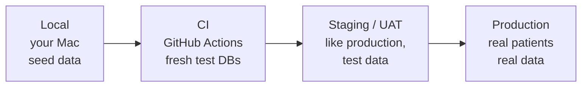

# Week 10: Shipping and capstone

[← Course home](README.md) · [Previous: Week 9](week-09.md)

## 1. Goal

By the end of this week you can:

- read ClinicQ's Dockerfiles and docker-compose file and explain what each line is for;
- explain images, containers, layers and multi-stage builds, and why teams ship containers;
- describe the path from a merged PR to users: environments, configuration, migrations, health checks, rollbacks;
- follow a real deployment in this repo: the workflow that publishes this course website;
- **complete the capstone**: write the PBI for "Patients can reschedule an appointment", direct an AI to build it on a branch, review it, test it, fix it by prompting, and run a retrospective.

## 2. Concept primer

### Why containers

"It works on my machine" happens because machines differ: Node versions, operating systems, installed libraries, settings. A **container image** packages the app **with** everything it needs to run: an operating system layer, Node.js, the installed packages, the compiled code and the start command. Any machine with Docker runs it the same way. A running copy of an image is a **container**.

An image is described by a **Dockerfile**: a recipe of steps. Each step creates a **layer**, and Docker caches layers. If a step's inputs haven't changed, Docker reuses the cached layer instead of redoing the work. That's why ClinicQ's Dockerfiles copy `package.json` files and install dependencies **before** copying the source code. A code change then doesn't re-run the slow install.

A **multi-stage build** uses one image to build and a different, smaller one to run. ClinicQ's web image builds the site with Node, then copies only the finished files into an nginx image. Node, the source code and hundreds of megabytes of build tools never reach the final image.

### Environments

The same code runs in several **environments**, each with its own configuration and data:



- **Local** is for development. Seed data, and relaxed secrets (`.env`).
- **CI** runs the automated checks on every PR, with throwaway databases.
- **Staging** (or UAT, test, pre-prod) is a production-like copy where PAs and testers accept features before release. It uses realistic but **not real** patient data.
- **Production** has real users and real PHI. The strictest access, real secrets, backups and monitoring.

**Master:** the principle "**build once, deploy many**". The same image that passed CI and UAT is the one deployed to production. Only configuration (environment variables and secrets) changes between environments, never the code. If production runs a different build from the one you tested, your UAT didn't test production.

### What a deployment involves

Deploying ClinicQ to a real server would mean:

1. **Build** the images once, from the merged `main`, and tag them with a version or the commit ID.
2. **Configure** the environment: `DATABASE_URL`, `JWT_SECRET`, `CORS_ORIGIN` and so on, from a secret manager.
3. **Migrate** the database. ClinicQ's API image runs `prisma migrate deploy` on start. Migrations must be safe to run while the old version is still serving, so risky changes (renaming, dropping columns) are split across releases.
4. **Start** the new containers alongside the old ones. The platform checks `/health` before sending them traffic.
5. **Switch** traffic to the new version, then stop the old one: a **zero-downtime deploy**. ClinicQ's graceful shutdown (Week 3) lets in-flight requests finish.
6. **Watch**: logs, error rates, response times (Week 4). If something's wrong, **roll back** to the previous image. Code rolls back easily, but data changes don't, which is another reason migrations are written carefully.

In front of it all sits **HTTPS**, handled by a load balancer or proxy, plus backups of the database.

### A real deployment you can watch: this course's website

This course is itself deployed. [`.github/workflows/docs.yml`](../../.github/workflows/docs.yml) runs on every push to `main`: it installs dependencies, checks the lessons against the code, builds the website, and publishes it to **GitHub Pages**. It's a small, complete deployment pipeline: trigger → build → check → publish to an environment → URL.

## 3. Reading path

1. [`apps/api/Dockerfile`](../../apps/api/Dockerfile) (**master**). The API image, step by step. _Why real projects have Dockerfiles:_ the recipe for the production runtime is versioned and reviewed like code, not configured by hand on a server.
2. [`apps/web/Dockerfile`](../../apps/web/Dockerfile) (**master**). A multi-stage build.
3. [`apps/web/nginx.conf`](../../apps/web/nginx.conf) (**master the three `location` blocks**).
4. [`.dockerignore`](../../.dockerignore) (**skim**). _Why:_ without it, `node_modules`, `.env` files (secrets!) and Git history get copied into the build.
5. [`docker-compose.yml`](../../docker-compose.yml) (**master**, revisiting Week 0 with new eyes).
6. The `docker` job in [`.github/workflows/ci.yml`](../../.github/workflows/ci.yml) and all of [`.github/workflows/docs.yml`](../../.github/workflows/docs.yml) (**master the shape**).
7. [`PROGRESS.md`](../../PROGRESS.md) (**skim**). Read the "Known issues" sections: they're the honest list of what would need doing before a real launch.

## 4. Block-by-block walkthrough

### The API image (`apps/api/Dockerfile`)

```dockerfile
FROM node:22-slim

WORKDIR /app
```

- **What it does:** it starts from the official Node.js 22 image (the "slim" variant, with fewer extras) and works in a folder called `/app` inside the image.
- **Syntax decoded:** `FROM` picks the base image, and `WORKDIR` sets and creates the working folder for the following steps. Dockerfile instructions are UPPERCASE by convention.
- **Connects to:** the `.nvmrc` version (22) and CI's Node version, all kept on the same major version.
- **Dev-speak:** "Based on node:22-slim."

```dockerfile
COPY package.json package-lock.json tsconfig.base.json ./
COPY apps/api/package.json apps/api/prisma.config.ts apps/api/
COPY apps/api/prisma apps/api/prisma
COPY apps/web/package.json apps/web/
COPY docs/package.json docs/
RUN npm ci --workspace apps/api --include-workspace-root
```

- **What it does:** it copies only what's needed to install dependencies: the package files for every workspace (npm needs to see them all to trust the lockfile) and the Prisma schema (installing generates the Prisma client). Then it installs.
- **Syntax decoded:** `COPY from to` copies files from the repo into the image. `RUN` executes a command at build time. `--workspace apps/api --include-workspace-root` installs the API's dependencies plus the root tools (TypeScript).
- **Connects to:** the layer-caching idea above. As long as these files don't change, this slow step is reused from cache.
- **Dev-speak:** "Dependency layer first for cache hits."

```dockerfile
COPY apps/api apps/api
RUN npm run build --workspace apps/api

ENV NODE_ENV=production
WORKDIR /app/apps/api
EXPOSE 3000

# Don't run as root inside the container.
USER node

# Apply any pending database migrations, then start the server.
CMD ["sh", "-c", "npx prisma migrate deploy && node dist/server.js"]
```

- **What it does:** it copies the API source, compiles it, and marks the environment as production. It documents that the app listens on 3000, and switches to an unprivileged user. It sets the command that runs when a container starts: apply pending migrations, then start the server.
- **Syntax decoded:**
  - `ENV` sets an environment variable in the image.
  - `EXPOSE` documents a port; `docker-compose.yml` actually publishes it.
  - `USER node` runs as the non-root user the Node image provides.
  - `CMD [...]` is the start command; `&&` means "only if the previous command succeeded".
- **Connects to:** `prisma migrate deploy` (Week 5), `dist/server.js` (the compiled `server.ts`, Week 3) and the `api` service in `docker-compose.yml`.
- **Dev-speak:** "Runs as non-root; migrations run on container start before the app boots."

**Things a reviewer might question** (both are listed as known issues in `PROGRESS.md`):

- The image keeps development dependencies, because it needs the Prisma CLI for migrations and `tsx` for the seed. A slimmer production image would move migrations to a separate step.
- Running migrations on every container start is simple, but with several containers starting at once, they'd all try. Larger systems run migrations once, as a separate deployment step.

### The web image, in two stages (`apps/web/Dockerfile`)

```dockerfile
# Stage 1: build the static site with Node.
# Build context is the repository root (see docker-compose.yml).
FROM node:22-slim AS build
```

```dockerfile
RUN npm ci --workspace apps/web --include-workspace-root --ignore-scripts

COPY apps/web apps/web
RUN npm run build --workspace apps/web

# Stage 2: serve the built files with nginx. Node isn't needed at runtime.
FROM nginx:1.30-alpine

COPY apps/web/nginx.conf /etc/nginx/conf.d/default.conf
COPY --from=build /app/apps/web/dist /usr/share/nginx/html
```

- **What it does:** stage 1, named `build`, installs dependencies and runs `vite build`, producing static HTML, JS and CSS in `dist/`. Stage 2 starts fresh from a small nginx image and copies in only the nginx config and the built files.
- **Syntax decoded:** `AS build` names a stage; `COPY --from=build …` copies files out of that stage. The final image is whatever the **last** `FROM` produces. `--ignore-scripts` skips install scripts, such as the API's Prisma generate, which the web app doesn't need.
- **Connects to:** [`vite.config.ts`](../../apps/web/vite.config.ts) (the build) and [`nginx.conf`](../../apps/web/nginx.conf) (serving).
- **Dev-speak:** "Multi-stage build; the runtime image is just nginx and static assets."

### nginx: three jobs (`nginx.conf`)

```nginx
    location /api/ {
        proxy_pass http://api:3000;
```

```nginx
    location /assets/ {
        expires 1y;
        add_header Cache-Control "public, immutable";
    }
```

```nginx
    location / {
        try_files $uri $uri/ /index.html;
    }
```

- **What it does:** it does three things.
  - It forwards `/api/...` to the API container.
  - It tells browsers to cache the built JavaScript and CSS for a year. Safe, because every build gives them new file names containing a content hash, so a new release is never stuck behind an old cached file.
  - For any other path, it serves the file if it exists, else `index.html`: the SPA fallback from Week 8.
- **Syntax decoded:** each `location` block matches URL prefixes. `proxy_pass` forwards the request. `try_files` tries each option in order.
- **Connects to:** the Vite proxy in development (Week 1), which does the `/api` job locally, and React Router (Week 8), which handles the paths after the fallback.
- **Dev-speak:** "nginx is the reverse proxy for /api, serves hashed assets immutable, with an SPA fallback."

### Publishing the course website (`docs.yml`)

```yaml
on:
  push:
    branches: [main]
  workflow_dispatch:
```

```yaml
- run: npm ci
- run: npm run check --workspace docs
- run: npm run build --workspace docs
  env:
    DOCS_BASE: /${{ github.event.repository.name }}/
- uses: actions/configure-pages@v6
- uses: actions/upload-pages-artifact@v5
  with:
    path: docs/.vitepress/dist
```

```yaml
- id: deployment
  uses: actions/deploy-pages@v5
```

- **What it does:** on every push to `main` (or when started by hand from the Actions tab), it installs dependencies, checks every lesson against the current code, builds the static website, and publishes it to GitHub Pages at `https://<owner>.github.io/ClinicQ/`.
- **Syntax decoded:**
  - `workflow_dispatch` adds a "Run workflow" button.
  - `uses:` runs a reusable action published by GitHub.
  - `env:` sets an environment variable for one step.
  - `${{ … }}` inserts a value from GitHub; here it's the repository name, so the site knows its URL path.
- **Connects to:** [`docs/.vitepress/config.ts`](../../docs/.vitepress/config.ts), which reads `DOCS_BASE`, and [`docs/scripts/check-lessons.mjs`](../../docs/scripts/check-lessons.mjs), the quality gate.
- **Dev-speak:** "A CD pipeline for the docs: check, build, deploy to Pages on merge to main." (**CD**: continuous delivery or deployment, the step after CI.)

## 5. Hands-on

1. **Build and run everything**: `docker compose up --build`, then `npm run docker:seed` in a second terminal, then open `http://localhost:8080`.
2. **See the layer cache.** Change one line of text in `apps/web/src/pages/DoctorsPage.tsx` and run `docker compose build web` again. The `npm ci` step says `CACHED`; only the later steps re-run. Undo the change.
3. **Look inside.** Run `docker compose ps` (what's running) and `docker compose logs api` (the API's JSON logs; production-style, not pretty). `docker compose exec api whoami` prints `node`, the non-root user.
4. **Kill and recover.** `docker compose restart api`: the API restarts, runs `migrate deploy` (nothing to apply), and comes back. Watch the web app keep working after a moment.
5. **Browse the course website locally**: `npm run dev:docs`, then open the address it prints. Use the search box. Once GitHub Pages is switched on for the repo (Settings → Pages → Source: **GitHub Actions**), every merge to `main` publishes it.

## 6. PA lens

**Release readiness is part of the definition of done.** Before a feature ships, someone should be able to answer: does it need a migration, and is it safe? New settings or secrets? New seed or reference data? A feature flag? Updated docs? How do we roll it back?

**Refinement questions for this layer:**

- Which environment will UAT use, and is it running the exact build that will go to production?
- Does this release include a migration? Can it be rolled back? Does it touch existing data?
- Are there new environment variables or secrets? Who sets them in each environment?
- What's the rollout plan: everyone at once, or behind a flag? What's the rollback trigger?
- What will we monitor after release to know it works?

**Typical release-time problems:**

- **"It passed UAT but broke in production."** A different build, different configuration, or data production has but UAT didn't.
- **Missing environment variable.** ClinicQ fails fast at startup (Week 4); less careful apps fail later, on the first request that needs it.
- **Migration too slow or locking tables** on a large real database.
- **Cached old frontend.** Users see the old UI until they refresh; hashed asset names prevent most of this.
- **No way back.** A data change that can't be undone.

## 7. Build with AI: the capstone

<a id="capstone"></a>

### Capstone: "Patients can reschedule an appointment"

This is the whole course in one feature. It crosses every layer: a business rule with edge cases, a transaction, an endpoint, a UI flow, tests at every level, and a retrospective. Budget two or three weeks at your usual pace.

You'll work in six steps. Do them in order, and don't skip step 1.

### Step 1: write the PBI (you, not the AI)

Write it before reading any further hints. Use your usual PBI format, and include:

- the user story;
- acceptance criteria in Given/When/Then, covering at least:
  - the happy path;
  - every business rule that applies, including the 2-hour rule, and whether it applies to the old appointment, the new one, or both;
  - what happens if the new slot is taken between choosing and confirming;
  - rescheduling to the same slot, or to a past slot;
  - someone else's appointment;
  - an already-cancelled appointment;
  - what the old slot becomes, and what the patient sees afterwards;
- out of scope;
- the authorization line (Week 6): who may do this, who may not;
- open questions for "the business". Answer them yourself, as product owner, and write the decision down.

Decisions you'll have to make (there's no single right answer):

- Is rescheduling "cancel + book" (two records, full history) or "move" (one record whose slot changes)? What does the admin list show afterwards?
- Does the booking limit (if you built Week 4's change) count differently during a reschedule?
- Can a patient reschedule to a different doctor, or only another time with the same doctor?
- How many times can an appointment be rescheduled?

<details>
<summary>After you've written yours: a reference set of acceptance criteria to compare against</summary>

These aren't "the answer"; they're one reasonable version. Differences are worth thinking about, not necessarily fixing.

```text
Story: As a patient, I want to move my appointment to another available time,
so that I don't have to cancel and rebook (and risk losing my place).

Decision: reschedule = cancel the old appointment + book the new slot, in one transaction.
The old appointment stays as CANCELLED (history); a new BOOKED appointment is created.
Same doctor or different doctor: both allowed.

AC1 Given my BOOKED appointment starts more than 2 hours from now
    and the new slot is free and in the future
    When I reschedule to the new slot
    Then the old appointment is CANCELLED with cancelledAt set,
    a new BOOKED appointment exists for the new slot,
    and I get 200/201 with the new appointment.
AC2 Given my appointment starts in 2 hours or less, Then 422 CANCELLATION_WINDOW_PASSED and nothing changes.
AC3 Given the new slot is in the past, Then 422 SLOT_IN_PAST and nothing changes.
AC4 Given the new slot was booked by someone else just before I confirm,
    Then 409 SLOT_ALREADY_BOOKED and my original appointment is still BOOKED.
AC5 Given the appointment isn't mine, Then 403 NOT_YOUR_APPOINTMENT and nothing changes.
AC6 Given the appointment is already CANCELLED, Then 409 ALREADY_CANCELLED.
AC7 Given the new slot is the same as the current one, Then 422 (a new code, e.g. SAME_SLOT).
AC8 Given I'm an admin, Then 403 (patients only, like booking).
AC9 After success, My appointments shows the new time under Upcoming
    and the old one under Past and cancelled; the old slot is bookable again.
AC10 In the web app, from My appointments, "Reschedule" opens the doctor's available times,
     and confirming shows "Your appointment was rescheduled." on My appointments.
```

</details>

### Step 2: predict the files

Before any code exists, list every file you expect to change, and why. Use the [folder map](README.md#folder-map). Write this down; you'll compare it with the real diff. A typical list covers:

- a service function;
- a rule, perhaps;
- a schema;
- a route and a controller;
- API tests;
- a web API function;
- one or two pages and a route;
- web tests;
- an E2E test;
- the API README.

Can you name each file?

### Step 3: build it in small steps, on a branch

```bash
git switch main && git pull
git switch -c feature/reschedule
```

Ask for one step at a time, and commit between them. A sensible order:

1. **Service and API tests.** A `rescheduleAppointment` service function using `prisma.$transaction`, with API-level tests for every AC. Ask the AI to write the tests first and show them failing.
2. **Endpoint.** Route, validation schema and controller, e.g. `POST /api/appointments/:id/reschedule` with body `{ "slotId": "…" }`.
3. **Web.** An API function; a way into the flow from My appointments; confirming; the success message.
4. **E2E.** Extend or add a Playwright test for the reschedule journey.
5. **Docs.** The API README table; the root README only if setup changed.

A prompt for step 1 might look like this:

```text
Read my PBI below. Implement step 1 only: a rescheduleAppointment(patientId, appointmentId,
newSlotId, now = new Date()) function in apps/api/src/services/appointments.service.ts.

It must cancel the old appointment and book the new slot inside prisma.$transaction, so that
if booking fails (P2002, slot taken) the cancellation is rolled back. Reuse the existing
rule functions and error codes; add a new code only where the PBI says so.

First write API tests in apps/api/tests/ for AC1–AC9 (they can call the service directly or
wait for the endpoint in step 2; say which you chose and why), run them, and show me they fail.
Then implement until they pass. Don't touch routes, controllers or the web app yet.
Explain your plan before writing code.

<paste your PBI here>
```

### Step 4: review the PR

Push the branch and open a PR (Week 9). Review it with the [Week 9 checklist](week-09.md#a-pr-review-checklist-to-keep), plus these capstone-specific checks:

- [ ] **Transaction.** Both writes (cancel old, create new) are inside the same `$transaction`. If the create fails, is the cancel really rolled back? Is there a test proving the original appointment is still `BOOKED` after a failed reschedule (AC4)?
- [ ] **Rule reuse.** The 2-hour check calls `isOutsideCancellationWindow`, and the past check calls `isInPast`. No re-implemented copies with a slightly different boundary.
- [ ] **Ownership** checked before anything else changes, using the ID from the token, not the request body.
- [ ] **The double-booking constraint** is still the guard for the new slot: `P2002` → 409, not a check-then-insert.
- [ ] **Existing behaviour untouched.** `bookAppointment` and `cancelAppointment` behave exactly as before, and all 52 existing tests pass unchanged.
- [ ] **Web:** loading, error and empty states on any new screen; the button is disabled while submitting; a taken slot refreshes the list (as booking does).
- [ ] **Files vs your prediction.** Which surprises were justified, and which weren't?

### Step 5: test it, and fix by prompting

```bash
npm run lint && npm run typecheck
npm test
npm run test:e2e
```

Then do your own UAT against every AC in the running app, including the ugly ones: two browser windows racing for the same slot (AC4), and an appointment 1 hour away (AC2). For each problem you find, write a short bug report (steps, expected, actual, status code), and give it to the AI as the prompt. Don't fix it by hand, and don't accept "fixed" without re-running the tests yourself.

Merge when CI is green and every AC passes.

### Step 6: retrospective

Write a short retrospective, a page at most, in a file like `docs/capstone-retro.md` on your branch, or in your own notes. The most valuable part is **what the AI got wrong, and why**. Use these prompts:

- **What went well?** Which steps went smoothly, and why?
- **What did the AI get wrong?** List each mistake. For each, note:
  - **Category:** misunderstood requirement / wrong edge case / broke an existing rule / security gap / invented API or package / outdated library usage / unrequested change / weak or missing test / claimed success without evidence.
  - **Why it happened:** was the spec ambiguous? Was context missing (a file it didn't read)? Was the step too big? Was it a knowledge limit (library versions)?
  - **How you caught it:** diff review, a test, UAT, CI, or luck.
  - **How you'd prevent it next time:** a spec line, a smaller step, a test-first request, a checklist item.
- **Your prediction vs reality:** which files did you predict correctly? What did you miss, and what does that teach you about the codebase?
- **What would you do differently** in your next PBI, and in your next prompt?

Compare your retrospective with the "When to distrust AI output" section of the [course home](README.md#when-to-distrust-ai-output). Which of those warnings came true for you?

## 8. Vocabulary

| Term                    | Meaning, and where it shows up in ClinicQ                                                                 |
| ----------------------- | --------------------------------------------------------------------------------------------------------- |
| Image / container       | A packaged app with its runtime / a running copy of one: `clinicq-api` from `apps/api/Dockerfile`.        |
| Dockerfile              | The recipe for an image: `FROM`, `COPY`, `RUN`, `CMD`.                                                    |
| Layer / cache           | Each Dockerfile step's result; reused when its inputs haven't changed (`npm ci` before `COPY` of source). |
| Multi-stage build       | Build in one image, run in a smaller one: `apps/web/Dockerfile` (Node → nginx).                           |
| Base image              | The starting image: `node:22-slim`, `nginx:1.30-alpine`, `postgres:16-alpine`.                            |
| Reverse proxy           | A server that forwards requests to others: nginx forwarding `/api` to the API.                            |
| Environment             | A place the app runs with its own config and data: local, CI, staging, production.                        |
| Build once, deploy many | The tested artifact is the deployed artifact; only configuration differs.                                 |
| Health check            | An endpoint or command proving the app is alive: `/health`, Compose `healthcheck`.                        |
| Zero-downtime deploy    | Starting the new version before stopping the old, so users see no outage.                                 |
| Rollback                | Returning to the previous version when a release goes wrong.                                              |
| CD                      | Continuous delivery or deployment: automatically publishing after CI, like `docs.yml` → GitHub Pages.     |
| GitHub Pages            | GitHub's static website hosting, used for this course.                                                    |
| Transaction             | All-or-nothing group of writes: needed for reschedule (`prisma.$transaction`).                            |
| Retrospective           | A structured look back: what worked, what didn't, why, what to change.                                    |

## 9. Quiz

1. Why do the Dockerfiles copy `package.json` files and run `npm ci` before copying the source code?
2. Why does the web app's final image not contain Node.js, and why is that good?
3. What does "build once, deploy many" protect against?
4. The API container runs `prisma migrate deploy && node dist/server.js`. What happens if a migration fails?
5. In the capstone, why must "cancel the old appointment" and "book the new slot" be in one transaction? Describe the bug without it.

<details>
<summary>Answers</summary>

1. Docker caches each layer. Dependencies change rarely and source code changes often, so installing first means code-only changes reuse the cached install, and builds take seconds instead of minutes.
2. Node is only needed to build the static files. The final image is nginx plus those files, which is smaller, faster to ship, and has less software in it that could have vulnerabilities (a smaller **attack surface**).
3. Testing one thing and shipping another. If production were rebuilt separately, a different dependency version or build setting could differ from what passed CI and UAT.
4. `&&` means the server only starts if migrations succeed. The container exits with an error, and the health check never passes, so the platform keeps (or rolls back to) the old version instead of running new code against the wrong schema.
5. If the cancel succeeds and the booking then fails (someone took the slot), the patient loses their original appointment and gets nothing, and it's shown to them as an error. With a transaction, the failed booking undoes the cancel, and the patient keeps their original appointment.

</details>

---

You've reached the end of the course. Go back to the [course home](README.md) and re-read the architecture overview: every box in that diagram should now be a file you can open and explain.
